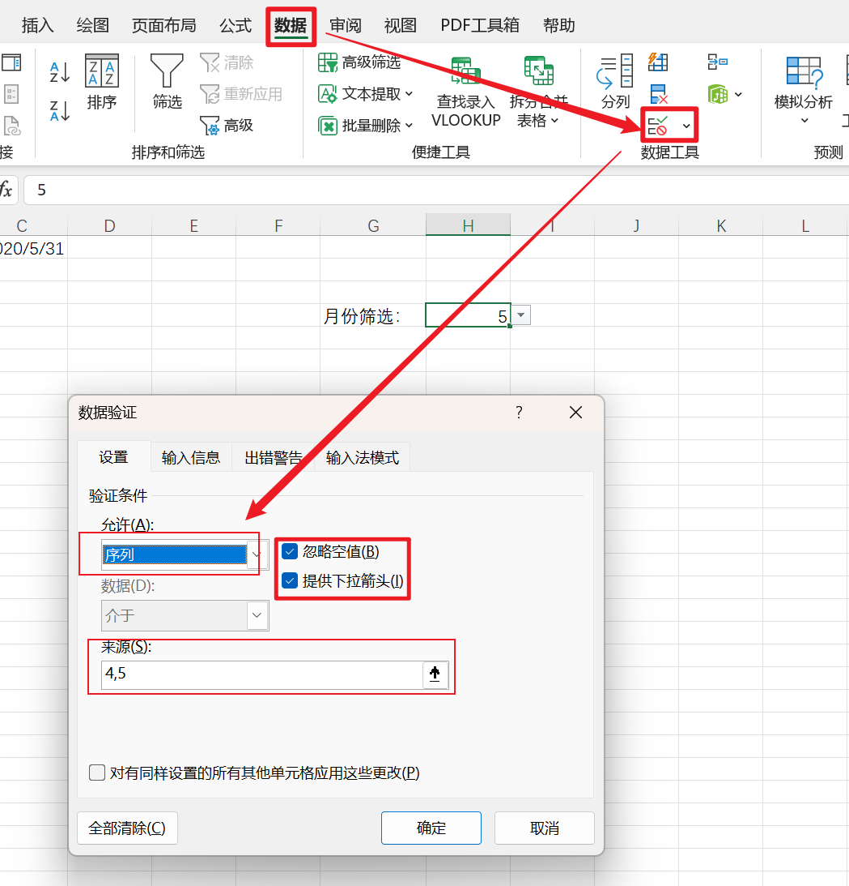
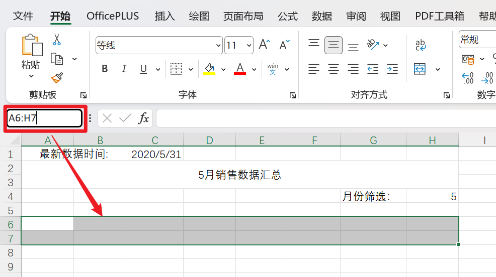
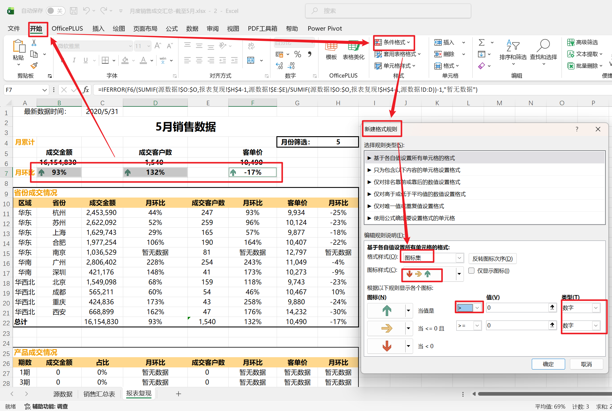
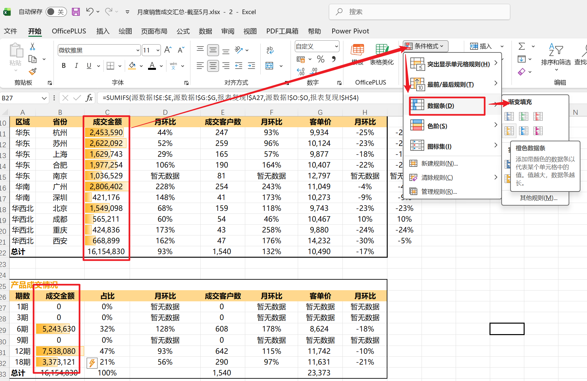
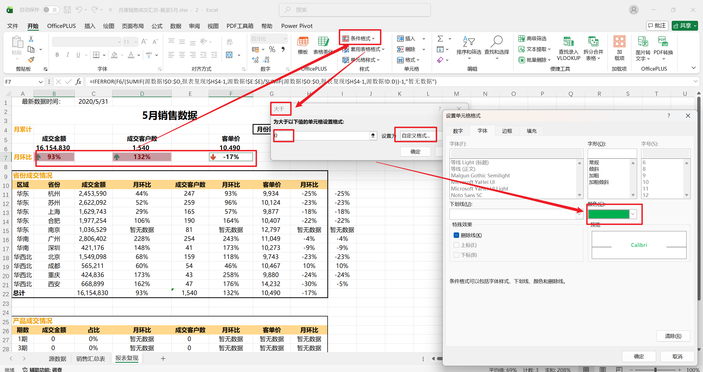
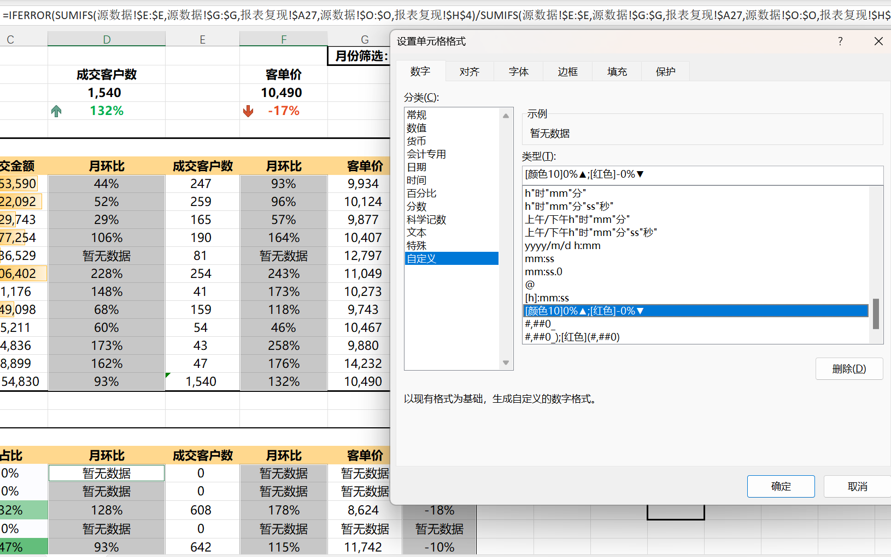
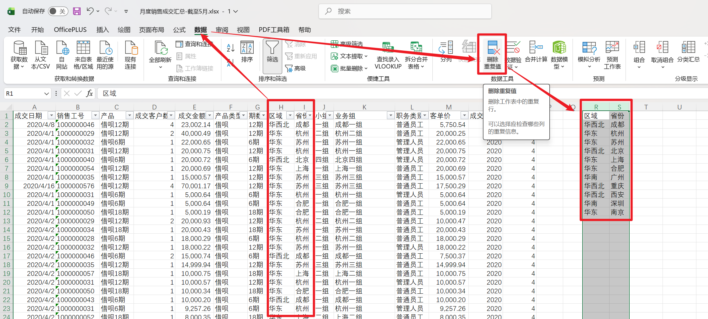
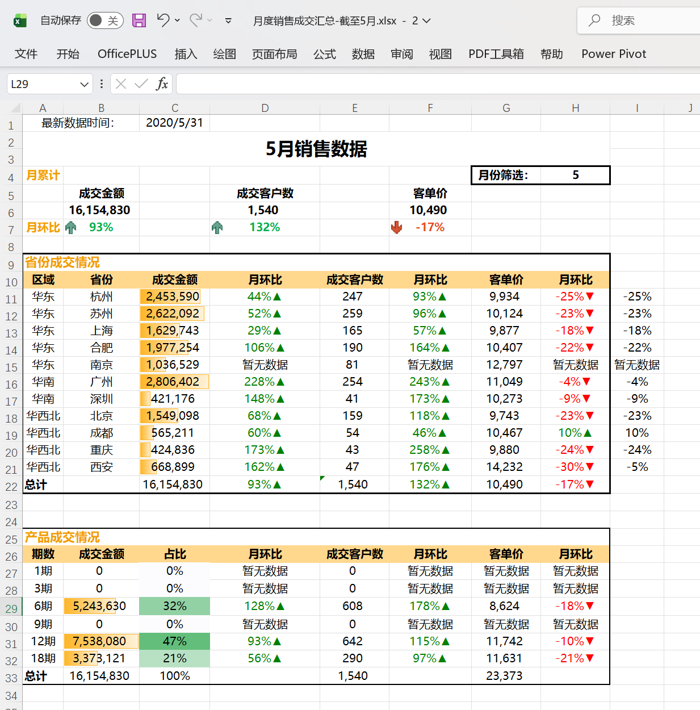

# Excel 报表开发实战学习笔记

---
> 本文内容整理自 B 站戴戴戴师兄的 Excel 数据分析课程，覆盖了报表搭建的核心知识点。
> 
> 更完整的笔记版本、练习文件与截图素材已统一归档至我的 [GitHub 仓库](https://github.com/moyan726/Excel-Learning-Vault)，如有需要可直接访问。
## 一、案例背景与数据结构

本笔记围绕一个完整的业务场景展开：**月度销售成交汇总报表的制作**。数据来源是一张包含 1657 条销售记录的明细表（"源数据"工作表），目标是制作一份可以按月份动态切换、自动计算核心指标的汇总报表。

### 1.1 源数据表的字段结构

源数据表共有 15 个核心字段，记录了每一笔销售的完整信息：

| 列号 | 字段名     | 业务含义                                             |
| ---- | ---------- | ---------------------------------------------------- |
| A    | 成交日期   | 每笔交易发生的日期                                   |
| B    | 销售工号   | 销售人员的唯一编号                                   |
| C    | 产品       | 具体产品名称，如"借呗12期""借呗6期"                  |
| D    | 成交客户数 | 该笔记录对应的客户数量                               |
| E    | 成交金额   | 该笔交易的金额                                       |
| F    | 产品类型   | 产品大类，如"借呗"                                   |
| G    | 期数       | 产品的分期期数，如 6期、12期、18期                   |
| H    | 区域       | 大区划分：华东、华南、华西北                         |
| I    | 省份       | 具体城市/省份：杭州、苏州、上海、北京等 11 个        |
| J    | 小组       | 业务小组名称                                         |
| K    | 业务组     | 业务组名称                                           |
| L    | 职务类别   | 普通员工或管理人员                                   |
| M    | 客单价     | 由公式 `=E2/D2` 计算，即成交金额÷成交客户数         |
| N    | 成交年份   | 由公式 `=YEAR(A2)` 从成交日期中提取年份              |
| O    | 成交月份   | 由公式 `=MONTH(A2)` 从成交日期中提取月份             |

其中 M、N、O 三列是通过公式从原始数据派生出来的辅助字段，后续的条件聚合公式会大量引用 O 列（月份）和 I 列（省份）作为筛选条件。

值得注意的是，源数据表的 R-S 列还保存了一份去重后的"区域-省份"对照表（共 11 个省份，分属华东、华南、华西北三个区域），U 列保存了去重后的期数列表（6期、12期、18期）。这些去重列表通常是通过 Excel 的**数据 → 删除重复值**功能生成的——选中区域和省份两列后，Excel 会自动去除完全相同的行，只保留唯一组合，这个功能在构建报表的维度列表时非常实用。

### 1.2 报表的最终结构

最终报表由三大区域组成：

**顶部汇总区（月累计）：** 展示当前所选月份的三个核心指标——成交金额、成交客户数、客单价，以及各自的月环比。报表标题由公式动态生成，随月份切换自动更新。

**中部明细区（省份成交情况）：** 按区域-省份维度展开，每个省份分别展示成交金额、成交客户数、客单价及其月环比。华东区包含杭州、苏州、上海、合肥、南京；华南区包含广州、深圳；华西北区包含北京、成都、重庆、西安。最下方有一行"总计"汇总。

**底部明细区（产品成交情况）：** 按产品期数（6期、12期、18期）展开，同样展示成交金额、占比、月环比、成交客户数及客单价。

整个报表最右上角有一个"月份筛选"下拉框（H4 单元格），用户在 4 和 5 之间切换月份后，报表中所有数值会自动联动更新。这是整张报表的控制核心。

---

## 二、常用聚合函数与条件聚合函数

### 2.1 基础聚合函数

基础聚合函数是 Excel 中日常使用频率最高的一组统计工具，它们作用于整个数据范围，不带筛选条件。

**SUM** 是最基础的求和函数，语法简单直接：`=SUM(E2:E100)`，将 E2 到 E100 之间所有数值相加。在本案例的报表中，省份明细区的"总计"行就使用了 `=SUM(C11:C21)` 来汇总所有省份的成交金额。

**计数函数三兄弟**各有分工：`COUNT` 只统计数值型单元格数量，忽略文本和空白；`COUNTA` 统计所有非空单元格，包括文本、数字、逻辑值；`COUNTBLANK` 则反过来，专门统计空白单元格。实际场景中，如果你想统计一列中有多少条有效记录，用 `COUNTA` 最稳妥，因为数据可能包含文本型内容。

**AVERAGE** 计算算术平均值。但需要注意，平均值对极端值非常敏感——如果一组数据里有一笔特别大或特别小的异常值，均值会被严重拉偏。此时可以考虑用 **MEDIAN**（中位数）来替代，中位数取排列后位于中间的那个值，能有效抵抗极端值的干扰，在数据分析中经常作为均值的补充指标。

**MAX / MIN** 返回范围内的最大值和最小值，功能简单但实用。如果需要查找"第 2 大""第 3 小"的值，可以使用更灵活的 **LARGE** 和 **SMALL**：`=LARGE(E2:E100, 2)` 返回第 2 大的值，`=SMALL(E2:E100, 3)` 返回第 3 小的值。

**RANK** 用于返回某个数值在范围内的排名：`=RANK(E2, E$2:E$100, 0)`，第三个参数为 0 表示降序排名（最大的排第一），为 1 则是升序排名。注意这里使用了 `E$2:E$100`（行号加 `$`），这是为了在向下拖拽公式时保持排名范围不变——关于 `$` 锁定的详细说明见后文。

**SUBTOTAL** 是一个特殊的聚合函数，它只对**可见单元格**进行计算。当你对数据表使用了筛选（`Ctrl + Shift + L`）后，SUM 等普通函数仍然会把被筛选隐藏的行算进去，而 SUBTOTAL 只计算筛选后显示出来的行。它的第一个参数是功能代码，决定执行哪种运算：9 表示求和、1 表示平均值、2 表示计数、4 表示最大值、5 表示最小值。例如 `=SUBTOTAL(9, E2:E100)` 就是对筛选可见行求和。AGGREGATE 是 SUBTOTAL 的增强版，还可以选择忽略错误值、忽略隐藏行等，适合数据质量不太稳定的场景。

**MODE** 返回众数（出现频率最高的值）。需要注意，`MODE` 在 Excel 2010 之后已被列为兼容性函数，新场景推荐使用 `MODE.SNGL`（返回单一众数）或 `MODE.MULT`（返回所有众数，以数组形式）。**STDEV / STDEVP** 计算标准差（衡量数据离散程度），**PERCENTILE** 返回指定百分位的值（如 `=PERCENTILE(E2:E100, 0.9)` 返回第 90 百分位值），这些在需要做更深入统计分析时会用到。

### 2.2 条件聚合函数

条件聚合函数是在基础聚合函数之上增加了筛选能力，只对满足特定条件的数据子集进行计算。它们构成了本案例报表的公式核心。

#### 单条件系列（-IF 后缀）

**SUMIF** — 条件求和，这是本报表中使用最多的函数。语法为：

```
=SUMIF(条件范围, 条件, 求和范围)
```

三个参数的理解方式：先确定"去哪里找"（条件范围），再确定"找什么"（条件），最后确定"找到之后对谁求和"（求和范围）。以报表中汇总区的成交金额公式为例：

```
=SUMIF(源数据!$O:$O, 报表复现!$H$4, 源数据!$E:$E)
```

这个公式的业务含义是：去源数据表的 O 列（成交月份）逐行扫描，找出所有等于 H4（月份筛选框的值，如 5）的行，然后把这些行对应的 E 列（成交金额）全部累加起来。结果就是"5 月份的总成交金额"。

**COUNTIF** — 条件计数，语法只有两个参数（因为计数不需要指定"对谁求和"）：

```
=COUNTIF(源数据!O:O, 报表复现!H4)
```

统计 O 列中月份等于 H4 值的记录共有多少行。

**AVERAGEIF** — 条件平均值，语法与 SUMIF 一致：`=AVERAGEIF(条件范围, 条件, 平均值范围)`。需要注意，当没有任何行满足条件时，AVERAGEIF 会返回 `#DIV/0!` 错误（因为相当于 0 个数求平均），建议外层套 IFERROR 做容错处理。

**MAXIFS / MINIFS** — 条件极值（Excel 2019 及以上支持），但要特别留意：这两个函数的参数顺序和 SUMIF **不同**，是求值范围在前、条件范围在后：`=MAXIFS(最大值范围, 条件范围, 条件)`。

#### 多条件系列（-IFS 后缀）

当需要同时满足两个或更多条件时，使用 IFS 后缀的版本。以省份明细区的成交金额公式为例：

```
=SUMIFS(源数据!$E:$E, 源数据!$I:$I, 报表复现!$B11, 源数据!$O:$O, 报表复现!$H$4)
```

这个公式包含两对条件：第一对要求源数据的 I 列（省份）等于报表复现表的 B11（如"杭州"），第二对要求 O 列（月份）等于 H4（如 5）。两个条件同时满足的行，其 E 列（成交金额）才会被累加。

**SUMIFS 与 SUMIF 最关键的区别：参数顺序不同。**

```
=SUMIF(条件范围, 条件, 求和范围)        ← 求和范围在最后
=SUMIFS(求和范围, 条件范围1, 条件1, …)  ← 求和范围在最前
```

这个顺序差异是实际使用中最容易出错的地方。微软如此设计是有道理的：SUMIFS 支持无限叠加条件对（每一对都是"条件范围 + 条件"），如果求和范围放在最后，函数就无法判断最后一个参数是新的条件还是求和范围。放在第一位，后面所有参数都固定成对出现，解析没有歧义。

**实用建议：** 由于 SUMIFS 完全兼容单条件场景（只写一对条件即可），很多有经验的用户直接只用 SUMIFS，放弃 SUMIF，从而避免在两种参数顺序之间来回切换导致出错。COUNTIFS 和 AVERAGEIFS 同理。

#### 条件写法的通用规则

所有条件聚合函数的条件参数写法完全一致，掌握一次即可通用：

| 写法             | 含义             | 示例            |
| ---------------- | ---------------- | --------------- |
| 直接引用单元格   | 等于该单元格的值 | `H4`            |
| 数字或文本       | 精确匹配         | `5` 或 `"北京"` |
| 比较运算符       | 大于、小于等     | `">100"`        |
| 通配符 `*`       | 匹配任意多个字符 | `"*手机*"`      |
| 通配符 `?`       | 匹配单个字符     | `"张?"`         |
| 运算符拼接单元格 | 动态比较条件（H4 须为数值型） | `">"&H4`        |

注意比较运算符必须用英文双引号包裹（如 `">100"`），这是因为 Excel 需要把整个表达式当作一个字符串来解析条件。

---

## 三、数据验证与下拉选择

### 3.1 什么是数据验证

数据验证是 Excel 中用于**限制单元格输入内容**的功能，可以规定某个单元格只允许输入数字、日期、特定列表中的值等。在本案例中，它被用来制作月份筛选下拉框，让用户只能从 4 和 5 之间选择月份，而不是随意输入。

### 3.2 操作步骤详解

**进入入口：** 选中目标单元格（如 H4），点击菜单栏的 **"数据"** 选项卡，在右侧的 **"数据工具"** 区域找到"数据验证"按钮（图标是表格加漏斗的样式），点击即可打开对话框。

**配置对话框：** 在"数据验证"对话框的"设置"选项卡中，有三个关键配置项：

- **允许 → 选择"序列"**：表示该单元格只允许用户从预设列表中选值，不能随意输入。
- **勾选"忽略空值"**：允许单元格留空而不触发错误提示。
- **勾选"提供下拉箭头"**：这是序列验证最核心的体验，勾选后单元格右侧会出现一个小三角箭头，用户点击即可展开选项列表进行选择。
- **来源 → 填写 `4,5`**：多个选项之间用英文逗号分隔。在本案例中，因为源数据只涵盖 4 月和 5 月两个月的数据，所以下拉选项只有 4 和 5。

点击"确定"后，H4 单元格就变成了一个下拉选择框。用户选择不同月份后，报表中所有引用 H4 的公式（SUMIF、SUMIFS 等）都会自动重新计算，实现整张报表的联动刷新。

### 3.3 适用场景与注意事项

数据验证下拉菜单在制作交互式报表、数据录入模板、看板面板时非常实用，能有效规范输入、减少人为错误。如果用户手动输入了列表之外的值，Excel 会弹出错误提示（可在"出错警告"选项卡中自定义提示文案）。

来源除了手动输入（如 `4,5`），还可以引用一个单元格区域（如 `=$R$2:$R$12`），这样当区域内的数据变化时，下拉选项也会随之更新，灵活度更高。



---

## 四、跨工作表引用与 $ 锁定

### 4.1 跨工作表引用

当公式需要引用另一个工作表中的数据时，使用以下格式：

```
工作表名称!单元格地址
```

感叹号 `!` 是工作表名与单元格地址之间的分隔符。例如 `源数据!O:O` 表示"源数据"工作表的整个 O 列，`报表复现!$H$4` 表示"报表复现"工作表中的 H4 单元格。

如果工作表名称中包含空格或特殊字符（如"Sheet 1"），需要用英文单引号包裹工作表名：`'Sheet 1'!A1`。

在本案例中，报表复现表中的几乎所有公式都涉及跨表引用，因为汇总数据存放在"报表复现"表，而明细数据在"源数据"表。

### 4.2 名称框快速选区

Excel 左上角有一个"名称框"，通常显示当前选中的单元格地址（如 A1）。在名称框中直接输入区域地址（使用 `:` 语法），可以快速选中指定范围。例如输入 `A1:E100` 后回车，Excel 会立即选中整个区域。当处理大数据表需要快速跳转或选中特定范围时，这个技巧比用鼠标拖拽高效得多。



### 4.3 `$` 符号与引用锁定

Excel 公式默认使用**相对引用**，即公式在拖拽复制时，引用的单元格地址会随之自动偏移。例如 `=A1` 向下拖一行变成 `=A2`，向右拖一列变成 `=B1`。这在大多数场景下很方便，但有些引用需要始终固定，比如固定的月份参数 H4、固定的源数据列范围等，就需要用 `$` 来锁定。

`$` 加在列字母前面锁定列，加在行数字前面锁定行，可以组合出四种引用方式：

| 写法     | 名称     | 拖拽时的行为                          |
| -------- | -------- | ------------------------------------- |
| `A1`     | 相对引用 | 行列均不锁定，拖拽时行列都会偏移      |
| `$A1`    | 锁列     | 列固定为 A，行随拖拽偏移              |
| `A$1`    | 锁行     | 行固定为第 1 行，列随拖拽偏移         |
| `$A$1`   | 绝对引用 | 行列全部锁定，无论怎么拖拽始终指向 A1 |

**`F4` 快捷键**可以在编辑公式时一键循环切换四种引用状态。操作方法：在编辑栏中将光标定位到某个单元格引用上，反复按 F4，引用方式就会按 `A1 → $A$1 → A$1 → $A1 → A1` 的顺序循环切换，比手动输入 `$` 高效得多。

### 4.4 结合报表案例理解锁定策略

在本案例的省份明细区公式中，锁定策略的运用非常典型：

```
=SUMIFS(源数据!$E:$E, 源数据!$I:$I, 报表复现!$B11, 源数据!$O:$O, 报表复现!$H$4)
```

- **`源数据!$E:$E`、`源数据!$I:$I`、`源数据!$O:$O`**：源数据列的引用全部用绝对引用锁定，因为无论公式复制到报表的哪个位置，它需要去源数据表查找的列始终不变。
- **`报表复现!$H$4`**：月份筛选值行列全锁定，因为整张报表的月份条件只来自这一个单元格，不能因为拖拽而偏移。
- **`报表复现!$B11`**：省份引用**只锁列不锁行**（`$B` 锁列，`11` 不锁行）。这是因为报表中各省份排列在不同的行（杭州在第 11 行、苏州在第 12 行……），公式向下拖拽时，省份引用需要从 B11 依次变成 B12、B13，自动匹配当前行对应的省份；但列不能变（必须始终是 B 列），所以列要锁定。

这个例子清楚地展示了 `$` 锁定的核心思维：**哪个方向不能动，就在哪个方向加 `$`**。

一个容易忽略的细节：`$` 锁定的是引用地址，而不是单元格的值。被锁定的单元格内容本身依然可以修改，公式只是保证始终引用那个固定位置。

---

## 五、文本拼接与动态标题

### 5.1 `&` 运算符

`&` 是 Excel 中专门用于拼接文本的运算符，作用等同于 `CONCATENATE()` 函数，但写法更简洁灵活。

报表标题使用了以下公式：

```
=H4&"月销售数据汇总"
```

当 H4 的值为 5 时，结果自动显示为 **"5月销售数据汇总"**；切换为 4 时则变为 **"4月销售数据汇总"**。这种动态拼接方式避免了手动修改标题，是构建交互式报表的基础技巧。

`&` 可以连接任意数量的部分，混合使用单元格引用、固定文本和函数结果。例如更丰富的标题：

```
=YEAR(TODAY())&"年"&H4&"月销售数据汇总"
```

若 H4 为 5，当前年份为 2026，结果为：**"2026年5月销售数据汇总"**。

### 5.2 注意事项

- 固定文本必须用**英文双引号** `""` 包裹，否则 Excel 会将其识别为单元格名称或函数名而报错。
- 单元格引用（如 H4）直接书写，不需要引号。
- 如果需要在拼接结果中包含引号本身，需要用两个连续引号 `""` 来转义。
- 报表中另一个动态文本的应用场景是 `=MAX(源数据!A:A)`，用于自动提取源数据中的最新日期，放在报表顶部显示"最新数据时间"。

---

## 六、同比与环比的概念与计算

### 6.1 概念辨析

**同比（Year-on-Year, YoY）** 是与**去年同一时期**相比的变化率，用于消除季节性波动、反映长期趋势。例如今年 5 月与去年 5 月对比。

$$
同比增长率 = \frac{本期数值 - 上年同期数值}{上年同期数值} \times 100\%
$$

**环比（Month-on-Month, MoM）** 是与**紧邻的上一个周期**相比的变化率，反映短期动态变化。例如本月与上月对比。

$$
环比增长率 = \frac{本期数值 - 上期数值}{上期数值} \times 100\%
$$

两者的选用取决于分析目的：同比排除季节因素，适合评估长期健康度（"方向对不对"）；环比对近期变化敏感，适合监控短期运营动态（"势头强不强"）。在实际报表中，两者通常同时呈现、互为补充。

### 6.2 环比公式的简化推导

上面的环比公式 $\frac{本期 - 上期}{上期}$ 可以做一步代数变换：

$$
\frac{本期 - 上期}{上期} = \frac{本期}{上期} - 1
$$

所以在 Excel 中，环比可以简化为 **本期值 ÷ 上期值 − 1**，写起来更简洁。

### 6.3 汇总区的环比公式

**成交金额月环比：**

```
=$B$6/SUMIF(源数据!$O:$O, 报表复现!$H$4-1, 源数据!$E:$E)-1
```

拆解这个公式：

- `$B$6` 是当前月（5 月）的成交金额总计，已经在上一步通过 SUMIF 计算好，存在 B6 单元格中，直接引用。
- `SUMIF(源数据!$O:$O, 报表复现!$H$4-1, 源数据!$E:$E)` 计算上个月（`$H$4-1`，即 5-1=4 月）的成交金额。核心技巧在于条件参数用了 `$H$4-1`——在月份值上减 1 就自动变成上期。
- 两者相除再减 1，得到环比增长率。

因为数据中只有 4 月和 5 月，所以只能计算 5 月的环比。如果选择查看 4 月，上期变成 3 月，但源数据中没有 3 月数据，SUMIF 会返回 0，除法会报 `#DIV/0!` 错误——这正是需要 IFERROR 来处理的原因。

**成交客户数月环比**与成交金额完全类似，只是把求和列从 E 列（金额）换成 D 列（客户数）。

**客单价月环比**的计算需要多想一步。客单价 = 成交金额 ÷ 成交客户数，所以上期客单价不能直接用 SUMIF 求出，而是需要分别求出上期金额和上期客户数再相除：

```
=IFERROR($F$6/(SUMIF(源数据!$O:$O, 报表复现!$H$4-1, 源数据!$E:$E)
  / SUMIF(源数据!$O:$O, 报表复现!$H$4-1, 源数据!$D:$D))-1, "-")
```

`$F$6` 是当月客单价（B6/D6）；分母部分用两个 SUMIF 分别求出上月的金额和客户数，再相除得到上月客单价。

### 6.4 省份明细区的环比公式（多层嵌套）

省份明细区的环比更复杂，因为需要同时按省份和月份两个维度筛选，使用的是 SUMIFS（多条件）。以"5 月杭州客单价月环比"为例：

```
=IFERROR(G11/(SUMIFS(源数据!$E:$E, 源数据!$I:$I, 报表复现!$B11, 源数据!$O:$O, 报表复现!$H$4-1)
  / SUMIFS(源数据!$D:$D, 源数据!$I:$I, 报表复现!$B11, 源数据!$O:$O, 报表复现!$H$4-1))-1, "暂无数据")
```

计算逻辑是：

1. `G11` — 5 月杭州客单价，前面已经算好，直接引用。
2. 分母的第一个 SUMIFS — 求 4 月杭州的成交金额（条件：省份=杭州 且 月份=H4-1）。
3. 分母的第二个 SUMIFS — 求 4 月杭州的成交客户数。
4. 两个 SUMIFS 相除 — 得到 4 月杭州的客单价。
5. `G11 / (4月杭州客单价) - 1` — 得到客单价的环比增长率。
6. 外层 IFERROR — 如果上期数据缺失导致除零错误，显示"暂无数据"。

处理这种多层嵌套公式的关键心法是：**由内向外构建，先写最内层的基础计算，逐层向外扩展**。先确保每一个 SUMIFS 单独能返回正确结果，再组合成除法，再减 1，最后套上 IFERROR。

---

## 七、IFERROR 与报表容错处理

### 7.1 为什么需要容错

在制作动态报表时，并非所有条件组合都有对应数据。比如查看 4 月时没有 3 月数据可以算环比，某些省份某些月份可能没有成交记录。这些情况下公式会返回 `#DIV/0!`、`#VALUE!` 等错误代码，不仅视觉上难看，还会影响后续公式的计算。IFERROR 就是用来优雅地处理这些错误的。

### 7.2 语法与参数

```
=IFERROR(value, value_if_error)
```

| 参数             | 含义                                   |
| ---------------- | -------------------------------------- |
| `value`          | 你实际要计算的公式                     |
| `value_if_error` | 当 value 计算出错时，显示的替代内容    |

IFERROR 能拦截 Excel 中所有类型的错误：`#DIV/0!`（除以零）、`#VALUE!`（类型不匹配）、`#REF!`（无效引用）、`#N/A`（找不到匹配值）、`#NAME?`（函数名拼写错误）、`#NULL!`、`#NUM!` 等。

### 7.3 替代值的选择

替代值的选择取决于报表的业务语境：

- `"-"` — 一个短横线，财务报表中最常见的"暂无数据"占位符，简洁专业。
- `"暂无数据"` — 中文提示，语义更明确。
- `""` — 空字符串，单元格看起来什么都没有。
- `0` — 数字 0（不加引号），适合需要参与后续计算的场景。

在本案例中，汇总区环比用了 `"-"`，省份明细区用了 `"暂无数据"`，都是合理的选择。

### 7.4 实用建议

在所有可能出错的公式外层统一套 IFERROR 是一个良好的报表开发习惯。尤其是 SUMIF/SUMIFS 作为分母参与除法运算时、AVERAGEIF 在无匹配数据时，都容易产生除零错误。写法固定：

```
=IFERROR(你的原始公式, 替代值)
```

只需要把原始公式整体作为第一个参数放进去即可，不影响正常计算逻辑——只有当出错时才会触发替代值。

---

## 八、条件格式的使用逻辑

条件格式是 Excel 中根据单元格的值自动改变其视觉样式的功能，能让报表的关键信息一目了然。本案例中使用了三种条件格式，各有不同的适用场景。

### 8.1 图标集——用于环比增减趋势

在报表的"月环比"列上应用了条件格式中的**图标集**。操作路径为：选中环比数据区域 → 开始 → 条件格式 → 图标集，选择带上升箭头（绿色）和下降箭头（红色）的样式。设置完成后，每个环比值旁边会自动显示一个方向箭头：正增长显示绿色上箭头，负增长显示红色下箭头。

图标集特别适合**正负变化率**这类数据，因为它强调的是方向和趋势（上升还是下降），而不是具体数值的大小。同比、环比这类指标用图标集呈现，报表读者可以在不看具体数字的情况下快速扫描出哪些指标在增长、哪些在下滑。



### 8.2 数据条——用于成交金额等绝对值指标

成交金额列使用了**数据条**格式。操作路径为：选中成交金额数据区域 → 开始 → 条件格式 → 数据条，选择渐变填充样式。设置后，每个单元格内会出现一根水平色条，长度与数值成正比——数越大条越长，数越小条越短。

数据条适合**规模型指标**（绝对值），因为它把数值大小直接转化为条形长度，相当于在单元格内嵌入了一张微型柱状图。用户一眼就能看出哪个城市金额最高、各城市之间差距有多大。如果这里改用色阶，虽然也能看到深浅变化，但颜色深浅对"差多少"的传达不如长度直观，尤其当金额跨度很大（从十几万到几百万）时。



### 8.3 色阶——用于占比等相对值指标

成交客户数占比列使用了**色阶**格式。设置后，单元格的背景色会根据值的高低呈现渐变——高值颜色深、低值颜色浅（或反之，取决于选择的配色方案）。

色阶适合**结构型指标**（比例、占比）。与数据条相比，色阶的核心优势在于"热力感"——深浅渐变能在二维表格中快速呈现整体分布，帮你一眼识别出"高占比区域"和"低占比区域"。而数据条更强调单列内各行之间的排名对比，当金额等指标跨度极大时，条长差异的视觉冲击更强。简而言之：需要看**整体分布热力图**时用色阶，需要看**单列内排名大小**时用数据条。

### 8.4 特殊条件下的字体颜色

除了以上三种内置条件格式，还可以通过条件格式规则来设置字体颜色。例如对环比值设置：当值 > 0 时字体为绿色（表示增长），当值 < 0 时字体为红色（表示下降）。操作路径为：开始 → 条件格式 → 新建规则 → 使用公式确定要设置格式的单元格，输入条件（如 `=C7>0`），然后在"格式"中设置字体颜色。

在 **条件格式 → 管理规则** 中可以查看当前工作表上所有已应用的条件格式规则，并进行修改、删除或调整优先级。



### 8.5 选择条件格式的核心原则

本质上，不同的条件格式对应不同的数据表达需求：

- **数据条** → 强调"规模感"和"差距感"，适合绝对值指标（金额、数量）。
- **色阶** → 强调"高低分布"和"相对水平"，适合比例型指标（占比、达成率）。
- **图标集** → 强调"方向"和"趋势"，适合变化率指标（同比、环比）。

让每一类指标都使用最符合其业务含义的视觉编码，这样读表效率最高。

---

## 九、自定义数字格式的作用与案例

### 9.1 核心原理：值与显示的分离

Excel 的每一个单元格实际上有两层东西：**存储的值**（底层数据）和**显示出来的样子**（视觉呈现）。自定义数字格式只作用于"显示的样子"，完全不改变"存储的值"。

例如单元格中存储的是小数 `0.83`，通过格式代码可以把它显示为 `-17%`（红色），但如果你在另一个单元格中引用它做计算（如 `=A1+1`），Excel 算的仍然是 `0.83+1=1.83`，而不是 `-0.17+1`。格式不影响计算。

同理，日期 `2026/3/8` 的本质是一个序列号数字 `46100`，日期格式只是把这个数字显示成了人类可读的日期形式。

这种**数据存储与展示完全解耦**的设计，意味着你可以随意改变显示样式，而不用担心破坏原始数据或影响下游公式。

### 9.2 本案例中的格式代码

报表中所有环比值使用了以下自定义格式代码（通过 右键 → 设置单元格格式 → 数字 → 自定义 来设置）：



```
[蓝色][>=0]0%;[红色][<0]-0%;暂无数据
```

这是一段**三段式条件格式代码**，用分号 `;` 隔开，分别对应三种情况：

**第一段 `[蓝色][>=0]0%`：** 当单元格的值 ≥ 0 时，用蓝色字体显示百分比。环比公式采用 `本期 / 上期 − 1` 的形式，结果直接就是增长率。例如本期比上期增长了 32%，公式返回值为 `0.32`，此处会显示为蓝色的 `32%`。

**第二段 `[红色][<0]-0%`：** 当值 < 0（即出现下降）时，用红色字体显示。例如值为 `-0.17`（表示本期比上期下降了 17%），显示为红色的 `-17%`。

**第三段 `暂无数据`：** 当值不满足前两个条件（比如是文本或 IFERROR 返回的字符串）时，直接显示"暂无数据"。

### 9.3 格式代码的通用语法

自定义格式代码最多可以有四段，用分号分隔，依次对应：正数格式;负数格式;零值格式;文本格式。在此基础上，还可以加入方括号条件（如 `[>=1]`）和颜色代码（如 `[蓝色]`、`[红色]`）。

常用的格式符号包括：

- `0` — 强制显示该位数字，不足则补零
- `#` — 有数字则显示，没有则不占位
- `%` — 将数值乘以 100 后加百分号显示
- `,` — 千分位分隔符
- `.` — 小数点

### 9.4 为什么不直接输入文本

既然格式能控制显示，为什么不直接在单元格里手动输入 `-17%` 这样的文本呢？因为一旦输入成文本，这个单元格就**无法再参与任何数值计算**了。SUM、AVERAGE 等函数会直接跳过文本单元格，引用它的公式也可能报错。用格式代码控制显示，保留底层数值，是 Excel 中最正确的做法。

---

## 十、筛选功能与快捷键

`Ctrl + Shift + L` 是开启/关闭自动筛选的快捷键，等同于菜单路径 **数据 → 筛选**。选中数据区域后按下此快捷键，Excel 会在表头行自动添加下拉筛选箭头，方便按条件过滤数据；再次按下则取消筛选。

需要注意：如果当前已有筛选条件处于激活状态，再次按下 `Ctrl + Shift + L` 会**直接移除所有筛选并清除已设置的条件**，而不是保留条件只关闭箭头。使用时需留意，避免意外丢失筛选状态。

筛选状态下，普通的 SUM 等函数仍然会计算所有行（包括被隐藏的行），如果只想对筛选后的可见行进行统计，应使用 SUBTOTAL 函数。

---

## 十一、删除重复数据

Excel 提供了专门的"删除重复值"功能，路径为 **数据 → 删除重复值**。选中包含数据的区域后，点击该按钮会弹出对话框，让你勾选需要参与去重判断的列。例如在本案例中，选中"区域"和"省份"两列进行去重，Excel 会删除这两列组合完全相同的行，只保留唯一的区域-省份对，最终生成了 R-S 列中的 11 个省份对照表。

这个功能在从明细数据中提取维度列表（如所有省份、所有产品类型）时非常实用，省去了手动筛选和整理的步骤。



---

## 十二、实操中常见错误与注意事项

### 12.1 SUMIF 与 SUMIFS 参数顺序混淆

这是最高频的错误。SUMIF 的求和范围在最后一个参数，SUMIFS 的求和范围在第一个参数。从 SUMIF 切换到 SUMIFS 时，很多人习惯性地把求和范围写在最后，导致结果错误但不会报错（因为语法上是合法的，只是语义错了），排查起来很头疼。**建议统一只用 SUMIFS**，从根源上避免这个问题。

### 12.2 `$` 锁定不当导致拖拽后引用错位

拖拽公式前一定要想清楚哪些引用需要固定、哪些需要随行/列变化。典型错误场景：
- 月份参数 `H4` 忘记锁定为 `$H$4`，向下拖拽后变成 `H5`、`H6`，引用了错误的单元格。
- 省份引用 `$B11` 误写为 `$B$11`（行也锁了），所有行都指向同一个省份。
- 源数据列引用忘记加 `$`，向右复制时列发生偏移。

写完公式后，建议先拖拽到两三个单元格，检查公式中的引用是否正确偏移，确认无误后再批量拖拽。

### 12.3 环比/同比公式的除零错误

当上期或去年同期没有数据时，除法分母为 0，会返回 `#DIV/0!`。解决方案是统一用 IFERROR 包裹，设置合理的替代值。

### 12.4 客单价环比的思维陷阱

客单价不能像成交金额那样直接用 SUMIF 求出上期值。因为客单价 = 金额 ÷ 客户数，必须分别求出上期的金额和客户数，再相除得到上期客单价。直接对客单价列做 SUMIF 求和是没有业务意义的——把每笔交易的客单价加起来，得到的不是整体客单价。

### 12.5 文本连接中的引号问题

`&` 拼接时，固定文本必须用**英文双引号**包裹。常见错误包括：使用了中文引号（`""`）、忘记加引号导致 Excel 把文本当作单元格名、在需要显示引号本身时没有用双引号转义。

### 12.6 自定义格式与实际值的混淆

格式代码只改变显示方式，不改变底层值。如果你看到单元格显示的是 `-17%`，但实际存储的是 `0.83`，在编辑栏中查看的是真实值。公式引用该单元格时使用的也是真实值。不要因为显示样式而对数据产生误判。

### 12.7 多层嵌套公式的调试方法

面对复杂嵌套公式（如客单价环比中四个 SUMIFS 的组合），最有效的调试方法是**由内向外逐层构建**：

1. 先在空白单元格中单独写最内层的 SUMIFS，确认返回值正确。
2. 组合两个 SUMIFS 做除法，确认客单价计算正确。
3. 加入外层的比值和减 1 运算。
4. 最后套上 IFERROR。

每一步都验证一次，远比一次写完整个公式再排错要高效。

---

## 十三、表格美化要点速查

报表制作完成后，合理的视觉美化能显著提升阅读体验和专业感：

1. **字体统一**：全表使用微软雅黑，字号 11；标题 18 号加粗；汇总行数据加粗。
2. **列宽调整**：双击列边界可自动适配内容宽度。
3. **对齐方式**：标签类内容（如"月累计""月环比"）左对齐；数值右对齐；指标名称居中。
4. **颜色标识**："月累计""月环比"等区域标题用橙色字体加以区分。
5. **边框划分**：通过添加边框线将不同数据区域（汇总区、省份明细、产品明细）清晰分隔。
6. **条件格式**：成交金额用数据条、占比用色阶、环比用图标集和字体颜色（正增长绿色、负增长红色）。
7. **自定义数字格式**：环比值用三段式格式代码控制颜色和百分比显示。

最终效果是一份结构清晰、重点突出、数据与视觉表达相匹配的专业销售汇总报表。


