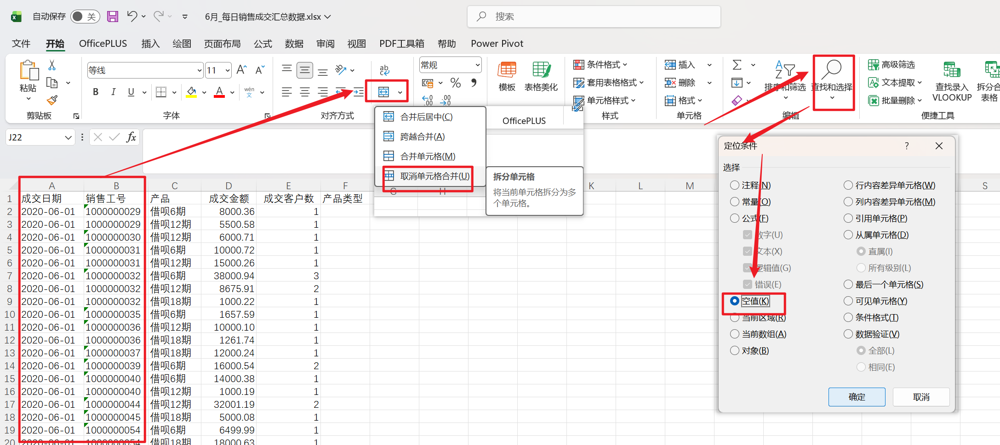

# Excel 学习笔记整理：常用操作、数据清洗与公式应用实战

这篇笔记围绕 Excel 日常处理中的高频场景展开，内容涵盖工作表复制、合并单元格清洗、文本拆分、跨表匹配、日期处理、数据类型判断以及常用效率技巧。全文按照实际操作场景重新整理，便于学习、复习与查阅。

## 一、Excel 中复制工作表

### 适用场景
当需要快速复制一个已有工作表作为模板继续使用时，可以直接复制当前工作表，而不必重新新建并手动补内容。

### 操作步骤
第一步：按住 `Ctrl` 键，这是整个操作中的关键。

第二步：左键单击并拖动工作表标签，也就是底部的工作表名称，例如 `Sheet1`、`Sheet2`。

第三步：拖动过程中，如果看到一个带加号（`+`）的白色小图标，说明当前执行的是复制，而不是移动。

第四步：释放鼠标后，Excel 会自动创建一个工作表副本。

### 补充说明
- 复制后的工作表通常会被命名为“原工作表名称 (2)”，例如 `Sheet1 (2)`。
- 如果拖动时没有按住 `Ctrl` 键，执行的将是移动工作表，而不是复制工作表。
- 该方法适用于 Excel 桌面版，包括 Windows 与 Mac 版本。
- Mac 用户虽然没有 Windows 键盘上的 `Ctrl` 键位习惯，但同样可以使用 `Control` 键完成相同逻辑的操作。

## 二、批量填充取消合并后的空白单元格

### 适用场景
标准数据表中通常不允许出现合并单元格。如果原始数据存在合并单元格，就需要先取消合并，再把原本显示在合并区域中的值补齐到所有空白单元格中。

原始场景中给出的核心前提是：标准数据中不允许出现合并单元格，因此这一处理方式属于典型的数据清洗步骤。

### 示例图


### 操作步骤
第一步：选中包含合并单元格的数据区域，例如 A 列、B 列等相关列。

第二步：取消合并单元格。

- 方式一：点击“开始”选项卡中的“合并后居中”下拉菜单，再选择“取消单元格合并”。
- 方式二：右键打开快捷菜单，直接选择取消合并。

第三步：定位所有空值单元格。

- 按 `Ctrl + G` 打开“定位”对话框。
- 点击左下角“定位条件”。
- 选择“空值”，再点击“确定”。
- 此时所有空白单元格会被一次性选中。

第四步：批量输入引用上方单元格的公式。

- 在保持所有空白单元格都被选中的状态下，直接输入 `=`。
- 按一次上方向键 `↑`，让当前公式引用到上方单元格。
- 编辑栏中此时通常会显示类似 `=A2` 这样的公式。

第五步：同时按下 `Ctrl + Enter`，把这个公式一次性填充到所有被选中的空白单元格。

第六步：如需保留静态结果，可将公式结果转为纯数值。

- 选中整列。
- 按 `Ctrl + C` 复制。
- 右键选择“粘贴为数值”。

### 公式说明
```excel
=上方单元格
```

公式作用：让当前空白单元格直接引用其正上方的值，从而实现取消合并后的批量补值。

### 原理解析
取消合并后，原合并区域中只有第一个单元格保留原值，其余单元格都会变为空白。通过“定位空值”可以一次性选中所有空白单元格，再用“引用上方单元格”的方式批量补值，最后借助 `Ctrl + Enter` 同时完成填充，这就是该方法高效的关键。

### 常见问题
- 如果只填充了一个单元格，通常是因为最后按了 `Enter`，而不是 `Ctrl + Enter`。
- 如果补出的值不对，通常是因为输入公式前误点了某个单元格，导致没有对所有空白单元格同时编辑。
- 如果后续还要排序、筛选或导出，建议将结果粘贴为数值，避免保留公式引用。

## 三、文本字段拆分：提取产品类型与期数

### 适用场景
当某一列中存放的是组合文本，例如 C 列“产品”里同时包含“产品类型”和“期数”信息，就需要先把它拆分为标准字段，便于后续统计、筛选和建模。

原始示例中，C 列数据如“借呗6期”“借呗12期”，目标是拆成两列：

| 字段 | 示例结果 |
| --- | --- |
| F 列：产品类型 | 借呗 |
| G 列：期数 | 6期、12期 |

### 操作步骤
第一步：提取产品类型，也就是左侧固定字符。

在 `F2` 单元格输入：

```excel
=LEFT(C2,2)
```

公式作用：从左侧提取前 2 个字符，得到“借呗”。

第二步：提取期数，也就是右侧可变字符。

在 `G2` 单元格输入以下任一公式：

```excel
=MID(C2,3,LEN(C2))
```

或

```excel
=MID(C2,3,999)
```

公式作用：从第 3 个字符开始，一直提取到文本末尾，得到“6期”或“12期”。

第三步：按 `Enter` 确认后，双击填充柄，将公式向下填充到所有数据行。

第四步：如有需要，可将结果复制并粘贴为数值，避免后续保留公式。

### 公式说明

#### 1. LEFT 函数
```excel
=LEFT(C2,2)
```

公式作用：从文本左侧提取固定长度的字符。

参数解释：

| 参数 | 值 | 含义 |
| --- | --- | --- |
| 第 1 参数 | `C2` | 源文本单元格，例如“借呗6期” |
| 第 2 参数 | `2` | 从左侧开始提取 2 个字符 |

结果说明：返回“借呗”，也就是产品类型。

#### 2. MID 函数
```excel
=MID(C2,3,999)
```

或

```excel
=MID(C2,3,LEN(C2))
```

公式作用：从指定位置开始提取字符，直到文本末尾。

参数解释：

| 参数 | 值 | 含义 |
| --- | --- | --- |
| 第 1 参数 | `C2` | 源文本单元格，例如“借呗6期” |
| 第 2 参数 | `3` | 从第 3 个字符开始提取，跳过前面的“借呗” |
| 第 3 参数 | `999` 或 `LEN(C2)` | 提取足够多的字符，确保取到末尾 |

结果说明：返回“6期”，也就是期数字段。

### 原理解析
“借呗6期”的字符结构可以理解为：

```text
"借呗6期" 的字符结构：
┌───┬───┬───┬───┐
│ 借 │ 呗 │ 6 │ 期 │
└───┴───┴───┴───┘
 位置1  位置2  位置3  位置4
```

因此：

```excel
=LEFT(C2,2)
```

公式作用：从位置 1 开始提取 2 个字符，结果为“借呗”。

```excel
=MID(C2,3,2)
```

公式作用：从位置 3 开始提取 2 个字符，结果为“6期”。

### 扩展处理
在实际操作中，很多人会先想到用下面这组公式把“6期”改成纯数字结果：

```excel
=MID(C2,3,LEN(C2)-2)
```

或

```excel
=VALUE(MID(C2,3,LEN(C2)-2))
```

这组写法的设计思路是：尝试去掉末尾“期”，并在需要时把结果转为数值。

但在“借呗6期”这个案例里，这其实是一个非常典型的错误思路，下面需要单独说明原因，并给出正确写法。

### 易错点：为什么 `=MID(C2,3,LEN(C2)-2)` 不能真正去掉“期”

#### 核心结论
`=MID(C2,3,LEN(C2)-2)` 看起来像是在减少字符，但在“借呗6期”这个案例里，它仍然会把“期”包含在提取结果中，所以返回值还是“6期”。

#### 问题拆解
以 `C2="借呗6期"` 为例：

| 字符 | 借 | 呗 | 6 | 期 |
| --- | --- | --- | --- | --- |
| 位置 | 1 | 2 | 3 | 4 |

此时：

```excel
=LEN(C2)
```

公式作用：返回字符总长度，结果为 `4`。

而原错误写法：

```excel
=MID(C2,3,LEN(C2)-2)
```

会变成：

```excel
=MID(C2,3,2)
```

公式作用：从第 3 个字符开始提取 2 个字符，所以结果自然仍是“6期”。

#### 正确思路
真正的目标是：

- 去掉前面的“借呗”两个字符；
- 还要再去掉最后一个“期”字；
- 也就是总长度减去 3 个字符，而不是减去 2 个字符。

#### 正确公式
```excel
=MID(C2,3,LEN(C2)-3)
```

公式作用：从第 3 个字符开始，只提取数字部分，不包含末尾的“期”。

如果需要数值型结果，可继续使用：

```excel
=VALUE(MID(C2,3,LEN(C2)-3))
```

公式作用：把提取出的数字文本进一步转成真正的数值。

### 常见写法对照
| 需求 | 公式 |
| --- | --- |
| 产品类型 | `=LEFT(C2,2)` |
| 期数（带“期”） | `=MID(C2,3,999)` |
| 期数（纯数字文本） | `=MID(C2,3,LEN(C2)-3)` |
| 期数（数值型） | `=VALUE(MID(C2,3,LEN(C2)-3))` |

## 四、跨表数据匹配：VLOOKUP 的标准用法

### 适用场景
这是一个典型的跨表匹配场景：根据“销售工号”，从“销售人员表”中补齐员工所属区域、所属省份、所属小组等信息，并写回到“成交汇总数据表”。

### 数据场景
| 表格角色 | 内容 |
| --- | --- |
| 源表 | 销售人员表，包含销售工号、入职时间、职务类别、所属小组、所属省份、所属区域等字段 |
| 目标表 | 6 月成交汇总数据，需要补充区域、省份、小组等信息 |
| 匹配键 | 销售工号 |

### 操作步骤
第一步：确认目标表中存在“销售工号”列，且源表中也有对应字段。

第二步：确认源表的数据区域必须以“销售工号”所在列作为查找范围的第一列。

第三步：在目标表对应单元格输入 `VLOOKUP` 公式。

第四步：按 `Enter` 确认后，向下填充到所有数据行。

第五步：检查返回结果。如果出现 `#N/A`，说明未找到匹配值；如果出现 `#REF!`，通常是列号超出范围。

### 公式说明
#### 函数语法
```excel
=VLOOKUP(查找值, 查找范围, 列号, 匹配方式)
```

公式作用：拿着一个查找值，去另一张表的第一列中定位该值，并返回同一行指定列的数据。

参数解释：

| 参数 | 含义 | 示例 |
| --- | --- | --- |
| 第 1 参数 | 查找值 | `B2`，即目标表中的销售工号 |
| 第 2 参数 | 查找范围 | `'[销售人员表.xlsx]Sheet1'!$A:$G` |
| 第 3 参数 | 列号 | `7`，表示返回第 7 列“所属区域” |
| 第 4 参数 | 匹配方式 | `0` 或 `FALSE`，表示精确匹配 |

#### 实际公式示例
```excel
=VLOOKUP(B2, '[销售人员表-截止7月1日.xlsx]Sheet1'!$A:$G, 7, 0)
```

公式作用：用 `B2` 中的销售工号，到销售人员表的 A:G 区域中查找匹配项，并返回第 7 列“所属区域”。

#### 逐参数解读
| 参数 | 值 | 作用 |
| --- | --- | --- |
| 查找值 | `B2` | 目标表中的销售工号 |
| 查找范围 | `'[销售人员表-截止7月1日.xlsx]Sheet1'!$A:$G` | 源表 A 到 G 列，并且 A 列必须是工号列 |
| 列号 | `7` | 返回“所属区域” |
| 匹配方式 | `0` | 强制精确匹配 |

### 匹配其他字段的公式调整
同一思路下，只需要调整第 3 参数，也就是返回列号：

| 需匹配字段 | 列号 | 参考公式 |
| --- | --- | --- |
| 所属小组 | `5` | `=VLOOKUP(B2,源表!$A:$G,5,0)` |
| 所属省份 | `6` | `=VLOOKUP(B2,源表!$A:$G,6,0)` |
| 所属区域 | `7` | `=VLOOKUP(B2,源表!$A:$G,7,0)` |

### 常见问题
| 问题 | 原因 | 解决方案 |
| --- | --- | --- |
| `#N/A` | 查找值在源表中不存在 | 检查工号是否一致，是否含空格或格式差异 |
| `#REF!` | 返回列号超出查找范围 | 确认第 3 参数不超过源表总列数 |
| 匹配错误 | 未使用精确匹配 | 第 4 参数固定写 `0` 或 `FALSE` |
| 源表关闭后报错 | 跨工作簿引用异常 | 保持源表打开，或改用 `INDEX+MATCH` |

### 原理解析
VLOOKUP 的本质可以概括为一句话：拿着一个值，去另一张表的第一列找它，找到后返回同一行指定列的内容。

这里有三条必须记住的规则：

1. 查找值必须位于查找范围的第一列。
2. 第 3 参数是相对于查找范围的列号，而不是工作表里的绝对列号。
3. 第 4 参数在业务数据处理中应优先使用 `0` 或 `FALSE`，确保精确匹配。

## 五、VLOOKUP 匹配失败：数据类型不一致的处理方法

### 适用场景
当 `VLOOKUP` 明明看起来“能对上”，却依然返回 `#N/A` 时，除了查找值不存在外，最常见的原因就是两边字段的数据类型不一致。

### 问题说明
原始案例中，两张表的“销售工号”虽然肉眼看起来完全一样，例如 `1001`，但实际类型不同：

| 表格 | 字段 | 数据类型 | 显示形式 |
| --- | --- | --- | --- |
| 6 月成交汇总表 | 销售工号 | 文本 | 左对齐，可能带绿色小三角 |
| 销售人员表 | 销售工号 | 数值 | 右对齐 |

Excel 只认“值”和“类型”的组合，不认“长得一样”，因此文本 `"1001"` 和数值 `1001` 不能直接匹配成功。

### 快速判断数据类型
| 特征 | 文本型 | 数值型 |
| --- | --- | --- |
| 默认对齐方式 | 左 | 右 |
| 左上角标记 | 可能有绿色小三角 | 通常没有 |
| 公式栏显示 | 可能是 `'1001` | 直接显示 `1001` |
| `=ISTEXT()` | `TRUE` | `FALSE` |
| `=ISNUMBER()` | `FALSE` | `TRUE` |

### 解决方案

#### 方法一：将文本转换为数值
```excel
=VLOOKUP(B2*1, '[销售人员表.xlsx]Sheet1'!$A:$G, 7, 0)
```

公式作用：先将文本型工号乘以 1，强制转成数值后再进行查找。

原理说明：文本 `"1001"` 乘以 `1` 后会变成数值 `1001`。

#### 方法二：将数值转换为文本
```excel
=VLOOKUP(B2&"", '[销售人员表.xlsx]Sheet1'!$A:$G, 7, 0)
```

公式作用：先把工号与空字符串拼接，强制转换为文本后再查找。

原理说明：数值 `1001` 连接 `""` 后会变成文本 `"1001"`。

#### 方法三：统一处理源数据类型
这是更推荐的思路。与其每次在公式里临时转换，不如直接把两张表中的关键字段统一成同一种类型。

| 操作 | 步骤 |
| --- | --- |
| 文本转数值 | 选中列后进入“数据”→“分列”→直接完成 |
| 数值转文本 | 选中列后进入“数据”→“分列”→第 3 步选择“文本” |

### 转换规则速查
| 原始类型 | 目标类型 | 转换公式 | 示例 |
| --- | --- | --- | --- |
| 文本 | 数值 | `值*1`、`--值`、`VALUE(值)` | `"1001"*1` → `1001` |
| 数值 | 文本 | `值&""`、`TEXT(值,"0")` | `1001&""` → `"1001"` |

### 一句话结论
> VLOOKUP 只认值，不认长相。文本 `"1001"` 和数值 `1001` 在 Excel 中是两个不同的值，必须统一数据类型后才能稳定匹配。

## 六、IF + VLOOKUP 组合公式：自动输出“普通员工 / 管理人”

### 适用场景
当基础表中存放的是编码字段，例如“职务类别”用 `1`、`2` 这样的数字表示时，可以先通过 `VLOOKUP` 查出编码，再通过 `IF` 把编码翻译成更容易阅读的业务结果。

### 原公式
```excel
=IF(VLOOKUP($B2*1,'[销售人员表-截止7月1日.xlsx]Sheet1'!$A:$G,4,FALSE)=1,"普通员工","管理人员")
```

整理后的多行写法如下：

```excel
=IF(
  VLOOKUP($B2*1,'[销售人员表-截止7月1日.xlsx]Sheet1'!$A:$G,4,FALSE)=1,
  "普通员工",
  "管理人"
)
```

公式作用：用销售工号匹配职务类别，如果查到的类别等于 `1`，返回“普通员工”，否则返回“管理人”。

### 整体逻辑
这个公式实际做了三件事：

1. 用销售工号到人员表中查找“职务类别”。
2. 判断查到的结果是否等于 `1`。
3. 如果等于 `1`，返回“普通员工”；否则返回“管理人”。

把公式翻译成自然语言就是：如果该销售的职务类别等于 `1`，那么显示“普通员工”；否则显示“管理人”。

### 公式拆解

#### 1. 先解决能不能匹配：`$B2*1`
```excel
$B2*1
```

公式作用：把成交汇总表中的销售工号强制转成数值，避免文本工号与数值工号无法匹配的问题。

#### 2. 再查表：`VLOOKUP(...)`
```excel
VLOOKUP(
  $B2*1,
  '[销售人员表-截止7月1日.xlsx]Sheet1'!$A:$G,
  4,
  FALSE
)
```

公式作用：在人员表中根据销售工号精确查找，并返回第 4 列“职务类别”。

参数解释：

| 参数 | 值 | 含义 |
| --- | --- | --- |
| 第 1 参数 | `$B2*1` | 查找值，即统一后的销售工号 |
| 第 2 参数 | `'[销售人员表-截止7月1日.xlsx]Sheet1'!$A:$G` | 查找范围，其中 A 列必须是工号列 |
| 第 3 参数 | `4` | 返回第 4 列，也就是“职务类别” |
| 第 4 参数 | `FALSE` | 精确匹配 |

如果人员表中数据如下：

| 销售工号 | 入职时间 | 离职时间 | 职务类别 |
| --- | --- | --- | --- |
| 1001 | 2022-01-01 |  | 1 |
| 1002 | 2021-05-01 |  | 2 |

那么查找到的“职务类别”就会作为后续判断依据。

#### 3. 再做逻辑判断：`VLOOKUP(...) = 1`
```excel
VLOOKUP(...) = 1
```

公式作用：判断查到的职务类别是否为 `1`。

如果返回值是 `1`，表示普通员工；如果不是 `1`，通常可归到管理人员或其他类别。

#### 4. 最后翻译结果：`IF(...)`
```excel
IF(逻辑判断, 判断为真时返回值, 判断为假时返回值)
```

套回本题就是：

```excel
IF(
  职务类别 = 1,
  "普通员工",
  "管理人"
)
```

公式作用：把机器可识别的编码结果，翻译成用户可直接阅读的业务标签。

### 最终显示效果
| 职务类别 | 公式结果 |
| --- | --- |
| `1` | 普通员工 |
| 非 `1` | 管理人 |

### 原理解析
这个组合公式是“先查表、再判断”的典型写法，也是企业数据处理中非常常见的一种建模思路。它专业的地方主要体现在三个方面：

1. 先处理数据类型问题，用 `*1` 保证查找稳定。
2. 用编码字段进行判断，而不是直接在表里堆砌描述文本。
3. 用 `IF` 把编码结果翻译成人能直接理解的文字结果。

### 公式含义的完整表述
用成交表中的销售工号先转换为数值，再到人员表中精确查找该员工的职务类别；如果查到的职务类别等于 `1`，就显示“普通员工”，否则显示“管理人”。

## 七、YEAR / MONTH 与日期文本：为什么“看起来像日期”却不能判断

### 适用场景
很多时候单元格里看起来像日期，例如 `2020-06-01`，但 `YEAR()` 或 `MONTH()` 却返回错误。这类问题的关键不在“显示样式”，而在“实际数据类型”。

### 核心结论
`YEAR()` 和 `MONTH()` 不是只能识别某一种日期写法，而是只能处理真正的日期型数据。只要单元格本质上是日期，不管显示成 `2020-06-01`、`2020/6/1` 还是 `2020年6月1日`，都可以正常判断。

### 什么情况下 YEAR / MONTH 能用
如果单元格中存放的是日期值，也就是 Excel 内部的日期序列号，那么以下写法都能被正确识别：

| 单元格显示 | YEAR(A1) | MONTH(A1) |
| --- | --- | --- |
| `2020-06-01` | `2020` | `6` |
| `2020/6/1` | `2020` | `6` |
| `2020年6月1日` | `2020` | `6` |
| `2020-06` | `2020` | `6` |
| `01-06-2020` | `2020` | `6` |

这说明显示样式并不是重点，真正决定能否判断的是数据类型。

### 什么情况下“看起来像日期”，但其实不能判断
以下情况中，`YEAR()` 和 `MONTH()` 会报错，或者无法直接使用：

| 内容 | 实际类型 | 结果 |
| --- | --- | --- |
| `'2020-06-01` | 文本 | `#VALUE!` |
| 左对齐的 `2020-06-01` | 文本 | `#VALUE!` |
| `20200601` | 数值或文本 | 不能直接判断 |
| `2020年6月`（文本） | 文本 | 不能判断 |

### 快速判断方法
- 如果单元格左对齐，且日期函数报错，通常说明它是文本。
- 如果 `=ISNUMBER(A1)` 返回 `FALSE`，说明它不是 Excel 认可的日期值。

### 公式说明

#### 方法一：先把文本日期转成真正日期
```excel
=DATEVALUE(A1)
```

公式作用：把文本形式的日期重新转换为 Excel 可识别的日期值。

然后再配合使用：

```excel
=YEAR(DATEVALUE(A1))
=MONTH(DATEVALUE(A1))
```

公式作用：先转换，再提取年份和月份。

适用范围：适合 `"2020-06-01"`、`"2020/6/1"` 这类规则文本日期。

#### 方法二：不转日期，直接拆字符串
```excel
=LEFT(A1,4)
=MID(A1,6,2)*1
```

公式作用：直接从固定格式的文本中拆出年份和月份。

适用范围：仅适用于结构固定、格式稳定的文本，例如 `2020-06-01`。

### 原理解析
Excel 内部的日期本质是一个序列号。例如：

- `2020-06-01` 约等于 `43983`
- `YEAR()` 和 `MONTH()` 的本质，是对这个序列号进行计算

因此需要明确区分：

> `YEAR / MONTH` 不是在识别“长得像日期的格式”，而是在处理“真正的日期值”。

### 一句话结论
只要是日期型数据，不管显示成什么格式，`YEAR()` 和 `MONTH()` 都能判断；只要是文本，哪怕看起来与日期一模一样，也不能直接判断。

## 八、快捷键选择连续数据区域：`Ctrl + Shift + → / ↓`

### 适用场景
当需要快速选中一整块连续数据区域时，这组快捷键比手动拖拽更快，也比直接按 `Ctrl + A` 更精准。

### 操作步骤
第一步：把光标放在数据区域的左上角单元格，通常是 `A1` 或表头起始位置。

第二步：按 `Ctrl + Shift + →`，向右选中当前连续数据区域。

第三步：再按 `Ctrl + Shift + ↓`，在已有选区基础上继续向下扩展。

完成后，选中的通常就是一个连续、完整的矩形数据块。

### 原理解析
这组快捷键的本质是“沿着数据边界扩展选区”，因此它会一直选到当前方向上第一个空白单元格为止。

### 前提条件
- 中间不能有空行。
- 中间不能有空列。
- 任意空单元格都可能把选区截断。

### 常见对比
| 快捷键 | 作用 |
| --- | --- |
| `Ctrl + A` | 选当前区域或整张表，容易误选 |
| `Ctrl + Shift + → / ↓` | 精准选择连续数据区域 |
| 点击左上角小三角 | 选整张工作表 |

### 一句话记忆
> `Ctrl + Shift` 是沿着数据边界扩展选区的方式，遇到空白就会停止。

## 九、`Ctrl + Shift + End`：快速选到最后一个使用过的单元格

### 适用场景
当需要从当前单元格快速选到工作表中“最后一个使用过的位置”时，可以使用 `Ctrl + Shift + End`。

### 操作步骤
第一步：先按住 `Ctrl` 不放。

第二步：再按住 `Shift` 不放。

第三步：最后按一下 `End` 键。

第四步：松开所有按键。

也可以理解为：`Ctrl` 和 `Shift` 一直按住，`End` 只点一下。

### 不同键盘的按法

#### Windows 台式机或笔记本键盘
`End` 键通常位于右侧功能区，和 `Home`、`Page Up`、`Page Down` 在同一区域。

#### 没有独立 End 键的笔记本
常见写法有：

```text
Ctrl + Shift + Fn + End
```

或：

```text
Ctrl + Shift + Fn + →
```

具体以键盘上的副标识为准。

### 和其他选择快捷键的区别
| 快捷键 | 作用 |
| --- | --- |
| `Ctrl + Shift + →` | 向右选到连续数据边界 |
| `Ctrl + Shift + ↓` | 向下选到连续数据边界 |
| `Ctrl + Shift + End` | 选到整张表最后一个使用过的位置 |

### 注意事项
`Ctrl + Shift + End` 可能会把看不见的空白区域一起选中。原因是 Excel 会记住一些曾经输入过、后来又删除过内容的区域，因此这些位置依然可能被认定为“使用过”。

### 一句话记忆
> `Ctrl + Shift + End` 的作用，是从当前单元格一口气选到 Excel 记忆中的终点。

## 十、移动整列且不覆盖原数据：按住 Shift 拖动列边缘

### 适用场景
当需要调整整列顺序，但又不希望覆盖原有列内容时，最稳妥的方式是按住 `Shift` 键拖动整列。

### 操作步骤
第一步：选中要移动的整列，直接点击列标即可。

第二步：把鼠标移动到列标题边缘，当光标变成四向箭头时，表示已经进入移动状态。

第三步：按住 `Shift` 键不放。

第四步：左键拖动整列到目标位置的左侧或右侧。

第五步：当出现一条竖向插入线时，松开鼠标。

第六步：再松开 `Shift` 键，整列就会被插入到新位置，而不会覆盖原有列。

### 原理解析
这里 `Shift` 的核心作用是把普通拖动变成“插入式移动”。也就是说，目标位置不是被覆盖，而是为当前列让出插入空间。

### 常见对比
| 操作方式 | 结果 |
| --- | --- |
| 直接拖动，不按 `Shift` | 覆盖目标列内容 |
| 按住 `Shift` 再拖动 | 插入式移动，更安全 |
| 按住 `Ctrl` 再拖动 | 复制整列 |

### 适用范围
- 可移动整列。
- 可移动多列，但需要先整体选中。
- 适用于同一工作表内部。
- 不能直接跨工作簿拖动。

### 一句话说明
> 按住 `Shift` 拖动列边缘，可以把整列数据插入到目标位置，而不会覆盖原有内容。

## 十一、最快判断 Excel 单元格数据类型的方法

### 适用场景
在公式报错、匹配失败、日期识别异常等问题中，第一步往往不是改公式，而是先确认单元格到底是数值、文本还是空值。

### 方法一：用函数判断
这是最准确、也最标准的方法，因为它不是靠肉眼判断，而是直接依据 Excel 的数据类型识别结果。

```excel
=ISNUMBER(A1)
```

公式作用：判断单元格是否为数值型数据，日期也会被算作数值。

- 返回 `TRUE`：说明是数值或日期。
- 返回 `FALSE`：说明不是数值，通常是文本。

如果需要继续细分，可进一步使用：

```excel
=ISTEXT(A1)
=ISBLANK(A1)
```

公式作用：分别判断单元格是否为文本、是否为空。

### 方法二：看默认对齐方式
在未手动设置对齐格式的前提下，Excel 默认显示规律如下：

| 方式 | 数据类型 |
| --- | --- |
| 右对齐 | 数值或日期 |
| 左对齐 | 文本 |
| 居中 | 可能是人为设置，不能据此判断 |

注意：如果用户手动改过对齐方式，这种方法就不可靠。

### 方法三：看公式栏细节
选中单元格后观察公式栏，也是一种很实用的方法：

- 显示 `'1001`，说明是文本。
- 显示 `1001`，说明是数值。
- 显示 `2020-06-01`，且 `ISNUMBER=TRUE`，说明是日期。

### 方法四：做一次轻微运算测试
```excel
=A1*1
```

公式作用：尝试把当前值参与数值运算，从而判断其是否具备数值属性。

- 如果能正常得到结果，说明原值是数值或日期。
- 如果返回 `#VALUE!`，通常说明原值是文本。

### 方法五：组合判断
| 现象 | 结论 |
| --- | --- |
| `ISNUMBER=TRUE` 且显示为日期 | 日期 |
| `ISNUMBER=TRUE` 且显示为数字 | 数值 |
| `ISTEXT=TRUE` | 文本 |

### 一句话记忆
> Excel 最底层只认三种数据：数值（包含日期）、文本、空值。

## 十二、文本日期转为数值型日期：用“分列”最稳妥

### 适用场景
当单元格内容看起来像日期，例如 `2020-06-01`，但本质上仍是文本，导致 `YEAR()`、`MONTH()` 无法识别时，可以使用“分列”功能把它重新转换为 Excel 真正认可的日期值。

### 操作步骤
第一步：选中文本日期所在列，例如 A 列。

第二步：进入菜单“数据 → 数据工具 → 分列”。

第三步：在“文本分列向导”的第 1 步中，选择“分隔符号”，然后点击“下一步”。

注意：即使日期中没有真正的分隔符，这一步仍然要选“分隔符号”。

第四步：在第 2 步中，不勾选任何分隔符，直接点击“下一步”。

第五步：在第 3 步中，把列数据格式设置为“日期”。

- 如果原始文本是 `2020-06-01` 这种形式，选择 `YMD`。
- 如果原始文本是其他格式，再按实际情况选择 `MDY` 或 `DMY`。

第六步：点击“完成”。

### 完成后的结果
- 单元格表面上仍然显示为日期。
- 但内部数据类型已经变成数值型日期。
- 此时可以正常使用日期函数。

```excel
=YEAR(A1)
=MONTH(A1)
```

公式作用：在完成类型转换后，正常提取年份与月份。

### 如何验证是否转换成功
可以直接输入：

```excel
=ISNUMBER(A1)
```

公式作用：如果结果为 `TRUE`，说明文本日期已经成功转为 Excel 认可的日期值。

此外，还可以通过以下现象辅助判断：

- 日期自动右对齐；
- 单元格格式可以自由切换为短日期、自定义日期等格式。

### 原理解析
“分列”真正起作用的地方，不是把数据拆开，而是强制 Excel 按指定规则重新解析这列文本。

也就是说，它会把“看起来像日期的文本”重新解释为真正的日期序列号。这也是为什么在批量处理历史数据时，“分列”通常比单纯依赖公式更稳定。

### 一句话说明
> 使用“数据 → 分列”，并在列数据格式中选择“日期”，可以把文本型日期强制转换为 Excel 可识别的数值型日期。

## 十三、双击移动指针：快速跳到数据边界

### 适用场景
除了键盘快捷键外，Excel 还提供了一个很高效的鼠标技巧：双击单元格边缘的移动指针，可以快速跳到当前方向上的连续数据边界。

### 操作步骤
第一步：任意选中一个单元格。

第二步：把鼠标移到该单元格的上、下、左、右任一边缘。

第三步：当光标变成四向箭头，也就是移动指针时，双击鼠标左键。

### 实际效果
- 向上双击：跳到该列最上方的连续数据单元格。
- 向下双击：跳到该列最下方的连续数据单元格。
- 向左双击：跳到该行最左侧的连续数据单元格。
- 向右双击：跳到该行最右侧的连续数据单元格。

### 原理解析
这个技巧的本质，是快速定位到连续数据区域的边界。它与 `Ctrl + ↑ / ↓` 的定位逻辑非常接近，只不过把键盘操作换成了鼠标操作。

### 生效前提
- 数据区域中间不能有空单元格。
- 一旦遇到空行或空列，Excel 就会停在该位置。
- 如果整列或整行本身就是空的，就不会发生跳转。

### 和常见快捷键的区别
| 方法 | 作用 |
| --- | --- |
| 双击移动指针 | 鼠标操作，直观快捷 |
| `Ctrl + ↑ / ↓` | 键盘操作，效果基本等同 |
| `Ctrl + Shift + ↑ / ↓` | 边跳转边扩展选区 |

### 一句话说明
> 在单元格边缘出现四向箭头时双击，可以快速跳转到该方向的连续数据边界。

### 补充说明
这是一个非常实用、但不常被系统讲清的效率技巧，尤其适合在培训材料、操作手册或高频实操场景中使用。
