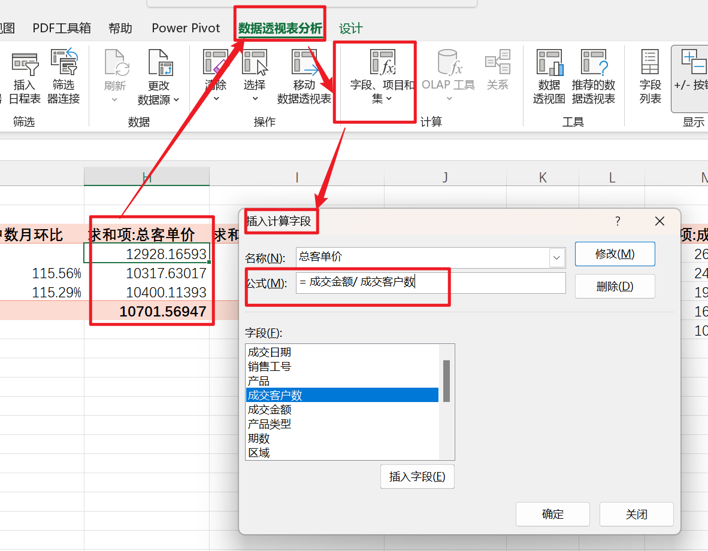
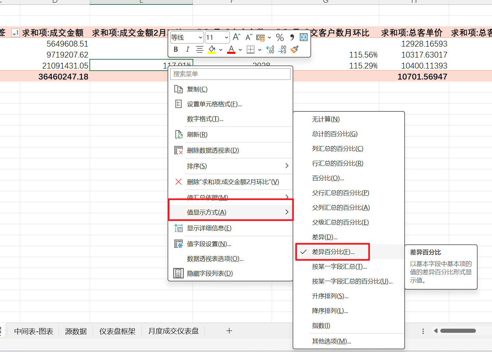
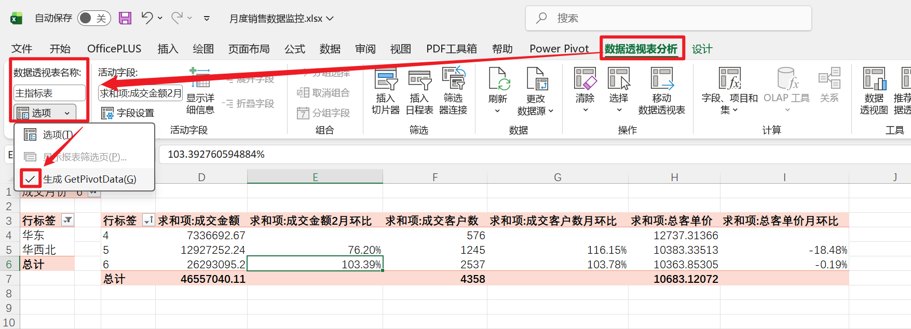
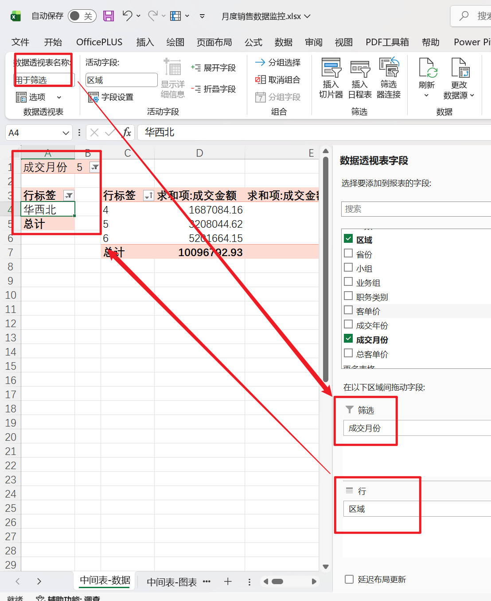
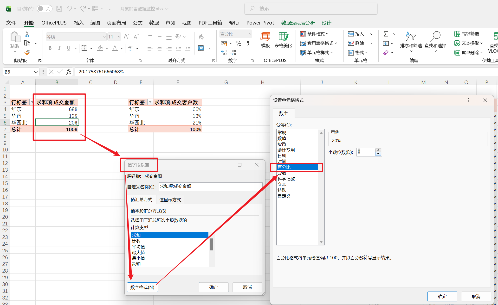
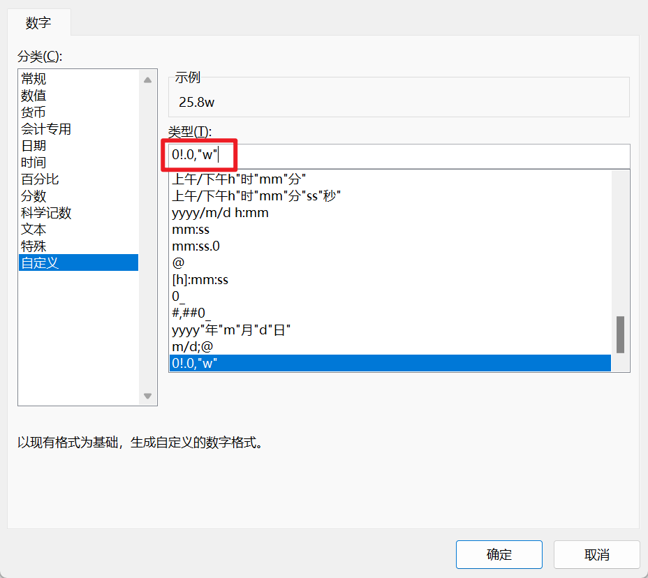
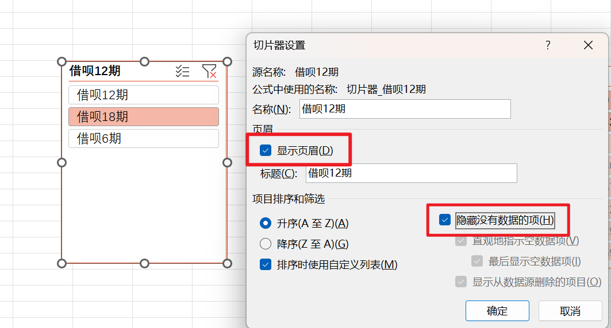
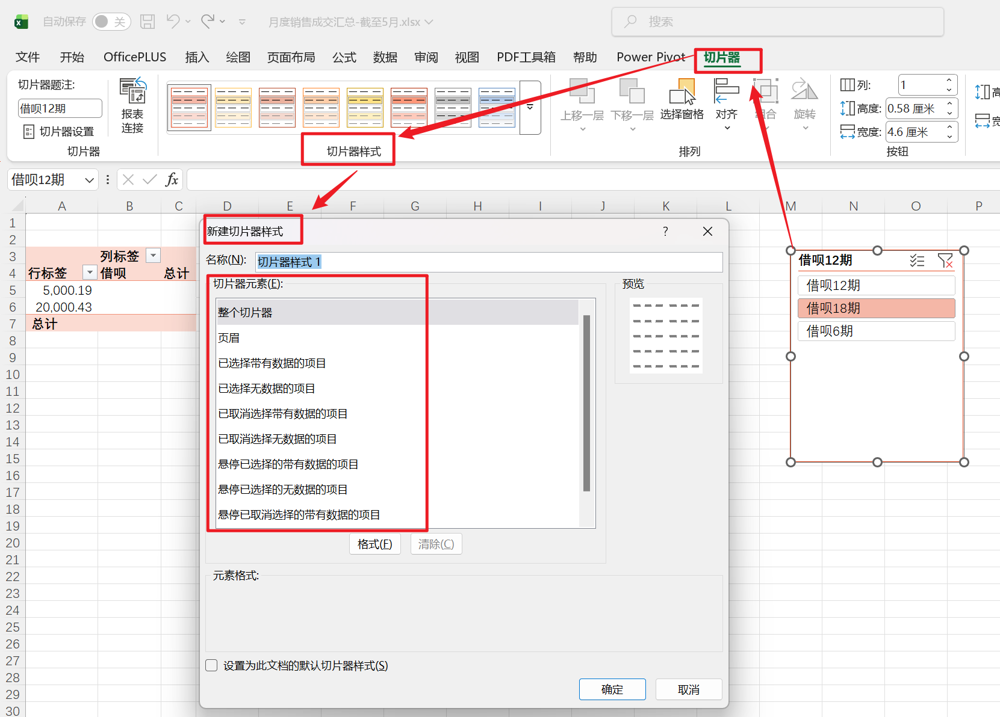
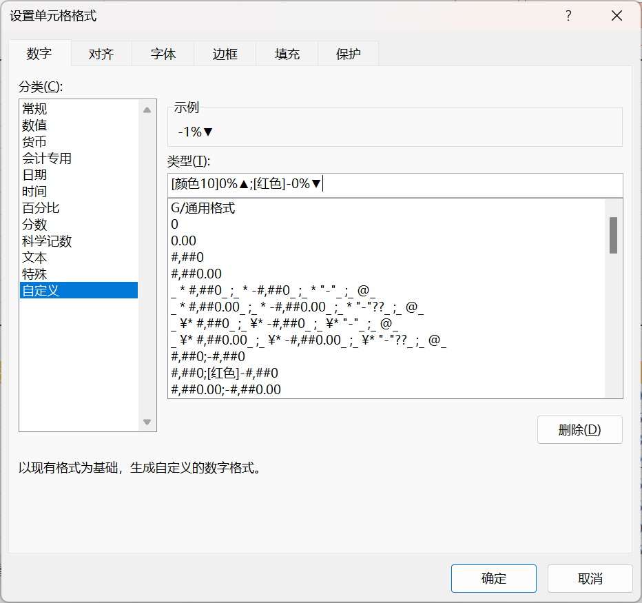

---
tags:
  - Excel
  - 数据透视表
  - 仪表盘
  - 切片器
  - GETPIVOTDATA
  - 动态报表
---

# Excel 仪表盘实战：从数据透视表到交互式动态报表的完整制作流程

<video controls style="width: 100%; max-width: 650px; max-height: 400px; border-radius: 8px; box-shadow: 0 4px 12px rgba(0,0,0,0.15); margin: 20px auto; display: block; background: #000; aspect-ratio: 16/9;">
  <source src="../images3/demo_video.mp4" type="video/mp4">
  您的浏览器不支持 HTML5 视频，请尝试升级浏览器。
</video>

<div style="text-align: center; color: #8a8a8a; font-size: 0.9em; margin-top: -10px; margin-bottom: 2rem;">
  ☝️ <i>以上为仪表盘最终的动态交互效果展示，推荐点击右下角 <b>[全屏]</b> 以获得最佳观感。</i>
</div>

## 写在前面：为什么你需要学会做 Excel 仪表盘？

在日常的数据分析工作中，我们经常面临一个尴尬的场景：**数据加工好了，但用一堆密密麻麻的表格发给领导，对方根本看不到重点。** 仪表盘（Dashboard）正是解决这一痛点的利器——它将关键指标、趋势图表和交互筛选器集中在一个页面，让决策者一眼抓住核心信息。

本文将以一个**月度成交仪表盘**为实战案例，带你从零走通完整的制作流程。内容涵盖：

- **数据透视表**（Pivot Table）的搭建逻辑与计算字段
- **环比分析**的原理与"值显示方式"的高级用法
- **切片器**（Slicer）的核心机制与多表联动
- **GETPIVOTDATA** 函数的结构化引用与动态报表技巧
- **影子透视表**解决切片器筛选导致环比丢失的行业难题
- 图表制作、条件格式、仪表盘布局美化与数据刷新维护

> 文中所有操作基于 **Microsoft Excel 365**，部分界面措辞在不同版本可能略有差异，但核心逻辑一致。

---

## 一、前期准备：规划框架与设定主题

### 1.1 数据还原

在正式操作之前，先将数据还原到只包含 4-6 月的状态，确保后续步骤的演示环境一致。

**操作路径**：工作簿中点击 `表格工具 → 表设计 → 外部表数据 → 刷新`

### 1.2 仪表盘框架规划

动手之前先想清楚"这块画布上要放什么"。下面是本案例的布局规划：

| 区域       | 内容                                                         |
| ---------- | ------------------------------------------------------------ |
| 第一行     | 仪表盘标题                                                   |
| 标题下方   | 主指标：成交金额、成交客户数、客单价（含总值和环比）         |
| 主指标下方 | 环形图：区域成交金额占比、区域成交客户数占比；柱状图：各期数客单价分布 |
| 中部       | 省份成交明细表 + 折线图（每日成交趋势）                      |
| 下部       | 产品成交明细表 + 堆积面积图（各期产品趋势）                  |
| 筛选区     | 月份筛选器 + 区域筛选器（位于标题下方）                      |

!!! tip "布局建议"
    先在纸上或脑中画出大致分区，再开始操作。避免"走一步看一步"导致反复返工。

### 1.3 设置主题色

**操作路径**：`页面布局 → 主题颜色 → 选择红橙色`

**为什么要先设主题色？** 因为 Excel 的图表、切片器、条件格式等组件都会跟随主题色自动配色。先确定主题色，后续所有配色将保持统一——如果日后需要换肤，只需改一次主题色，全局自动同步。

---

## 二、工作表创建：搭建仪表盘的"骨架"

### 2.1 复制目标工作表

按住 ++ctrl++，单击工作表标签并拖动，完成复制，命名为 **月度成交仪表盘**。

### 2.2 创建中间数据表

数据透视表（Pivot Table）是仪表盘的计算引擎。简单来说，它能将大量明细行数据按照你指定的维度（如月份、区域）自动聚合（求和、计数等），省去写大量 `SUMIFS`、`COUNTIFS` 公式的麻烦。

**操作步骤**：

1. 点击元数据工作表中有数据的任意单元格
2. `插入 → 表格 → 表格和区域 → 数据透视表`
3. 放置位置选择：**新工作表**
4. 将新工作表命名为 `中间表-数据`

---

## 三、主指标计算：透视表的核心搭建

### 3.1 基础透视表字段配置

1. 将 **成交金额**、**成交客户数** 拖至**值区域**
2. 将 **成交月份** 拖至**行区域**

这一步完成后，透视表会自动按月份汇总成交金额总和与客户数总和。

### 3.2 创建计算字段：总客单价

**计算字段**（Calculated Field）是数据透视表中的一项强大功能——它允许你基于已有字段定义新的派生指标，而无需在原始数据中新增列。

**操作步骤**：

1. `数据透视表分析 → 计算 → 字段、项目合集 → 计算字段`
2. 名称输入：`总客单价`
3. 公式输入：`=成交金额/成交客户数`
4. 点击确定，删除值中多余的原客单价字段



### 3.3 计算月环比：值显示方式的高级用法

#### 操作步骤

1. 再次将 **成交金额** 拖至值区域（此时值区域中会出现两个"求和项:成交金额"）
2. 右键点击新增的字段 → `值显示方式 → 差异百分比`
3. **基本字段**：成交月份
4. **基本项**：选择 `上一个`（即与前一个月对比，实现环比计算）
5. 点击确定
6. 重命名字段为 `成交金额月环比`



!!! warning "注意"
    月份必须为**升序排序**，否则"上一个"的基准方向会出错。对成交客户数和总客单价重复相同操作即可获得各自的环比。

#### 深入理解：值汇总依据 vs 值显示方式

很多人初学透视表时容易混淆这两个概念。它们是数据透视表处理数据的**两个不同阶段**：

| 特性         | 值汇总依据（第一步）           | 值显示方式（第二步）               |
| :----------- | :----------------------------- | :--------------------------------- |
| **计算对象** | 原始清单中的明细行             | 已经汇总好的数值                   |
| **解决问题** | "一共是多少？"                 | "占多少？比上次多多少？"           |
| **数据形态** | 绝对值（金额、个数、重量）     | 相对值（百分比、排名、差值）       |
| **典型应用** | 计算总销售额、总利润           | 计算环比增长率、市场份额、毛利占比 |

简单来说：

- **值汇总依据**（Summarize Values By）决定了数据如何"聚合"——选求和得到总额，选计数得到笔数。它确定的是计算的**物理量纲**。
- **值显示方式**（Show Values As）决定了聚合后的结果如何"呈现"——比如显示为总计的百分比、与前一期的差异百分比等。它确定的是数据的**分析视角**。

以"差异百分比"为例：透视表先通过"值汇总依据"算出 2 月销售额 100 万、1 月 80 万，再通过"差异百分比"计算 `(100-80)/80 = 25%`。最终单元格显示的不是 100 万，而是 **+25%**。

!!! tip "实用判断法则"
    如果报表里的数字太大、看不出趋势，或者需要做各种占比分析，就去调 **值显示方式**；如果发现数据算错了（该求和的变成了计数），就去调 **值汇总依据**。

---

## 四、切片器：让仪表盘"动"起来的核心控件

### 4.1 切片器是什么？

**切片器**（Slicer）是数据透视表的图形化过滤工具。它用直观的按钮面板替代了传统的下拉菜单筛选，显著提升了数据分析的交互性。

通俗地说，切片器就是一排可以点击的按钮。点哪个，图表和数据就筛选到哪个——所见即所得。

#### 核心功能特性

**直观的交互体验**

- **单选**：直接点击某个按钮
- **多选**：按住 ++ctrl++ 点击多个按钮，或点击切片器右上角的"多选"图标
- **连续选择**：按住 ++shift++ 点击首尾两个按钮
- **清除筛选**：点击切片器右上角的漏斗图标

**多表联动（报表连接）**

这是切片器最强大的高级功能之一。一个切片器可以通过**报表连接**功能同时控制同一数据源下的多个透视表或透视图。只需点击一个切片器，整个页面的图表同步更新——这正是仪表盘实现交互式筛选的底层机制。

**视觉化状态反馈**

切片器按钮的颜色会根据数据状态自动变化：

| 状态           | 含义                                                     |
| :------------- | :------------------------------------------------------- |
| 深色 / 高亮    | 当前已选中的筛选项                                       |
| 浅色 / 常规    | 可选但未选中的项                                         |
| 灰色 / 暗色    | 当前筛选条件下该选项对应的数据为空（互斥项），不可选     |

!!! note "切片器 vs 日程表"
    对于"时间"维度，Excel 还提供了专门的**日程表**（Timeline）工具。切片器适合处理分类数据（姓名、城市等），日程表则为日期格式设计，支持在年、季、月、日之间快速滑动切换。

### 4.2 插入切片器

**操作步骤**：

1. `数据透视表分析 → 筛选 → 插入切片器`
2. 勾选：**区域**、**成交月份**

### 4.3 核心问题：单选月份时环比数据消失

到这里，你可能会兴奋地点击切片器试试效果——然后发现一个严重的问题：

> **单选某个月份（例如 5 月）时，环比数据消失了。**

原因很直观：环比计算需要"上一个"月份的数据作为基准。当切片器筛选为 "5月" 后，透视表里只剩 5 月这一行，4 月的数据被彻底过滤掉，Excel 找不到基准值，环比自然变成空白或报错。

**这是 Excel 仪表盘制作中最经典的实战难题之一。** 接下来介绍的解决方案，是整个仪表盘最核心的技巧。

---

## 五、GETPIVOTDATA 与影子透视表：解决环比丢失的关键技术

### 5.1 先认识 GETPIVOTDATA 函数

要理解解决方案，我们需要先认识一个关键函数。

`GETPIVOTDATA` 是 Excel 中专门用于从数据透视表中**提取特定汇总数据**的函数。它的名称由三个英文词汇组成：

| 词汇    | 含义             | 功能体现                                     |
| :------ | :--------------- | :------------------------------------------- |
| **GET** | 获取 / 提取      | 定义了函数的动作——"定位并抓取"               |
| **PIVOT** | 透视 / 中心枢纽 | 限定了数据来源——来自数据透视表               |
| **DATA** | 数据             | 指代最终返回的结果——经过汇总后的度量值       |

串联起来就是一句指令：**从数据透视表中提取汇总数据**。

#### 函数语法

```excel
=GETPIVOTDATA(data_field, pivot_table, [field1, item1, field2, item2], ...)
```

| 参数                    | 说明                                                         |
| :---------------------- | :----------------------------------------------------------- |
| `data_field`            | 想提取的数值字段名称，需用双引号，如 `"销售额"` 或 `"求和项:利润"` |
| `pivot_table`           | 透视表内任意单元格的引用，告诉 Excel 查哪张表                 |
| `field / item`（可选）  | 查询条件对。`field` 是字段名（如 `"地区"`），`item` 是具体值（如 `"华东"`）。可添加多组 |

#### 核心优势：引用稳定性

传统的单元格引用（如 `=C5`）像"坐标定位"，如果透视表刷新后 "6月" 跑到了另一行，引用就会错位。而 `GETPIVOTDATA` 基于**字段名和项目名**定位，像"按名字找人"——无论数据移动到哪个位置，函数始终能准确抓取。

#### 自动生成与动态引用

Excel 默认开启了自动生成功能：在透视表之外输入 `=` 然后点击透视表内的数值，Excel 会自动生成 `GETPIVOTDATA` 公式，无需手动编写。



但自动生成的公式中，筛选条件是**硬编码**的（如 `"5月"`），向下拖动填充时每行都查找同一个值。进阶技巧是——**把硬编码的参数替换为单元格引用**，让函数"活"起来：

```excel
' 原始（硬编码）：
=GETPIVOTDATA("求和项:成交金额",'中间表-数据'!$C$3,"成交月份",5)

' 改造后（动态引用）：将 5 替换为月份单元格的引用
=GETPIVOTDATA("求和项:成交金额",'中间表-数据'!$C$3,"成交月份",'中间表-数据'!$B$1)
```

这样，当引用的月份单元格值变化时，函数会自动返回对应月份的数据。

!!! tip "开启 / 关闭自动生成的判断法则"
    **默认保持开启**以确保引用的稳定性。只有在需要快速下拉填充公式、或进行临时草稿计算时，再临时关闭。操作路径：`数据透视表分析 → 选项 → 取消勾选"生成 GetPivotData"`。

#### GETPIVOTDATA 使用注意事项

| 注意项               | 说明                                                         |
| :------------------- | :----------------------------------------------------------- |
| 数据必须在透视表中可见 | 如果某项目被切片器过滤掉或被折叠隐藏，函数将返回 `#REF!` 错误 |
| 字段名称需完全匹配   | 参数中的名称必须与透视表中显示的完全一致，如 `"求和项:金额"` 不能只写 `"金额"` |
| 计算性能             | 大量 GETPIVOTDATA 公式时计算速度略慢于简单引用，但日常使用可忽略 |

### 5.2 影子透视表：解决环比丢失的核心方案

现在回到我们的核心问题。解决思路是构建一套**"双表联动"**系统：

```
用户点击切片器 → 影子表捕获选中的月份 → GETPIVOTDATA 从完整的主表中取数 → 环比永不丢失
```

#### 原理拆解

问题的本质在于：切片器直接连接了包含环比计算的主透视表，导致筛选时"上一个月"被删除。

解决方案的核心思想是**"分离筛选动作和数据展示"**：

- 建立一个**影子透视表**（也叫"冗余筛选透视表"），专门响应切片器的筛选动作
- **主指标透视表**不连接月份切片器，始终保持完整数据（所有月份都在）
- 用 `GETPIVOTDATA` 函数从影子表读取"用户选了哪个月"，再到主指标表中精准提取数据

#### 操作步骤

**第一步：创建影子透视表**

1. 复制透视表，将原表命名为 `主指标表`
2. 清空复制后的透视表字段，**仅**在行中放入"区域"，命名为 `冗余筛选`
3. 将"成交月份"放入**筛选区域**

!!! info "为什么把成交月份放到筛选区？"
    放在筛选区的字段始终占据一个**固定的单元格位置**（如 B1），无论切片器怎么切换，月份值永远在这个单元格里。而如果放在"行"中，切换月份后行号会变化，导致引用不稳定。



**第二步：断开主指标表与月份切片器的连接**

右键点击月份切片器 → `报表连接` → **取消勾选**"主指标表"，仅保留"冗余筛选"。

这样一来，无论月份切片器怎么切换，主指标表始终显示所有月份——4 月和 5 月的数据都在，环比计算永远不会因为找不到基准而报错。

**第三步：用 GETPIVOTDATA 函数桥接两张表**

在仪表盘页面中通过函数引用数据，条件参数指向影子透视表中的月份单元格：

```excel
=GETPIVOTDATA("求和项:成交金额",'中间表-数据'!$C$3,"成交月份",'中间表-数据'!$B$1)
```

#### 完整联动逻辑


> **一句话总结**：用一个不显示的透视表捕捉切片器的动作，用函数去一个不被筛选隐藏行的主表里取数，完美解决"筛选导致环比数据丢失"的问题。

!!! note "关于区域切片器"
    区域切片器仍然同时连接两张表。因为按区域筛选不会导致月份缺失（华东区也有 1-12 月的数据），所以不需要解绑。

### 5.3 透视表中数字格式的正确设置方式

在透视表环境中设置数字格式有一个**常见的坑**：直接右键 → 设置单元格格式，虽然当时生效，但透视表一刷新，格式就会**被覆盖还原**。



#### 正确操作路径

1. 右键点击透视表数值区域 → **值字段设置**
2. 点击左下角的 **数字格式** 按钮
3. 在弹出的对话框中选择所需格式（百分比、数值等），设置小数位数

#### 为什么必须走这条路径？

| 设置方式             | 格式绑定对象   | 刷新后       | 百分比处理逻辑                     |
| :------------------- | :------------- | :----------- | :--------------------------------- |
| 直接设置单元格格式   | 绑定单元格位置 | 格式丢失     | 将小数 ×100，可能显示为 2018%      |
| 通过值字段设置       | 绑定字段本身   | 格式保留     | 正确识别已有百分比值，显示为 20%   |

关键区别在于：透视表是动态报表，每次刷新都会重新渲染单元格。通过值字段设置的格式属于**透视表结构的一部分**，刷新后会持久保留；而直接设置的格式只是"贴"在单元格表面，随时会被冲刷掉。

---

## 六、图表制作与美化

### 6.1 区域成交金额环形图

**透视表字段配置**：

- 行：区域
- 值：成交金额
- 值显示方式：总计的百分比
- 数字格式：百分比，0 位小数

**图表创建**：

1. `插入 → 数据透视图 → 饼图 → 圆环图`
2. 右键切片器 → 报表连接：勾选成交月份、区域

**美化要点**：

- 各区域使用差异化填充色（如：华东浅粉色、华南浅绿色、华西北浅金色）
- 隐藏字段按钮、图表标题、图例
- 显示数据标签：勾选"类别名称"，分隔符选"新文本行"
- 形状填充：无；形状轮廓：无（让图表"浮"在仪表盘上）

### 6.2 区域成交客户数环形图

操作同 6.1，仅将值字段改为**成交客户数**。

### 6.3 各期数客单价柱状图

**透视表字段配置**：

- 行：期数
- 值：总客单价
- 数字格式：数值，0 位小数，千位分隔符

**图表创建**：

1. `插入 → 数据透视图 → 柱形图 → 簇状柱形图`
2. 连接切片器：成交月份、区域

**美化要点**：标签位置设为"轴内侧"，颜色选金色，无填充、无轮廓。

### 6.4 区域成交趋势折线图

**透视表字段配置**：

- 行：成交日期
- 列：区域
- 值：成交金额
- 日期格式：`3-14`
- 数值格式：自定义 `0!.0,"万"`



??? note "自定义格式 `0!.0,\"万\"` 的原理解析"
    这个格式代码让大数值以"万"为单位简洁显示（如 258000 → 25.8万），而数值本身不变——依然可以参与公式计算。

    **逐字符拆解**：

    | 代码部分   | 作用                                                     |
    | :--------- | :------------------------------------------------------- |
    | `0`        | 数字占位符，有数字显示数字，没有显示 0                   |
    | `!.`       | 转义字符 `!` + 小数点，强制在此位置插入小数点            |
    | `0`        | 小数点后保留一位数字                                     |
    | `,`        | 末尾逗号，每个逗号将显示值缩小 1000 倍                   |
    | `"万"`     | 在数值后追加文本单位                                     |

    **计算过程**（以 258000 为例）：

    1. 逗号缩放：÷1000 → 258
    2. 强制插入小数点：→ 25.8
    3. 追加单位：→ 25.8万

**图表创建**：

1. `插入 → 数据透视图 → 折线图`
2. 显示数据表
3. 各区域设置对应颜色（华东浅粉、华南浅绿、华西北浅金）

**美化要点**：

- 数据表格式：取消水平 / 垂直边框，显示图例项标识
- 删除左侧坐标轴，图例移至左上角
- 无填充、无轮廓

### 6.5 产品成交趋势堆积面积图

**透视表字段配置**：

- 行：成交日期
- 列：期数
- 值：成交金额

**图表创建**：

1. `插入 → 数据透视图 → 面积图 → 堆积面积图`
2. 图表样式：单色配色

**美化要点**：取消网格线，删除左侧坐标轴，图例移至左上角，无填充、无轮廓。

### 6.6 省份成交明细表

**透视表字段配置**：

- 行：区域、省份
- 值：成交金额、成交客户数、总客单价及对应月环比
- 报表布局：**以表格形式显示**，**重复所有项目标签**
- 分类汇总：不显示
- 总计：对行和列均禁用

**排序设置**：

1. 右键区域字段 → 排序 → 其他排序选项 → 降序排序依据：成交金额
2. 右键省份字段 → 排序 → 其他排序选项 → 降序排序依据：成交金额

**月环比处理**：

- 为省份明细表创建**独立透视表**，仅连接区域切片器（不连接月份切片器）
- 使用 `GETPIVOTDATA` 函数引用数据
- 嵌套 `IFERROR` 函数处理无数据时的错误值

---

## 七、仪表盘布局与美化

### 7.1 整体布局调整

- 插入首行首列以调整元素间距
- 各区域添加浅橙色边框，形成视觉分区
- 主指标居中对齐
- 数值格式：0 位小数，千位分隔符
- 环比格式：百分比，0 位小数

### 7.2 切片器美化

**按钮布局设置**：

- 按钮列数：月份 4 列，区域 3 列
- 高度：1.2 cm
- **取消显示页眉**：去掉字段名标题栏，节省空间、更美观
- **勾选"隐藏没有数据的项"**：消除无效的灰色按钮，防止用户点击后看到空报表



??? note "这两个设置为什么重要？"
    **取消页眉**：切片器默认的页眉占用垂直空间，且在仪表盘中通常已有其他方式标识切片器用途。去掉它后，切片器更像原生 APP 的导航栏，视觉更干净。

    **隐藏无数据项**：多切片器联动时，如果"华北"没有"产品A"，默认情况下"产品A"按钮会变灰但仍显示。勾选隐藏后，无效选项直接消失，用户点击任何可见按钮都保证有结果——真正的"所见即所得"。

**自定义样式**：

1. 新建切片器样式 → 命名为 `个人样式`
2. 整个切片器：边框选择**无边框**
3. 已选择状态：字体加粗，字号 12，无边框，填充浅橙色
4. 已取消选择状态：字号 12，无边框
5. 悬停状态：字体加粗，字号 12，无边框



??? note "切片器样式参数详解"
    自定义样式对话框中的"切片器元素"列表决定了不同交互状态下的视觉表现：

    | 元素类别       | 含义                                                         |
    | :------------- | :----------------------------------------------------------- |
    | 整个切片器     | 整体背景色、外边框和默认字体（"底色"）                       |
    | 页眉           | 顶部标题栏样式                                               |
    | 已选择（有数据）| 用户选中、且有对应数据的按钮样式（通常设为深色高亮）         |
    | 已选择（无数据）| 用户选中、但因联动导致无数据的按钮样式                       |
    | 已取消选择     | 未被选中的按钮样式（可选项为浅色，无数据项为暗淡色）         |
    | 悬停           | 鼠标悬停时的视觉反馈（通常设一个轻微变色效果）               |

    通过精心配置这些参数，可以让切片器从"生硬的 Excel 控件"变成"专业的交互组件"。

**添加标题标签**：

- 插入文本框 → 输入 "月份" / "区域"
- 字体：微软雅黑，14 号，加粗
- 与切片器对齐组合

### 7.3 条件格式

条件格式（Conditional Formatting）是 Excel 根据单元格数值自动改变视觉样式的功能。本案例中用到两种：

| 数据类型   | 条件格式类型   | 效果说明                                                 |
| :--------- | :------------- | :------------------------------------------------------- |
| 绝对值     | **数据条**     | 在单元格内绘制微型条形图，长度代表数值大小               |
| 月环比     | **数据条**     | 可双向显示，正数向右延伸，负数向左延伸                   |
| 占比       | **色阶**       | 用渐变颜色（如绿-黄-红）标识数值区间分布                 |

??? note "数据条 vs 色阶：如何选择？"

    | 特性             | 数据条（Data Bars）         | 色阶（Color Scales）        |
    | :--------------- | :-------------------------- | :-------------------------- |
    | **视觉元素**     | 长度（条形图）              | 颜色（热力图）              |
    | **主要目的**     | 比较个体间的大小差距        | 观察整体数据的分布与区间    |
    | **适用数据量**   | 中少量数据（列向对比）      | 大量数据（全局趋势）        |
    | **正负值表现**   | 优秀（双向延伸）            | 一般（仅靠颜色区分）        |
    | **直观感受**     | "谁比谁多？"                | "哪里是高频区 / 低频区？"   |

    **选择法则**：目标是"比大小"选数据条，目标是"看分布"选色阶。

#### 自定义环比数字格式

**格式代码**：`[颜色10]0%▲;[红色]-0%▼`



这行代码让环比数据自动变色并添加箭头：正值以绿色 ▲ 显示，负值以红色 ▼ 显示——单元格始终保持纯数字，不影响公式计算。

**代码拆解**：

| 部分             | 作用                                   |
| :--------------- | :------------------------------------- |
| `[颜色10]`       | 内置颜色索引，对应深绿色               |
| `0%`             | 整数百分比显示                         |
| `▲`              | 正数后追加向上箭头                     |
| `;`              | 分隔符，分隔正数和负数的格式规则       |
| `[红色]`         | 负数显示为红色                         |
| `-0%▼`           | 保留负号，追加向下箭头                 |

**应用方法**：选中目标单元格 → ++ctrl+1++ → 自定义 → 输入格式代码 → 确定。

!!! tip "扩展格式"
    保留一位小数：`[颜色10]0.0%▲;[红色]-0.0%▼`。不喜欢绿色可将 `[颜色10]` 改为 `[蓝色]`。

### 7.4 底色设置

元数据表：`表设计 → 表格样式 → 橙色底色样式`，与仪表盘整体配色保持一致。

---

## 八、数据刷新与维护

### 8.1 新增数据

1. 将新月份数据放入数据处理文件夹
2. 删除旧月份人员表（如需要）

### 8.2 刷新操作

1. `数据 → 全部刷新`（刷新数据连接）
2. 右键透视表 → 全部刷新（刷新所有透视表和图表）
3. ++ctrl+s++ 保存

!!! warning "刷新顺序很重要"
    先刷新数据连接，再刷新透视表。如果顺序反了，透视表可能基于旧数据计算。

---

## 九、核心知识点速查表

| 功能               | 用途                                                     |
| :----------------- | :------------------------------------------------------- |
| 数据透视表         | 替代 SUMIFS 实现灵活的多维聚合分析                       |
| 计算字段           | 在透视表中创建派生指标（如客单价 = 金额 / 客户数）       |
| 值显示方式         | 在汇总结果上二次加工，计算差异百分比（环比）、占比等     |
| 切片器             | 图形化筛选控件，支持多表联动                             |
| GETPIVOTDATA       | 结构化引用透视表数据，避免布局变动导致引用失效           |
| 影子透视表         | 解决切片器筛选时环比数据丢失的核心技巧                   |
| 条件格式           | 数据条比大小、色阶看分布、自定义格式标涨跌               |
| 主题色             | 一键切换全局配色方案，保持视觉一致性                     |

---

## 十、实战避坑清单

| #   | 注意事项                                                     |
| :-- | :----------------------------------------------------------- |
| 1   | GETPIVOTDATA 函数不要手动编写，应先引用透视表数据再修改参数   |
| 2   | 引用透视表数据时根据需求决定是否开启"生成 GETPIVOTDATA"选项   |
| 3   | 月环比透视表**不能**连接月份切片器，否则单选时环比消失         |
| 4   | 月份必须**升序排列**，环比计算才能正确                         |
| 5   | 透视表数字格式必须通过**值字段设置**修改，直接设置刷新后会丢失 |
| 6   | 全程使用主题色，便于后期一键换色                               |

---

## 写在最后

回顾整个流程，Excel 仪表盘的制作本质上是一套**"数据 → 计算 → 展示 → 交互"**的工程化思路：

1. 用**数据透视表**做后台计算引擎
2. 用**GETPIVOTDATA**做稳健的数据桥梁
3. 用**切片器**做前端交互入口
4. 用**图表 + 条件格式**做可视化呈现

其中，**影子透视表**技巧是整个仪表盘最精妙的设计——它将透视表从"直接展示的报表"转变为"后台数据库"，实现了"筛选不破坏计算"的效果。

如果你正在做月报、季报或管理看板，不妨按照本文的流程实操一遍。掌握了这套方法论，Excel 其实就是你手边最趁手的 BI 工具。

---

> **本文原创，转载请注明出处。如有疑问欢迎评论区交流。**