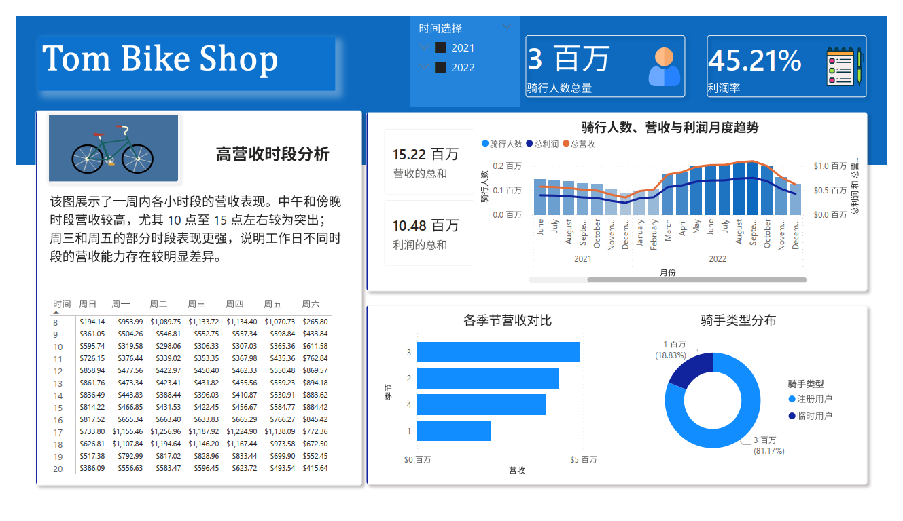
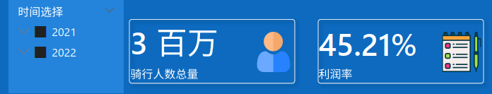
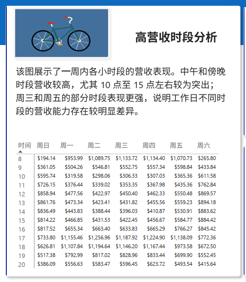
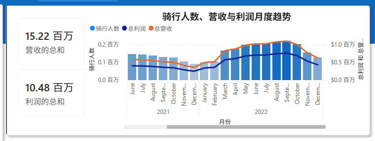
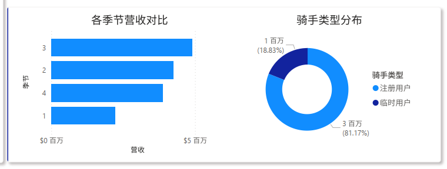
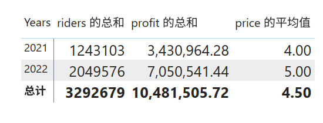

# :material-chart-areaspline: 经营分析深度复盘

!!! note "阅读说明"
    本文基于 `2021` 与 `2022` 双年全选视图，对 Toman Bike Shop 的共享单车经营看板进行逐图复盘。除特别说明外，营收与利润沿用 Dashboard 展示口径：`2021` 单价按 `4.00` 计算，`2022` 单价按 `5.00` 计算。这一口径来自 SQL 处理中将 `price` 转为 `INT` 的步骤，与原始 `cost_table.csv` 中 `3.99 / 4.99` 存在轻微差异，但与看板数值完全一致。

!!! warning "指标命名勘误"
    看板右上角的 `45.21%` 被标记为**"利润率"**，但按现有数值反推，它更接近 `(Revenue - Profit) / Profit`，即成本相对利润的比例。若按标准财务定义，整体利润率应为 `Profit / Revenue = 68.87%`。以下正文保留看板数值，但统一按更严谨的分析术语解读。

[:octicons-arrow-left-16: 返回项目概览](datashow.md){ .md-button }

---

## 1. 仪表板总览



=== "图表目的 / 指标口径"

    这是整套 Dashboard 的首页视图，整合了时间筛选、KPI 卡片、时段热区、月度趋势、季节结构、用户结构和年度对比六类核心信息。默认阅读场景是 `2021 + 2022` 双年汇总，用于回答经营层最关心的**规模、效率、结构与定价**问题。

=== "关键发现"

    - 这套看板覆盖的核心问题可以概括为六项：时段效率、月度趋势、季节结构、用户结构、年度对比，以及明年是否具备继续提价的空间。
    - 页面阅读路径很清晰：先看顶部 KPI 判断总体盘子，再看中部趋势判断增长节奏，最后看底部结构与年度汇总做经营决策。
    - 看板中的每一块图表都围绕 `riders`、`revenue`、`profit` 和 `price` 展开，说明当前分析主线是**经营表现**，而不是用户生命周期或天气归因。

=== "业务含义"

    从信息架构看，这是一张适合**经营复盘和管理汇报**的诊断型看板。它能快速回答"业务有没有增长""增长集中在哪些时段和季节""用户基本盘靠谁支撑""价格是否还有上调空间"这些高层问题，适合作为季度复盘或面试作品中的业务分析案例。

!!! tip "分析边界"
    当前看板适合作为经营诊断看板，不适合作为精细化归因看板，因为**缺少渠道、天气、地区、复购/留存、营销活动**等维度。除非单独切换时间筛选器，否则以下结论默认基于 `2021` 与 `2022` 同时选中的汇总视图。

---

## 2. 筛选器与核心 KPI 解读



=== "图表目的 / 指标口径"

    这一块承担的是"先看总体，再下钻细节"的入口作用。左侧时间切片器支持分别查看 `2021`、`2022` 或双年汇总；右侧两张卡片分别展示总骑行人数和一个被命名为"利润率"的百分比指标。

=== "关键发现"

    - 总骑行人数为 `3,292,679`，卡片上以约 `3 百万` 的形式展示，说明业务规模已经达到百万级别。
    - 总营收为 `15,220,292`，总利润为 `10,481,505.72`，这两组数与 Dashboard 的汇总表完全一致（前提是价格采用整数口径 `4 / 5`）。
    - 卡片中的 `45.21%` **不能直接解释为标准利润率**。按当前看板数值反推，它更接近 `成本 / 利润` 的比例；如果使用标准财务口径，整体利润率应为 `68.87%`。
    - 时间切片器使这套看板具备了年度对比能力，后续每一张图都既可以做单年复盘，也可以做双年合并分析。

=== "业务含义"

    顶部 KPI 说明这不是一个"高收入、低利润"的案例，而是**规模和盈利同时成立**的案例。对于业务方来说，这意味着当前模式不仅有量，而且有足够的利润缓冲；对于分析师来说，这块区域提供了后续所有细分图表的总盘校验基准。

!!! warning "口径提醒"
    正式汇报时不建议继续把 `45.21%` 命名为"利润率"，更稳妥的做法是将其改为 `成本/利润比`，或者直接将 DAX 改写为标准利润率公式：

    ```dax
    Profit Margin = DIVIDE(SUM('view'[profit]), SUM('view'[revenue]))
    ```

---

## 3. 工作时段营收热区分析



=== "图表目的 / 指标口径"

    这张图本质上是 `weekday × hour` 的**平均营收矩阵**，用于识别"一周内哪些时间组合的单位时段营收表现更强"。图中展示的是经营时段内的 `Average Revenue`，不是利润矩阵，也不是原始交易明细。

=== "关键发现"

    - 最强的平均营收组合集中在工作日通勤和下班时段，Top 组合包括 `周二 17:00`、`周四 17:00`、`周二 18:00`，说明工作日傍晚是最稳定的高价值时段。
    - 按总量看，贡献最高的小时分别是 `17:00`、`18:00` 和 `08:00`，对应典型的晚高峰与早高峰，**通勤需求特征**非常明显。
    - 按周内总营收排序，`周五` 和 `周四` 最强，分别约占总营收的 `14.83%` 和 `14.80%`；`周日` 最弱，约占 `13.42%`。
    - 图左侧的数值矩阵与右侧的色阶热区本质上表达的是同一件事，只是一个强调精确数值，一个强调视觉热点。

=== "业务含义"

    这张图最直接的经营价值是**指导运力调度和高峰保障**。若要提升营收效率，优先级应放在工作日 `08:00` 以及 `17:00-18:00` 的车辆供给、调度效率和站点周转上，而不是平均用力。周四、周五强于周日，也说明通勤型需求对整体收入的贡献高于纯休闲型需求。

!!! tip "口径提醒"
    - 这张图更适合回答"**什么时段单位表现更强**"，不适合回答"什么时段贡献了最多总收入"，因为可视化用的是**平均值**而不是总和。
    - 现图不能直接被解释为利润热区，更严谨的表述应是"平均营收更高"或"营收表现更强"。

---

## 4. 月度规模与盈利联动趋势分析



=== "图表目的 / 指标口径"

    这张组合图把月度 `riders`、`revenue` 和 `profit` 放在同一时间轴上观察，核心目的是判断业务规模、收入和盈利是否**同步变化**，以及增长高点与回落时点分别出现在什么时候。

=== "关键发现"

    - `2022` 年整体规模显著强于 `2021` 年，几乎所有月份的指标都高于上一年同期，说明增长不是局部月份的偶发抬升，而是**全年级别的台阶式上移**。
    - 双年趋势都表现为 `年初低位 → 春末夏初抬升 → 8-9 月见顶 → Q4 回落`，呈现非常典型的**季节性经营波动**。
    - `2022 年 9 月` 是全局峰值，当月约有 `218,573` riders、`1,092,865` revenue 和 `751,891.12` profit，是看板中最强的单月表现。
    - 骑行人数、营收和利润走势**高度同向**，说明利润变化主要由规模驱动，而不是由成本结构波动驱动——单量上去，收入和利润几乎同步上去。
    - `2021` 年的阶段性高点出现在 `6 月` 左右（riders `143,512`，revenue `574,048`，profit `396,093.12`），季节性旺季在两年中都存在，只是 2022 的峰值被整体放大了。

=== "业务含义"

    这张图告诉业务方两件事：

    1. **需求增长具有明确的季节节奏**，运力和营销预算不应该按月平均分配；
    2. 当前商业模式下，**利润增长的首要驱动因素是规模扩张**，因此提升高峰月的供给能力，比在低波动月份做零散优化更有价值。

!!! tip "口径提醒"
    - 图表可视窗口看起来像是从 `2021 年中` 开始，但源数据实际覆盖 `2021-01` 到 `2022-12`；这是图表横向滚动带来的展示窗口问题，**不是数据缺失**。
    - 由于利润与营收走势几乎同向，这张图适合判断"规模带动盈利"，但不适合单独用来讨论边际成本变化或精细成本控制。

---

## 5. 季节营收结构与用户类型结构



=== "图表目的 / 指标口径"

    这一组图表分别回答两个结构性问题：营收在不同季节如何分布，以及业务基本盘更多依赖注册用户还是临时用户。左图按季节汇总 `Revenue`，右图按 `rider_type` 汇总 `Riders`。

=== "关键发现：季节营收"

    季节营收排序为 **秋季 > 夏季 > 冬季 > 春季**：

    | 季节 | 营收 | 占比 |
    |:----:|-----:|:----:|
    | 🍂 秋季 | $4,885,995 | **32.10%**（最强） |
    | ☀️ 夏季 | — | 第二 |
    | ❄️ 冬季 | — | 第三 |
    | 🌸 春季 | $2,206,740 | **14.50%**（最弱） |

    秋季营收约为春季的 **2.21 倍**，旺淡季差异非常显著。

=== "关键发现：用户结构"

    | 用户类型 | 骑行人次 | 占比 |
    |:--------:|--------:|:----:|
    | 注册用户（Registered） | 2,672,662 | **81.17%** |
    | 散客（Casual） | 620,017 | 18.83% |

    用户结构呈现非常明显的**"注册用户主导"**特征，业务收入基本盘更依赖稳定、重复使用的会员型需求，而不是一次性体验型需求。

=== "业务含义"

    这组图表的经营结论很明确：

    - **收入高峰集中在夏秋**，决定了资源投放节奏——旺季前需提前准备车辆、站点和维护能力。
    - **用户基本盘高度依赖注册用户**，决定了用户经营重点——最值得持续投入的是提升注册用户**留存与活跃度**。

!!! tip "口径提醒"
    - 饼图展示的是 `Riders` 占比，不是利润贡献占比；不过本案例中用户没有差异化定价，因此它仍然可以作为收入结构的近似 proxy。
    - 季节图是双年汇总结果，能说明季节性模式，但**不能区分**某一年的极端天气、节假日分布或单次活动冲击。

---

## 6. 年度经营对比与定价信号



=== "图表目的 / 指标口径"

    这张汇总表把 `2021` 与 `2022` 的 riders、profit 和 average price 放在同一张表里，核心用途是做**年度经营对比**，并为"明年能否继续提价"提供基础判断。

=== "关键发现"

    | 年份 | Riders | Revenue | Profit | 平均价格 |
    |:----:|-------:|--------:|-------:|:-------:|
    | 2021 | 1,243,103 | $4,972,412.00 | $3,430,964.28 | $4.00 |
    | 2022 | 2,049,576 | $10,247,880.00 | $7,050,541.44 | $5.00 |
    | **同比** | **+64.88%** | **+106.09%** | **+105.50%** | **+25%** |

    - `2021 → 2022`，riders 从 `1,243,103` 增至 `2,049,576`，同比约 **+64.88%**。
    - Revenue 同比约 **+106.09%**，Profit 同比约 **+105.50%**，说明第二年的增长不仅有量的扩张，也有单价提升的**放大效果**。
    - 平均价格由 `4.00` 提升到 `5.00`，但需求没有因涨价而收缩，反而同步增长，说明当前市场对现有价格仍具有较强承受能力。
    - 按标准口径看，两年的利润率都接近 **69%**，说明价格上调后并没有明显破坏整体盈利质量。

=== "业务含义"

    从年度对比结果看，这个案例释放出的主要信号不是"提价一定会带来增长"，而是**"当前价格上调并未压制需求"**。对于经营者来说，这意味着产品在当前市场阶段可能仍有一定的价格弹性空间，但更合理的做法是小步试探，而不是一次性激进加价。

!!! warning "分析边界"
    - 这张表只能说明"涨价与增长**同时发生**"，**不能直接证明**"涨价导致了增长"。真实增长可能同时受到市场扩张、天气、营销、用户习惯变化等多因素影响。
    - 当前样本只有**两年**，适合提出定价假设，不适合单独作为因果定价模型的最终证据。

---

## 7. 结论与建议

### 核心结论

!!! success "三条关键结论"

    1. **双轮驱动增长：** 业务增长来自价格提升与需求扩张的双重作用，而不是单纯依赖某一个因素。
    2. **高价值时段明确：** 工作日通勤高峰（`08:00`、`17:00`、`18:00`）和夏秋旺季是最值得重点保障的资源投放节点。
    3. **注册用户是基本盘：** 这类共享出行业务的稳定性主要来自**高频、重复使用人群**，注册用户留存优先于散客拉新。

### 经营建议

<div class="grid cards" markdown>

-   :material-account-heart:{ .lg .middle } __稳住注册用户__

    ---

    通过会员权益、套餐设计和高峰期服务稳定性，提升核心人群留存与复购频次。

-   :material-truck-fast:{ .lg .middle } __强化高峰供给__

    ---

    把车辆调度、站点补给和维修保障向工作日 `08:00` 与 `17:00-18:00` 倾斜，优先保障高价值时段的运力。

-   :material-weather-sunny:{ .lg .middle } __旺季资源前置__

    ---

    围绕夏秋旺季做资源前置配置，在旺季前完成车辆、人员和维护能力准备。

-   :material-currency-usd:{ .lg .middle } __保守提价策略__

    ---

    若明年继续提价，建议小幅试探（+10%）而非激进加价，并按注册用户与临时用户分群观察接受度与流失率变化。

</div>

### 口径提醒

!!! warning "三点指标口径说明"

    1. 正式汇报时，建议将看板中的 `45.21%` 从"利润率"改为更准确的名称，或直接改写为标准利润率公式 `Profit / Revenue`。
    2. 时段矩阵分析的是 `Average Revenue`，所有结论都应使用**"平均营收表现"**来表述，而不是将其误读为利润表现。
    3. 如果后续要把这套 Dashboard 升级为更完整的经营分析工具，优先补充**天气、渠道、地区、会员留存和营销活动**等维度。

---

[:octicons-arrow-left-16: 返回项目概览与仪表板](datashow.md){ .md-button .md-button--primary }