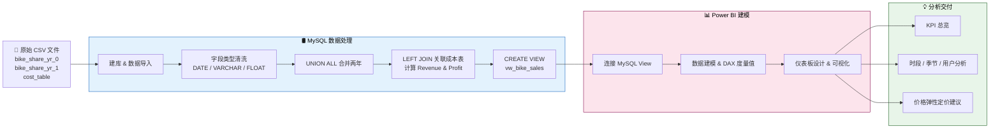

# :material-bicycle: Toman 共享单车经营分析 · Power BI 全流程项目

<div class="grid cards" markdown>

-   :material-database:{ .lg .middle } __MySQL__

    数据库搭建、字段清洗、类型规范化

-   :material-code-braces:{ .lg .middle } __SQL__

    CTE · UNION ALL · LEFT JOIN · VIEW

-   :material-chart-bar:{ .lg .middle } __Power BI__

    数据建模 · DAX · 交互式仪表板

-   :material-lightbulb-on:{ .lg .middle } __业务分析__

    价格弹性推导 · 定价策略建议

</div>

!!! quote "项目一句话"
    基于 2021—2022 双年骑行数据，完成从原始 CSV 到可交互 BI 仪表板的全链路分析，并以价格弹性模型回答客户核心问题：**明年是否具备提价空间？**

---

## :material-play-circle: 在线仪表板

<iframe
  title="bike"
  width="100%"
  height="486"
  src="https://app.powerbi.com/view?r=eyJrIjoiNTZkMGVkZDEtODIwZS00ZGJiLTgzYWMtNGZmOWIzODY3MWNlIiwidCI6IjRiZGI3OTM4LWZlZjctNGMwYy04ZDExLWVmNmY0ZTJjNDZkMCIsImMiOjEwfQ%3D%3D"
  frameborder="0"
  allowFullScreen="true">
</iframe>

[:octicons-link-external-16: 在新标签页打开仪表板](https://app.powerbi.com/view?r=eyJrIjoiNTZkMGVkZDEtODIwZS00ZGJiLTgzYWMtNGZmOWIzODY3MWNlIiwidCI6IjRiZGI3OTM4LWZlZjctNGMwYy04ZDExLWVmNmY0ZTJjNDZkMCIsImMiOjEwfQ%3D%3D){ .md-button }

---

## 一、业务背景

!!! info "客户来信"

    **客户：** Toman Bike Share 运营方  
    **诉求：** 开发一套数据仪表板以支撑经营决策，具体需要：

    - :material-clock-outline: **每小时收入分析**（Hourly Revenue Analysis）
    - :material-trending-up: **利润与收入趋势**（Profit & Revenue Trends）
    - :material-weather-sunny: **季节性收入分布**（Seasonal Revenue）
    - :material-account-group: **骑行者人口结构**（Rider Demographics）
    - :material-palette: 使用企业色系，确保仪表板易于导航操作
    - :material-currency-usd: **针对明年是否提高价格，给出数据驱动的建议**

---

## 二、数据集说明

### 数据来源

数据源自 **Capital Bikeshare（华盛顿特区共享单车系统）**，记录了 2021—2022 年的骑行情况，是数据分析领域的经典教学案例，在 UCI Machine Learning Repository 和 Kaggle 均有收录。

[:octicons-mark-github-16: 查看数据文件](https://github.com/moyan726/data-analytics-notes/tree/main/docs/PowerBI/Bicycle/bike_share_data){ .md-button }

---

### 核心字段说明

=== "骑行数据表"

    `bike_share_yr_0.csv` / `bike_share_yr_1.csv`

    | 字段 | 类型 | 说明 |
    |------|------|------|
    | `dteday` | DATE | 日期 |
    | `season` | VARCHAR | 季节（1:春 / 2:夏 / 3:秋 / 4:冬） |
    | `yr` | VARCHAR | 年份标识（0 → 2021，1 → 2022） |
    | `hr` | VARCHAR | 小时（0-23），用于识别早晚高峰 |
    | `weekday` | VARCHAR | 星期几（0-6） |
    | `workingday` | VARCHAR | 是否工作日 |
    | `weathersit` | VARCHAR | 天气状况（1:晴朗 / 2:多云 / 3:小雨雪 / 4:恶劣） |
    | `temp` / `atemp` | FLOAT | 温度 / 体感温度（归一化处理） |
    | `hum` | FLOAT | 湿度 |
    | `windspeed` | FLOAT | 风速 |
    | `rider_type` | VARCHAR | 骑行者类型：`casual`（散客）/ `registered`（注册用户） |
    | `riders` | INT | **核心度量字段**：该时段骑行人数 |

=== "成本价格表"

    `cost_table.csv`

    | 字段 | 类型 | 说明 |
    |------|------|------|
    | `yr` | VARCHAR | 年份标识（外键，与骑行表 `yr` 关联） |
    | `price` | INT | 单次骑行定价（2021: $3.99 / 2022: $4.99） |
    | `COGS` | FLOAT | 单位销货成本（含折旧、维护、调度等运营成本） |

---

## 三、技术工作流



---

## 四、SQL 数据处理

### 4.1 建库与字段清洗

```sql title="建库 & 字段类型规范化"
CREATE DATABASE bike_data;
USE bike_data;

-- 日期字段：字符串 → DATE 类型
UPDATE bike_share_yr_0
SET dteday = STR_TO_DATE(dteday, '%e/%c/%Y');
ALTER TABLE bike_share_yr_0 MODIFY COLUMN dteday DATE;

-- 分类字段统一为 VARCHAR，数值字段统一为 FLOAT
ALTER TABLE bike_share_yr_0 MODIFY COLUMN season     VARCHAR(50);
ALTER TABLE bike_share_yr_0 MODIFY COLUMN yr         VARCHAR(50);
ALTER TABLE bike_share_yr_0 MODIFY COLUMN rider_type VARCHAR(50);
ALTER TABLE bike_share_yr_0 MODIFY COLUMN temp       FLOAT;
ALTER TABLE bike_share_yr_0 MODIFY COLUMN atemp      FLOAT;
ALTER TABLE bike_share_yr_0 MODIFY COLUMN hum        FLOAT;
ALTER TABLE bike_share_yr_0 MODIFY COLUMN windspeed  FLOAT;

-- bike_share_yr_1 做同等处理
```

### 4.2 多表合并与利润计算（CTE + LEFT JOIN）

```sql title="CTE 多表合并 + 利润计算"
-- 确保关联字段类型一致
ALTER TABLE cost_table MODIFY COLUMN yr VARCHAR(50);

-- 使用 CTE 合并两年数据，LEFT JOIN 成本表，计算收入与利润
WITH cte AS (
    SELECT * FROM bike_share_yr_0
    UNION ALL
    SELECT * FROM bike_share_yr_1
)
SELECT
    dteday,
    season,
    a.yr,
    weekday,
    hr,
    rider_type,
    riders,
    price,
    COGS,
    riders * price                 AS revenue,
    riders * price - COGS * riders AS profit
FROM cte a
LEFT JOIN cost_table b ON a.yr = b.yr;
```

### 4.3 创建视图（VIEW）— 供 Power BI 直接调用

```sql title="创建持久化视图 vw_bike_sales"
CREATE VIEW vw_bike_sales AS
SELECT
    dteday,
    season,
    a.yr,
    weekday,
    hr,
    rider_type,
    riders,
    price,
    COGS,
    riders * price                 AS revenue,
    riders * price - COGS * riders AS profit
FROM (
    SELECT * FROM bike_share_yr_0
    UNION ALL
    SELECT * FROM bike_share_yr_1
) a
LEFT JOIN cost_table b ON a.yr = b.yr;
```

!!! tip "为什么用 VIEW 而不是 CTE？"
    VIEW 在 Power BI 中可作为**持久化数据源**直接连接，无需每次重新执行查询逻辑。相比 CTE（查询结束即消失），VIEW 更适合 BI 工具的数据建模场景，支持重复调用、权限控制，也更便于团队协作。

---

## 五、仪表板解读

### 5.1 全局总览


仪表板分为六个核心模块：**KPI 卡片 · 时段热区 · 月度趋势 · 季节结构 · 用户结构 · 年度对比**。阅读路径从顶部 KPI 判断总体规模，向下依次拆解增长节奏与结构特征，最终支撑定价决策。

---

### 5.2 核心 KPI 总览


<div class="grid cards" markdown>

-   :material-account-multiple: __总骑行人数__

    ---

    **3,292,679**

    双年累计骑行人次，百万级业务规模

-   :material-cash-multiple: __总营收__

    ---

    **$15,220,292**

    双年合计收入

-   :material-chart-line: __总利润__

    ---

    **$10,481,506**

    双年累计利润

-   :material-percent: __利润率__

    ---

    **≈ 68.87%**

    Profit / Revenue 标准口径

</div>

!!! success "关键信号"
    这不是一个「有量无利」的案例——规模与盈利能力**同时成立**，为后续定价调整提供了充足的利润缓冲空间。

---

### 5.3 工作时段营收热区（Weekday × Hour 矩阵）


!!! note "核心发现"

    - **高峰时段：** `08:00`（早高峰）与 `17:00–18:00`（晚高峰）是全周平均营收最强的时间组合，通勤型需求驱动特征极为明显。
    - **强日：** 周四、周五营收贡献分别约占全周的 **14.80%** 和 **14.83%**；周日最弱（约 13.42%）。
    - **经营含义：** 运力调度和车辆补给应优先向工作日通勤高峰时段倾斜，而非平均分配资源。

---

### 5.4 月度规模与盈利联动趋势


!!! note "核心发现"

    - **2022 年全年规模全面高于 2021 年**，台阶式增长而非局部抬升。
    - 双年均呈现 `年初低位 → 春末夏初抬升 → 8–9 月见顶 → Q4 回落` 的季节性波动规律。
    - **全局峰值：** 2022 年 9 月，riders ≈ 218,573，revenue ≈ $1,092,865，profit ≈ $751,891。
    - Riders、Revenue、Profit 走势**高度同向**，当前利润增长的核心驱动力是规模扩张，而非成本压缩。

---

### 5.5 季节营收结构 & 用户类型结构


=== "季节营收分布"

    | 季节 | 营收 | 占比 |
    |:----:|-----:|:----:|
    | 🍂 秋季 | $4,885,995 | **32.10%**（最强） |
    | ☀️ 夏季 | — | 第二 |
    | ❄️ 冬季 | — | 第三 |
    | 🌸 春季 | $2,206,740 | **14.50%**（最弱） |

    秋季营收约为春季的 **2.21 倍**，旺淡季差异显著，需提前做好旺季产能储备。

=== "用户类型结构"

    | 用户类型 | 骑行人次 | 占比 |
    |:--------:|--------:|:----:|
    | 注册用户（Registered） | 2,672,662 | **81.17%** |
    | 散客（Casual） | 620,017 | 18.83% |

    业务基本盘**高度依赖注册用户**，收入的稳定性来自高频重复使用的会员群体，而非一次性体验型散客。

---

### 5.6 年度经营对比 & 定价信号


| 年份 | Riders | Revenue | Profit | 平均单价 |
|:----:|-------:|--------:|-------:|:-------:|
| 2021 | 1,243,103 | $4,972,412 | $3,430,964 | $4.00 |
| 2022 | 2,049,576 | $10,247,880 | $7,050,541 | $5.00 |
| **同比** | **+64.9%** | **+106.1%** | **+105.5%** | **+25%** |

!!! success "关键信号"
    在单价上调 **25%** 的背景下，需求不降反升（+64.9%），利润率维持约 **69%**，说明现有价格在市场上仍有较强承受空间。

---

## 六、核心业务问题：明年是否应当提价？

### 6.1 分析框架：价格弹性三步推导

!!! example "第一步：价格变化率"

    $$\text{价格变化率} = \frac{4.99 - 3.99}{3.99} \approx 25\%$$

    2022 年相较 2021 年，单次骑行价格上涨约 **25%**。

!!! example "第二步：需求变化率"

    以骑手数（riders）作为需求的代理指标：

    $$\text{需求变化率} = \frac{200万 - 120万}{120万} \approx 64\%$$

    价格上涨的同时，骑行需求反而增长了约 **64%**。

!!! example "第三步：价格弹性"

    $$\text{价格弹性} = \frac{\text{需求变化率}}{\text{价格变化率}} = \frac{64\%}{25\%} \approx 2.56$$

### 6.2 弹性解读

在经典经济学中，价格弹性通常为**负数**（价格上升 → 需求下降）。但本案例得到了**正向价格弹性（2.56）**，说明：

- 需求增长**同时受多种因素驱动**（市场扩张、用户习惯变化、城市骑行文化增长等）
- 价格上调未对需求形成明显抑制，**当前市场对价格不敏感**
- 利润结构未因提价而恶化，盈利质量保持稳定

!!! warning "注意边界"
    「价格上涨 25% + 需求增长 64%」**不能**做线性外推。需求的增长背后有多重驱动因素，若贸然大幅提价，可能触及需求天花板。应采用小步试探策略，而非一次性激进加价。

---

## 七、最终建议

!!! success "结论"
    市场当前具备提价空间，但建议采用**保守策略分阶段推进**。

| 方案 | 提价幅度 | 新定价 | 备注 |
|:----:|:--------:|:------:|:----:|
| ✅ 保守方案（推荐） | +10% | **≈ $5.49** | 优先验证市场承受能力 |
| 适中方案 | +15% | **≈ $5.74** | 市场研究充分后考虑 |

**配套行动建议：**

1. :material-account-multiple-check: **细分定价策略：** 注册用户与散客的价格敏感度不同，可考虑差异化定价，保留核心会员忠诚度。
2. :material-monitor-eye: **监控先行：** 提价后重点跟踪 `骑手数变化`、`注册用户流失率`、`季度环比利润率` 三项核心指标。
3. :material-magnify: **进一步市场调研：** 结合客户满意度、竞争格局与宏观经济环境，评估提价幅度取上限还是下限。
4. :material-truck-fast: **旺季运力前置：** 夏秋旺季前完成车辆补给、站点扩容和维护准备，确保高峰期服务质量。

---

## 八、项目技术亮点

<div class="grid cards" markdown>

-   :material-database-cog:{ .lg .middle } __SQL 数据处理__

    ---

    字段类型清洗 · `UNION ALL` 跨表合并 · `LEFT JOIN` 多表关联 · `CTE` 临时查询 · `VIEW` 视图持久化

-   :material-graph:{ .lg .middle } __数据建模__

    ---

    将分散原始表整合为分析就绪的星型结构（事实表 + 维度表），为 Power BI 提供清洁数据层

-   :material-chart-areaspline:{ .lg .middle } __Power BI 可视化__

    ---

    KPI 卡片 · Weekday×Hour 热区矩阵 · 折线/柱状组合图 · 饼图 · 时间切片器 · 交叉筛选

-   :material-brain:{ .lg .middle } __业务分析思维__

    ---

    基于价格弹性模型构建定价建议框架，将经济学概念落地为可执行的运营策略

-   :material-arrow-decision:{ .lg .middle } __端到端交付__

    ---

    业务定义 → 数据获取 → SQL 清洗 → BI 建模 → 可视化 → 定价建议，完整覆盖数据分析全链路

</div>

---

[:octicons-graph-16: 查看经营分析深度复盘](analytics.md){ .md-button .md-button--primary }
[:octicons-mark-github-16: 数据仓库](https://github.com/moyan726/data-analytics-notes/tree/main/docs/PowerBI/Bicycle/bike_share_data){ .md-button }