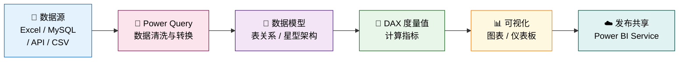

# :material-microsoft-azure: Power BI 商业智能

!!! quote "Power BI 的价值"
    数据只有被看见、被理解，才能驱动决策。Power BI 将原始数据转化为**可交互的视觉故事**，让每一个业务问题都能找到数据答案。

---

## 🧩 项目实战

<div class="grid cards" markdown>

-   :material-bicycle:{ .lg .middle } __Toman 共享单车经营分析__

    ---

    基于 2021—2022 双年骑行数据的全链路 BI 项目：MySQL 数据清洗 → SQL 多表关联 → Power BI 仪表板，以**价格弹性模型**回答定价决策核心问题，仪表板已发布至 Power BI Service。

    `MySQL` `SQL CTE/JOIN/VIEW` `Power BI` `价格弹性分析`

    **关键指标**

    - 📊 总骑行人次：**3,292,679**
    - 💰 双年总利润：**$10,481,506**
    - 📈 利润率：**≈ 68.87%**
    - 🔑 核心发现：价格上调 25%，需求反增 64%

    [:octicons-arrow-right-24: 查看项目展示与仪表板](Bicycle/datashow.md){ .md-button .md-button--primary }
    [:octicons-graph-16: 经营分析深度复盘](Bicycle/analytics.md){ .md-button }
    {: .card-btn-group }

</div>

---

## 📖 Power BI 核心知识

### 什么是 Power BI？

Power BI 是微软推出的商业智能与数据可视化平台，可连接数百种数据源，简化数据准备，并推动即时分析与决策。

<div class="grid cards" markdown>

-   :material-desktop-classic:{ .lg .middle } __Power BI Desktop__

    ---

    免费桌面应用，用于创建报告、构建数据模型和编写 DAX 公式。

-   :material-cloud:{ .lg .middle } __Power BI Service__

    ---

    基于云的 SaaS 平台，用于发布、共享和协作管理报告与仪表板。

-   :material-cellphone:{ .lg .middle } __Power BI Mobile__

    ---

    移动端应用，支持 iOS 与 Android，随时随地查看和交互报告。

</div>

---

### 标准工作流



---

### 核心功能速览

=== "Power Query"

    数据清洗与转换的核心工具，无需写代码即可完成大部分数据处理工作：

    - 合并与追加查询（横向/纵向合并数据）
    - 删除重复项、替换值、筛选行
    - 拆分列、分组聚合、透视/逆透视
    - 自定义列与条件列
    - 数据类型规范化

=== "数据建模"

    通过建立表之间的关系，形成清晰的数据架构：

    | 架构类型 | 特点 | 适用场景 |
    |:--------:|:----:|:--------:|
    | **星型架构** | 一个事实表 + 多个维度表 | 分析型报表（推荐） |
    | **雪花架构** | 维度表进一步规范化 | 数据仓库场景 |
    | 多对多关系 | 使用桥接表处理 | 复杂业务场景 |

=== "DAX 公式"

    Data Analysis Expressions，用于创建计算列和度量值：

    ```dax
    -- 基础聚合
    Total Revenue = SUM('Sales'[revenue])

    -- 同比增长率
    YoY Growth =
    DIVIDE(
        [Total Revenue] - CALCULATE([Total Revenue], SAMEPERIODLASTYEAR('Calendar'[Date])),
        CALCULATE([Total Revenue], SAMEPERIODLASTYEAR('Calendar'[Date]))
    )

    -- 标准利润率
    Profit Margin = DIVIDE(SUM('view'[profit]), SUM('view'[revenue]))
    ```

---

### 版本与价格

| 版本 | 核心特点 | 费用 |
|:----:|:--------:|:----:|
| **Power BI Desktop** | 完整的报告创建与建模能力 | **免费** |
| **Power BI Pro** | 共享与协作，支持发布到服务 | $9.99 / 用户 / 月 |
| **Power BI Premium** | 企业级容量，支持大规模部署 | $4,995 / 容量 / 月 |

!!! tip "学习建议"
    对于学习与个人作品展示，**Power BI Desktop（免费）+ Power BI Service（免费个人版）** 的组合完全足够。Desktop 负责建模与设计，Service 负责在线发布与分享。

---

## 🔗 学习资源

- [:octicons-link-external-16: Power BI 官方文档](https://docs.microsoft.com/zh-cn/power-bi/) — 微软官方中文文档
- [:octicons-link-external-16: SQLBI](https://www.sqlbi.com/) — DAX 与数据建模深度学习资源
- [:octicons-link-external-16: Guy in a Cube](https://www.youtube.com/@GuyInACube) — YouTube 高质量 Power BI 教程频道
- [:octicons-link-external-16: Power BI 社区](https://community.fabric.microsoft.com/t5/Power-BI-forums/ct-p/powerbi) — 官方问答社区