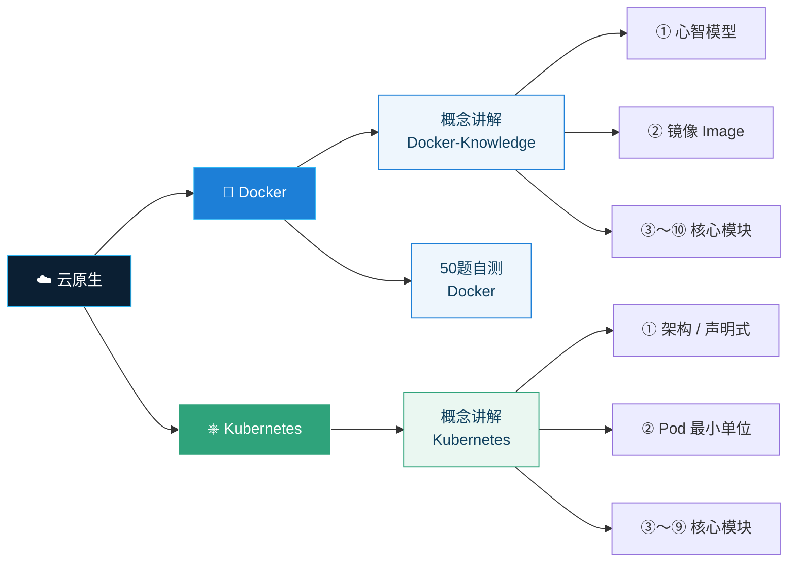

# :material-school: 云原生课程文档

!!! quote "学习思路"
    先建**心智模型**，再记命令。这里的每份文档都遵循同一原则：先用大白话和类比讲清楚「它到底解决什么问题」，再给出对比表和考点框帮你记牢。

---

## 📦 课程一览

<div class="grid cards" markdown>

-   :material-docker:{ .lg .middle } __Docker 零基础教程__

    ---

    从「容器是什么」到镜像、网络、存储、编排全链路，配合 **50 道单选题**将抽象概念转化为可验证的肌肉记忆。

    `镜像 Image` `容器 Container` `Volume` `Network` `Registry` `Compose`

    *   📖 **概念讲解**：10 个模块逐步拆解，每块配类比 + 考点框
    *   ✅ **50 题自测**：题目覆盖全部模块，答案含逐项解析

    [:octicons-arrow-right-24: 概念讲解](Docker-Knowledge.html){ .md-button .md-button--primary }
    [:octicons-checklist-16: 50 题自测](Docker.html){ .md-button }
    {: .card-btn-group }

-   :simple-kubernetes:{ .lg .middle } __Kubernetes 零基础教程__

    ---

    K8s 核心思想只有一句话：**你描述想要的状态，它负责让现实保持在那里**。9 个模块从架构到 kubectl 速查，逐个拆清楚。

    `Pod` `Deployment` `Service` `Ingress` `ConfigMap` `PV/PVC` `kubectl`

    *   🧠 **声明式 + 自愈**：用「恒温空调」类比打通核心思想
    *   🔬 **高频考点**：探针、控制器、RBAC 等易混概念专项整理

    [:octicons-arrow-right-24: 概念讲解](Kubernetes.html){ .md-button .md-button--primary }
    {: .card-btn-group }

</div>

---

## 🗺️ 知识关系



---

## 📋 文档速览

| 文档 | 内容 | 章节数 | 适合阶段 |
| :--- | :--- | :---: | :--- |
| **Docker 概念讲解** | 镜像、容器、网络、存储、Registry、安全、编排 | 10 | 零基础入门 |
| **Docker 50 题自测** | 单选题 + 逐项解析，覆盖全部 10 模块 | — | 学完讲解后巩固 |
| **Kubernetes 概念讲解** | 架构、Pod、控制器、Service、探针、存储、调度、安全 | 9 | 有 Docker 基础后 |

!!! tip "推荐学习路径"

    ```
    Docker 概念讲解  ──▶  Docker 50 题自测  ──▶  Kubernetes 概念讲解
         ↑                      ↑                        ↑
    建立框架                 查漏补缺                  进阶编排
    ```

    每份讲义都建议：**通读一遍建立框架 → 重点反复看类比和考点框 → 合上页面用自己的话复述**。
