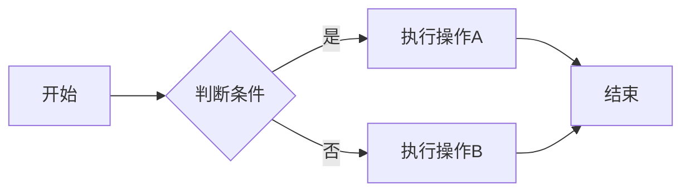
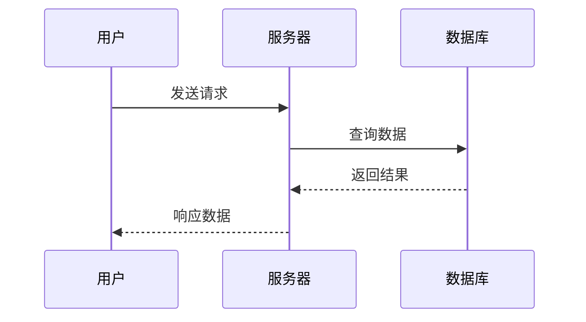
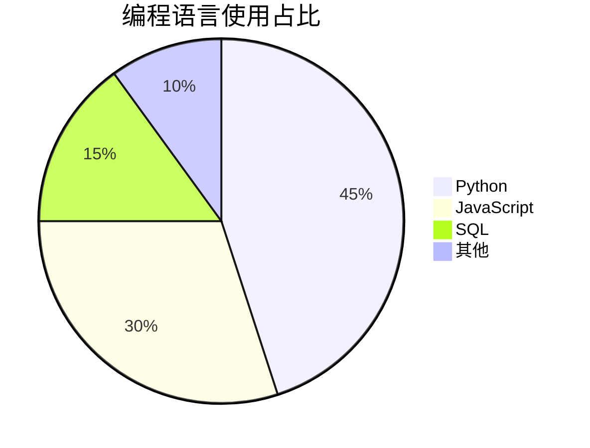

# 🎨 MkDocs Material 功能测试页

本页面展示了所有新添加的 MkDocs Material 主题功能，每个功能都有源码示例和实际效果展示。

---

## 1. Admonition 提示框

### 源码

```markdown
!!! note "笔记"
    这是一个笔记提示框，用于补充说明。

!!! tip "技巧"
    这是一个技巧提示框，分享实用建议。

!!! warning "警告"
    这是一个警告提示框，提醒注意事项。

!!! danger "危险"
    这是一个危险提示框，标记高风险操作。

!!! info "信息"
    这是一个信息提示框，提供相关信息。

!!! success "成功"
    这是一个成功提示框，表示操作成功。

!!! question "问题"
    这是一个问题提示框，用于提出疑问。

!!! example "示例"
    这是一个示例提示框，展示用法。
```

### 效果展示

!!! note "笔记"
    这是一个笔记提示框，用于补充说明。

!!! tip "技巧"
    这是一个技巧提示框，分享实用建议。

!!! warning "警告"
    这是一个警告提示框，提醒注意事项。

!!! danger "危险"
    这是一个危险提示框，标记高风险操作。

!!! info "信息"
    这是一个信息提示框，提供相关信息。

!!! success "成功"
    这是一个成功提示框，表示操作成功。

!!! question "问题"
    这是一个问题提示框，用于提出疑问。

!!! example "示例"
    这是一个示例提示框，展示用法。

---

## 2. 可折叠提示框

### 源码

```markdown
??? note "点击展开笔记"
    这是一个可折叠的提示框，默认收起状态。
    
    可以包含多行内容。

???+ tip "默认展开的技巧"
    这个提示框默认是展开的（注意 `+` 号）。
```

### 效果展示

??? note "点击展开笔记"
    这是一个可折叠的提示框，默认收起状态。
    
    可以包含多行内容。

???+ tip "默认展开的技巧"
    这个提示框默认是展开的（注意 `+` 号）。

---

## 3. 代码块功能

### 3.1 带标题和行号的代码

#### 源码

````markdown
```python title="hello.py" linenums="1"
def greet(name: str) -> str:
    """向用户问好"""
    return f"Hello, {name}!"

if __name__ == "__main__":
    print(greet("World"))
```
````

#### 效果展示

```python title="hello.py" linenums="1"
def greet(name: str) -> str:
    """向用户问好"""
    return f"Hello, {name}!"

if __name__ == "__main__":
    print(greet("World"))
```

### 3.2 代码高亮特定行

#### 源码

````markdown
```python hl_lines="2 3"
def calculate():
    x = 10  # 这行会高亮
    y = 20  # 这行也会高亮
    return x + y
```
````

#### 效果展示

```python hl_lines="2 3"
def calculate():
    x = 10  # 这行会高亮
    y = 20  # 这行也会高亮
    return x + y
```

### 3.3 行内代码高亮

#### 源码

```markdown
使用 `#!python print("Hello")` 来输出文本。

SQL 查询示例：`#!sql SELECT * FROM users WHERE id = 1`
```

#### 效果展示

使用 `#!python print("Hello")` 来输出文本。

SQL 查询示例：`#!sql SELECT * FROM users WHERE id = 1`

---

## 4. 标签页 (Tabs)

### 源码

```markdown
=== "Python"

    ```python
    print("Hello, Python!")
    ```

=== "JavaScript"

    ```javascript
    console.log("Hello, JavaScript!");
    ```

=== "SQL"

    ```sql
    SELECT 'Hello, SQL!' AS greeting;
    ```
```

### 效果展示

=== "Python"

    ```python
    print("Hello, Python!")
    ```

=== "JavaScript"

    ```javascript
    console.log("Hello, JavaScript!");
    ```

=== "SQL"

    ```sql
    SELECT 'Hello, SQL!' AS greeting;
    ```

---

## 5. 任务列表

### 源码

```markdown
- [x] 已完成的任务
- [x] 另一个完成的任务
- [ ] 待完成的任务
- [ ] 还未开始的任务
```

### 效果展示

- [x] 已完成的任务
- [x] 另一个完成的任务
- [ ] 待完成的任务
- [ ] 还未开始的任务

---

## 6. 表格

### 源码

```markdown
| 功能 | 描述 | 状态 |
|:-----|:-----|:----:|
| 代码高亮 | 语法着色显示 | ✅ |
| 暗色模式 | 护眼主题切换 | ✅ |
| 搜索功能 | 全站搜索 | ✅ |
| 数学公式 | LaTeX 渲染 | ✅ |
```

### 效果展示

| 功能 | 描述 | 状态 |
|:-----|:-----|:----:|
| 代码高亮 | 语法着色显示 | ✅ |
| 暗色模式 | 护眼主题切换 | ✅ |
| 搜索功能 | 全站搜索 | ✅ |
| 数学公式 | LaTeX 渲染 | ✅ |

---

## 7. 数学公式 (MathJax)

### 7.1 行内公式

#### 源码

```markdown
爱因斯坦的质能方程：\(E = mc^2\)

勾股定理：\(a^2 + b^2 = c^2\)
```

#### 效果展示

爱因斯坦的质能方程：\(E = mc^2\)

勾股定理：\(a^2 + b^2 = c^2\)

### 7.2 块级公式

#### 源码

```markdown
\[
\int_{-\infty}^{\infty} e^{-x^2} dx = \sqrt{\pi}
\]

\[
\sum_{n=1}^{\infty} \frac{1}{n^2} = \frac{\pi^2}{6}
\]
```

#### 效果展示

\[
\int_{-\infty}^{\infty} e^{-x^2} dx = \sqrt{\pi}
\]

\[
\sum_{n=1}^{\infty} \frac{1}{n^2} = \frac{\pi^2}{6}
\]

---

## 8. Mermaid 图表

### 8.1 流程图

#### 源码

````markdown

````

#### 效果展示


### 8.2 时序图

#### 源码

````markdown

````

#### 效果展示


### 8.3 饼图

#### 源码

````markdown

````

#### 效果展示


---

## 9. Emoji 表情

### 源码

```markdown
:smile: :heart: :rocket: :star: :fire: :thumbsup:

:white_check_mark: 表示完成
:x: 表示失败
:warning: 表示警告
```

### 效果展示

:smile: :heart: :rocket: :star: :fire: :thumbsup:

:white_check_mark: 表示完成
:x: 表示失败
:warning: 表示警告

---

## 10. 文本格式化

### 源码

```markdown
- ^^下划线文本^^
- ~~删除线文本~~
- ==高亮文本==
- ^^**下划线加粗**^^
- H~2~O 表示水的化学式（下标）
- X^2^ 表示 X 的平方（上标）
```

### 效果展示

- ^^下划线文本^^
- ~~删除线文本~~
- ==高亮文本==
- ^^**下划线加粗**^^
- H~2~O 表示水的化学式（下标）
- X^2^ 表示 X 的平方（上标）

---

## 11. 键盘按键

### 源码

```markdown
- 复制：++ctrl+c++
- 粘贴：++ctrl+v++
- 保存：++ctrl+s++
- 撤销：++ctrl+z++
- 全选：++ctrl+a++
```

### 效果展示

- 复制：++ctrl+c++
- 粘贴：++ctrl+v++
- 保存：++ctrl+s++
- 撤销：++ctrl+z++
- 全选：++ctrl+a++

---

## 12. 脚注

### 源码

```markdown
这是一段带有脚注的文本[^1]，脚注可以包含详细说明[^2]。

[^1]: 这是第一个脚注的内容。
[^2]: 这是第二个脚注，可以包含更详细的说明。
```

### 效果展示

这是一段带有脚注的文本[^1]，脚注可以包含详细说明[^2]。

[^1]: 这是第一个脚注的内容。
[^2]: 这是第二个脚注，可以包含更详细的说明。

---

## 13. 定义列表

### 源码

```markdown
Python
:   一种高级编程语言，以简洁易读著称。

MkDocs
:   一个快速、简单的静态网站生成器。
:   专为项目文档设计。
```

### 效果展示

Python
:   一种高级编程语言，以简洁易读著称。

MkDocs
:   一个快速、简单的静态网站生成器。
:   专为项目文档设计。

---

## 14. 缩写词

### 源码

```markdown
HTML 规范由 W3C 维护。

*[HTML]: Hyper Text Markup Language
*[W3C]: World Wide Web Consortium
```

### 效果展示

HTML 规范由 W3C 维护。

*[HTML]: Hyper Text Markup Language
*[W3C]: World Wide Web Consortium

---

## 15. 智能符号

### 源码

```markdown
- 版权符号：(c)
- 注册商标：(r)
- 商标：(tm)
- 箭头：--> <-- <-->
- 分数：1/4 1/2 3/4
- 省略号：...
```

### 效果展示

- 版权符号：(c)
- 注册商标：(r)
- 商标：(tm)
- 箭头：--> <-- <-->
- 分数：1/4 1/2 3/4
- 省略号：...

---

## 16. 图片增强

### 源码

```markdown
{ loading=lazy }
```

### 效果展示

{ loading=lazy }

---

## 🎉 总结

以上功能都已在您的 MkDocs 站点中启用。您可以：

1. **切换主题**：点击右上角的 :material-brightness-7: 图标切换亮/暗模式
2. **使用搜索**：按 ++s++ 或点击搜索框进行全站搜索
3. **代码复制**：鼠标悬停在代码块上，点击复制按钮
4. **返回顶部**：向下滚动后，点击右下角的返回顶部按钮

---

*本页面由 Claude 创建，用于测试 MkDocs Material 主题的各项功能。*
