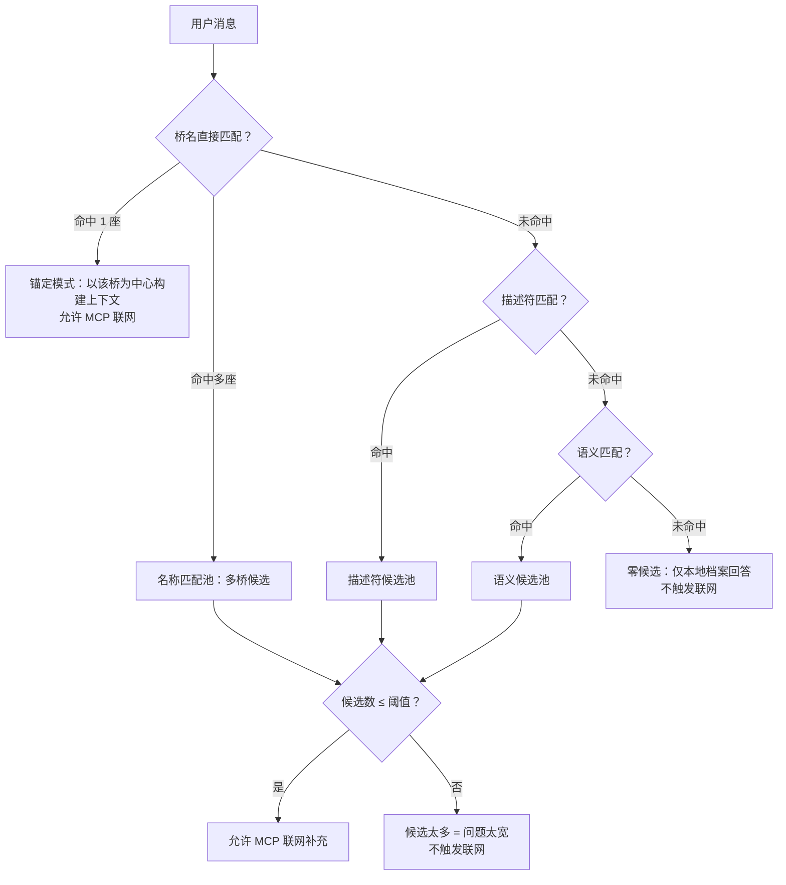

# AI 对话系统深度解析：从自然语言到精准回答的全链路

> 本文是 [主文章](blog_post.md) 中"大模型'乱说'怎么办"的扩展阅读，聚焦于 AI 对话系统内部的工程实现——如何让一个通用大语言模型在 100 座古桥的垂直领域里"只说它该说的话"。

---

## 一、问题全貌

接入 DeepSeek 大语言模型做古桥智能问答后，面临的不只是"模型编造数据"这一个问题，而是一条完整的链路：

1. **用户的话该怎么理解？** —— "帮我看看浙江的廊桥" 是要筛选？还是要问答？
2. **该从哪里找数据给模型？** —— 100 座桥的档案、当前页面的上下文、外部联网搜索，三个来源怎么组合？
3. **模型输出该怎么处理？** —— 模型回答 800 字长文，前端 Markdown 渲染后一团乱麻怎么办？
4. **联网搜索结果该信谁？** —— 搜出来 20 条结果，有知乎帖子、百度百科、地方政府网站，哪些能用？

以下逐一拆解。

---

## 二、意图路由：这句话到底想干啥？

### 2.1 双模式分流

所有用户消息进入同一个 API 入口（`POST /api/ai/dialog`），由 `detect_dialog_mode()` 函数决定走哪条链路：

```text
用户消息
  │
  ├─ 检测到重置/清空意图词（"清空""重置"）  → 筛选模式
  │
  ├─ 检测到回答意图词 + 问号                → 回答模式
  │
  ├─ 检测到筛选意图词（"帮我看""找""筛选"）  → 筛选模式
  │
  ├─ 包含问号                              → 回答模式
  │
  ├─ 包含具体桥名（赵州桥/北涧桥...）       → 回答模式
  │
  └─ 以上都不命中                          → 默认走筛选模式
```

**关键设计决策**：当消息同时包含回答意图和筛选意图时（如"帮我找找赵州桥的历史有什么？"），用**问号**作为仲裁依据——有问号倾向回答，无问号倾向筛选。

### 2.2 筛选模式：正则 + LLM 双重解析

筛选模式的目标是把自然语言转换为结构化筛选条件（省份、时期、桥型、排序方式等）。

#### 第一层：规则解析（`heuristic_parse_message`）

不依赖任何 AI 调用，纯规则驱动：

1. **省份别名映射**：遍历 `PROVINCE_ALIAS_MAP`（覆盖全国 34 个省级行政区的简称/全称/方言称法），按别名长度降序匹配，避免短别名"吞"掉长别名。
2. **时期别名映射**：遍历 `PERIOD_ALIAS_MAP`（秦汉/隋唐/宋代/元代/明清/近现代，以及"唐代""北宋""南宋"等变体），同样按长度降序。
3. **桥型别名匹配**：内置了 `BRIDGE_TYPE_ALIAS_RULES` 和 `QUERY_ONLY_BRIDGE_TERMS`（如"石梁桥""跨海大桥""风雨桥"等系统没有独立筛选字段的概念），后者不做桥型筛选，而是保留到 `query` 做语义检索。
4. **特殊指令**：识别"全国"→清空省份、"清空"/"重置"→全部归零。

#### 第二层：LLM 结构化解析（`build_parse_prompt` → DeepSeek）

规则解析的结果作为 `heuristicHint` 传给 LLM，让模型在此基础上做补充和修正。Prompt 约束要点：

- 只返回 JSON，不输出解释
- 可用键只有 `province`, `period`, `bridgeType`, `tier`, `sortBy`, `query`, `warnings`
- 如果用户只修改部分条件，只返回需要变更的键
- 如果用户只说"桥"或"古桥"，不得擅自推断为具体桥型
- 如果用户提到更细粒度但系统没有独立字段的概念（如"石梁桥""元代"），保留到 `query`

#### 第三层：归一化与安全合并（`normalize_ai_filter_result`）

LLM 的输出不是直接信任的。`normalize_ai_filter_result` 会逐字段验证：

- 省份/时期/桥型必须落在 `filter_options` 的允许值列表内
- 如果用户**未显式提及桥型**但 LLM 自动补了（如用户说"浙江"，模型猜"拱桥"），会被主动丢弃并记录 warning
- LLM 调用失败时自动回退到纯规则解析结果，标注"已回退为规则解析"

这种**规则兜底 + LLM 增强 + 安全校验**的三层架构，保证了筛选结果永远在可控范围内。

---

## 三、候选收敛：先本地、再联网

这是整个 AI 系统最核心的设计——**不是每个问题都触发联网搜索**，而是先在本地 100 座桥的数据中做候选收敛，然后根据收敛结果决定是否需要外部补充。

### 3.1 本地候选三级匹配

`find_local_bridge_candidates()` 实现了三级匹配策略，优先级从高到低：



#### 第一级：桥名直接匹配

`find_direct_bridge_reference_matches()` 在用户消息中搜索所有桥梁的名称和别名（含别名字段 `aliases`），按匹配文本长度加权评分（`len(normalized_item) * 10 + 优先级加分`），选出最佳匹配：

- 如果只匹配到 1 座桥 → 进入"锚定模式"，后续搜索和上下文都围绕这座桥构建
- 如果匹配到多座桥 → 保留多桥候选，继续看能否通过筛选条件缩窄

#### 第二级：描述符匹配

`build_candidate_phrase_terms()` 从消息中提取短语关键词（包括 `QUERY_ONLY_BRIDGE_TERMS` 中出现的术语），然后在每座桥的**描述符字段**（`bridge_subtype` 和 `tag_text`）中做全覆盖匹配：

```python
# 所有短语都必须在至少一个描述符字段中出现
if phrase_terms and all(
    any(term.lower() in field.lower() for field in bundle["descriptors"])
    for term in phrase_terms
):
    descriptor_matches.append(bridge)
```

#### 第三级：语义匹配

`expand_candidate_semantic_terms()` 对关键词做语义扩展（如"跨海大桥"拆为"跨海"、"大桥"→"桥"），然后在每座桥的**语义字段**（summary、summary_long、engineering_keywords、cultural_keywords 等）中搜索。

每座桥的字段池由 `build_local_candidate_bundle()` 构建：

| 层级 | 包含字段 |
|:-----|:---------|
| `names` | `name` + `aliases` |
| `descriptors` | `bridge_subtype` + `tag_text` |
| `semantics` | 上述所有 + `summary` + `summary_long` + `engineering_keywords` + `cultural_keywords` |

### 3.2 联网触发决策

候选收敛完成后，`allow_mcp` 的判定逻辑：

```python
allow_mcp = 0 < candidate_count <= LOCAL_CANDIDATE_LIMIT
```

- **零候选** → 问题太偏，本地没有相关桥梁，不联网（联网也搜不到项目域内的好结果）
- **候选数 > 阈值** → 问题太宽泛，联网意义不大
- **候选数在 1 ~ 阈值之间** → 精准范围，触发 MCP 联网补充

这个设计**把联网搜索当作增强手段而非默认行为**，既节约了 API 调用成本，也避免了低质量外部结果污染回答。

---

## 四、联网搜索与来源过滤

### 4.1 搜索查询构建

`build_search_query()` 不是直接把用户消息转为搜索词，而是根据页面上下文、筛选状态和候选结果来组装搜索查询：

- **详情页场景**：桥名 + 省份 + 桥型 + "中国古桥"
- **单桥锚定**：锚定桥名 + 筛选条件 + "中国古桥"
- **宽泛场景**：所有筛选条件 + 语义扩展词 + "中国古桥"

消息中的口语化噪音（"你能""给我""告诉我""请问"等）会被 `_rewrite_query_for_search()` 去除后再拼入搜索词，总长度限制在 80 字符内。

### 4.2 可信来源三级分类

`web_source_filters.py`（11KB, 424 行）实现了一套完整的搜索结果过滤体系：

| 来源层级 | 判定规则 | 举例 |
|:---------|:---------|:-----|
| **权威来源（primary）** | 域名后缀 `.gov.cn` `.edu.cn` `.ac.cn` `.museum` 或域名含 `museum` `heritage` `unesco` `kaogu` 等 | 故宫博物院、文物保护单位官网 |
| **二级来源（secondary）** | 百度百科、维基百科、搜狗百科、学术平台（CNKI/万方/知网）、官方媒体（人民网/新华网/光明网） | `baike.baidu.com`、`cnki.net` |
| **封锁来源（blocked）** | 域名含 `zhihu` `tieba` `douyin` `bilibili` `weibo` 等 UGC 平台，或内容包含"论坛""报价""排行榜"等噪音词 | 知乎、贴吧、抖音 |

`evaluate_search_result()` 对每条搜索结果做多维评分：

- 来源层级加权（权威 > 二级 > 封锁/过滤）
- 标题/摘要中桥梁相关术语的命中数
- 与当前筛选条件（省份/桥名/桥型）的匹配度
- 不符合桥梁领域的结果直接标记为 `filtered`

### 4.3 搜索上下文精炼

`refine_search_context_for_answer()` 在搜索结果返回后还有一层精炼——根据当前 profile（是单桥精确查询还是宽泛查询）重新评估和筛选搜索结果，记录外部来源被抑制的数量，在回答中体现透明度。

---

## 五、上下文注入：给模型看什么

### 5.1 按页面类型构建上下文

`build_page_context()` 根据用户当前所在页面，构建不同粒度的上下文：

| 页面类型 | 上下文内容 |
|:---------|:-----------|
| `bridge-detail` | 该桥的完整档案（含 summary_long、工程关键词、文化关键词、来源引用）+ 同省相关桥梁（最多 4 座） |
| `explore` | 当前筛选结果（最多 5 座桥的摘要）+ 省域聚合统计 + 来源标签 |
| `home` 及其他 | 全库统计概览（桥梁总数、省份分布、精选案例） |

### 5.2 候选桥梁注入

除了页面上下文，`localCandidateMatches` 会把候选收敛的结果也注入到上下文中——包括每座候选桥的 `name`、`province`、`period`、`bridgeType`、`summary`（截断到 96 字）。

### 5.3 搜索结果注入

如果 MCP 联网搜索被触发且有有效结果，搜索摘要也会一并注入。model 的 user prompt 结构是一个 JSON：

```json
{
  "question": "用户原始消息",
  "parsedSlots": [{"key": "province", "label": "地域", "value": "浙江"}],
  "projectContext": { /* 页面上下文 + 候选桥梁 */ },
  "webSearch": { /* 联网搜索结果（如有）*/ }
}
```

---

## 六、Prompt 工程：14 条输出约束

`build_dialog_answer_prompt()` 中的 system prompt 包含 **14 条格式约束规则**，逐条解释：

| # | 约束 | 目的 |
|:--|:-----|:-----|
| 1 | 优先整理项目内上下文，再参考联网搜索 | 确保本地数据优先 |
| 2 | 联网不可用时只根据项目上下文回答 | 优雅降级 |
| 3 | 只允许：段落、`-` 列表、`>` 引用、`**粗体**`、`==高亮==` | 限制 Markdown 语法 |
| 4 | 允许先写一句简短寒暄，正文必须全部分点 | 统一回答结构 |
| 5 | 不要输出标题 | 避免前端多级标题冲突 |
| 6 | 不要写长篇连续段落 | 保证可读性 |
| 7 | 每个列表项只讲一个点，1-2 句 | 控制信息密度 |
| 8 | 普通句保持正常表达，不得整句加粗 | 避免视觉轰炸 |
| 9 | `**粗体**` 只用于短实体（地名/桥名/术语等） | 精准强调 |
| 10 | `==高亮==` 只允许 1-2 个核心结论 | 高亮限额 |
| 11 | 不要编造来源 | 事实准确 |
| 12 | 不要伪造古籍原文 | 避免虚构引用 |
| 13 | 根据上下文自然作答 | 语感自然 |
| 14 | 结构清晰、便于扫读 | 用户体验 |

这些约束不是"指导建议"，而是**实打实的格式要求**——模型如果违反（如整段加粗），下一步的后处理管线会强制修正。

---

## 七、回答后处理管线

模型输出的原始文本不直接返回前端，而是经过三步规范化：

### 7.1 强调控制（`normalize_answer_emphasis`）

```text
输入：**赵州桥位于河北省石家庄市赵县，是中国现存最早的敞肩式石拱桥**
输出：赵州桥位于河北省石家庄市赵县，是中国现存最早的敞肩式石拱桥
       ↑ 超过 18 字符的粗体被去除
```

```text
输入：==以"虹桥飞架"的形态展现了隋代石作工艺== ... ==古朴典雅== ... ==雕刻精美==
输出：==以"虹桥飞架"的形态展现了隋代石作工艺== ... ==古朴典雅== ... 雕刻精美
       ↑ 第三处高亮被去除（全文限额 2 处）
```

控制逻辑：

- `is_short_emphasis_target(text, max_length)` 判断文本是否适合强调——不含标点、长度不超限
- 粗体阈值：≤18 字符
- 高亮阈值：≤14 字符，且全文累计不超过 2 处

### 7.2 结构化重组（`normalize_answer_markdown`）

如果模型输出的文本**不含列表标记**（`-` 或 `*`），后处理会自动将其重组为分点格式：

1. 去标题：移除所有 `#` 开头的行
2. 压缩空行：3 个以上连续空行压缩为 2 个
3. 段落拆分：按双换行分段
4. 句子拆分：按中文句末标点（`。！？；`）拆句
5. 寒暄提取：如果第一句匹配寒暄模式（≤36 字符），单独保留为引导句
6. 列表生成：其余所有句子自动加 `- ` 前缀，转为分点列表

**最终效果**：无论模型输出什么格式，前端拿到的始终是"（可选的一句寒暄）+ 分点列表"的统一结构。

### 7.3 来源与免责声明（`build_dialog_answer_response`）

根据搜索状态生成不同级别的免责声明：

| 条件 | 免责声明 |
|:-----|:---------|
| 联网成功且保留了有效来源 | "基于当前项目档案与外部参考资料综合生成。" |
| 联网成功但来源被全部过滤 | "本次已检索到外部候选结果，但未达到可信度与匹配度要求，已仅保留项目内来源。" |
| 联网失败 | "本次外部检索失败，已回退本地档案。" |
| 联网未启用 | "仅基于当前项目档案与样本库生成，当前未启用外部补充。" |

这种透明度设计让用户清楚知道回答的数据来源和可信度。

---

## 八、MCP 联网搜索架构

### 8.1 通信协议

联网搜索基于 **MCP（Model Context Protocol）** 标准，通过 `stdio` 协议与本地搜索服务通信。`mcp_search.py`（403 行）实现了完整的 MCP 客户端：

- `SearchSettings` 数据类管理搜索配置（backend/transport/tool_name/timeout 等）
- `MCPSearchBackend` 实现 `stdio_client` 连接管理、工具调用、结果解析
- 支持连接探测（`probe_connection`）和搜索调用（`search`）
- 结果经过 `_normalize_result` → `_extract_payload` → `_extract_rows` → `_normalize_rows` 的层层解析

### 8.2 本地 MCP 服务

`local_mcp_search_server.py`（8.7KB）是一个独立的 MCP 搜索服务实例，实现了 `web_search` 工具的标准化接口。后端通过 `stdio` 协议启动并通信，无需 HTTP 端口暴露。

---

## 九、完整处理流程示例

以用户在探索工作台输入 **"赵州桥是什么年代建的？"** 为例：

```text
1. 意图路由
   - 检测到问号 + 包含桥名"赵州桥" → answer 模式

2. 筛选解析
   - 规则层：未检测到省份/时期/桥型显式筛选词
   - LLM 层：识别出 query: "赵州桥"
   - 归一化：保留当前筛选状态 + query="赵州桥"

3. 候选收敛
   - 桥名直接匹配：命中 1 座（赵州桥，bridge_id: zhaozhou_bridge）
   - confidence: "name"，allow_mcp: true
   - search_anchor: "赵州桥"

4. 上下文构建
   - 页面上下文：探索工作台，当前筛选结果 + 省域统计
   - 本地候选：赵州桥完整档案（名称/省份/桥型/摘要）

5. 联网搜索
   - 搜索词："赵州桥 河北 拱桥 中国古桥 年代 建造 历史"
   - MCP 返回 8 条结果
   - 来源过滤：保留 gov.cn 和百科来源（3 条），过滤 UGC 来源（5 条）

6. Prompt 构建
   - system: 14 条格式约束
   - user: {"question": "赵州桥是什么年代建的？", "projectContext": {...}, "webSearch": {...}}

7. 模型调用 → 后处理
   - 去除整段加粗 → 高亮限额检查 → 自动分点 → 返回前端

8. 响应    
   - mode: "answer"
   - answerMode: "local-plus-web"
   - disclaimer: "基于当前项目档案与外部参考资料综合生成。"
   - sources: [{"title": "赵州桥-河北省文物保护单位", "url": "..."}, ...]
```

---

## 十、设计取舍与反思

### 10.1 为什么不用 RAG + 向量数据库？

100 座桥的数据量用向量数据库属于"大炮打蚊子"。当前方案用 JSON 全量加载 + 正则/关键词匹配就能快速定位候选，响应时间在毫秒级。如果数据扩展到千级以上，再引入 embedding + 向量检索是合理的演进方向。

### 10.2 为什么要在后端做 Markdown 后处理？

一开始我把所有格式约束放在 prompt 里，指望模型"自觉遵守"。但实际测试发现模型会随机违反（尤其是整段加粗这个问题频率很高）。后端后处理是 **最后一道防线**，保证无论模型输出什么，前端拿到的都是一致的、可预期的格式。

### 10.3 联网触发的阈值怎么定的？

`LOCAL_CANDIDATE_LIMIT` 的值是在实际测试中调出来的——太小会导致很多合理问题被拦截，太大会导致联网搜索带回大量不相关结果。当前设定在一个平衡点上，保证"精准问题触发联网、模糊问题先本地消化"。
