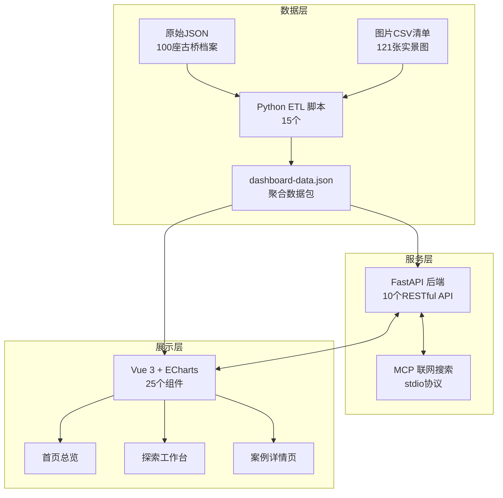
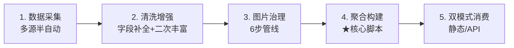

# 用数据讲述中国古桥：从信息架构到 AI 对话的全链路实践

<small>原标题：从零到上线——我如何用 Vue + ECharts + FastAPI 构建了一个古桥时空图谱</small>

> **一句话介绍**：一个支持地图下钻、多维联动筛选、AI 问答的中国古桥数字档案系统，收录了 100 座古桥、121 张实景图片，覆盖 22 个省级行政区。
>
> :material-arrow-right-bold: 深度专题：[AI 对话系统深度解析](ai_deep_dive.md) | [视觉设计系统](design_system.md)

---

## 为什么做这个

我是数据科学与大数据技术专业大三学生，这是我参加 2026 年（第 19 届）中国大学生计算机设计大赛"信息可视化设计——交互信息设计"赛道的作品。

选题的出发点很简单——中国古桥是中华文明物质遗产的重要组成部分，但网上的信息要么是百科词条，要么是零散的旅游攻略，**没有一个地方能让我同时看到"这座桥在哪、什么年代建的、什么结构、有什么故事"**。我想做的不是"桥梁知识百科网页"，而是一个具有时空结构和文化表达的交互探索系统——用户可以在其中从全国格局一路下钻到单桥证据。

---

## 信息架构："时域形义"四维框架

在动手写代码之前，我花了不少时间想清楚一个问题：**100 座桥的信息应该用什么逻辑组织起来？**

最终我选择了"时—域—形—义"四个维度作为整套系统的信息骨架：

| 维度 | 含义 | 在系统中怎么体现 |
|:-----|:-----|:-----------------|
| **时** | 历史时期 | 时期筛选器、时期趋势图、详情页时期标签 |
| **域** | 空间分布 | 中国地图下钻、省域聚合、空间散点 |
| **形** | 结构类型 | 桥型筛选器、桥型分布图、**5 类桥型 AI 结构图鉴**（每类含素描示意图 + 3 条力学/美学解读，详见 [视觉设计系统](design_system.md)） |
| **义** | 人文记忆 | **诗桥轮播**（用 `export_bridge_poetry.py` 从桥梁档案中提取古诗词，首页横向滚动展示）、文化线索深描 |

其中"时"和"域"做主导航，用户主要通过时间和空间进入探索；"形"和"义"做辅助筛选与解释层，用于丰富展示和深化理解。这个框架贯穿了首页总览→探索工作台→案例详情页的三层递进：

- **宏观层（首页）**：建立整体认知，统计指标 + 核心案例入口
- **中观层（探索工作台）**：精准定位，地图下钻 + 多维筛选 + 图表联动
- **微观层（案例详情页）**：深度理解，"图证 + 解释 + 档案"并行的证据型深描

!!! tip "一个设计取舍"
    最初方案里有 5 层页面（首页 → 探索 → 省份下钻 → 桥梁档案 → 重点桥详情），后来我把"省份下钻"合并进了探索工作台的地图交互，"桥梁档案"和"重点桥详情"合并为一个参数化路由 `/bridge/:id`。**从 5 层砍到 3 层**，页面更少但交互更连贯，开发和维护成本也降了一半。

---

## 整体技术架构



### 核心决策：为什么不用数据库？

这个问题我纠结了很久。100 座桥的数据量并不大，如果上 MySQL 或 MongoDB，反而引入了额外的运维成本。最终我选择了 **JSON 文件 + 内存缓存** 的方案：

- Python 脚本预先把原始数据清洗、聚合成一个 `dashboard-data.json`
- 后端启动时一次性加载到内存，用 `@lru_cache` 缓存，所有查询都是内存操作，毫秒级响应
- 前端也能直接读这个 JSON，不依赖后端就能跑起来

方案的好处是**部署极简**（不需要装数据库），坏处是数据更新需要重新跑构建脚本。对于一个比赛项目来说，这个取舍是合理的——项目汇总版思路说明里原话就写了"如果数据规模控制在 100 条左右，暂时不需要引入数据库系统"。

### 前后端技术栈选择

| 层级 | 技术 | 选择理由 |
|:-----|:-----|:---------|
| 前端框架 | Vue 3 + Vite 6 | 组合式 API（Composition API）天然适合复杂交互状态管理 |
| 数据可视化 | ECharts 5 | 原生支持中国地图组件和交互下钻，省去自己画地图 |
| 后端 | FastAPI 0.115 | Python 异步框架，自动生成 API 文档，跟数据处理脚本同语言 |
| 安全渲染 | markdown-it + DOMPurify | AI 回答需要渲染 Markdown，但必须防 XSS 攻击 |
| 联网搜索 | MCP 协议 | MCP（Model Context Protocol）标准化接入本地搜索服务 |

!!! note "技术选型的另一个背景"
    早期方案讨论过用 Dash/Streamlit 这种纯 Python 方案快速出原型，后来考虑到地图下钻动画、页面转场和高度定制的视觉风格，最终选了 Vue + ECharts 的前后端分离方案。虽然开发量更大，但在"作品感"上确实拉开了差距。

### 水墨主题色板

所有 ECharts 图表不使用官方默认色板，而是通过 `chartTheme.js` 统一配置了一套"古纸水墨"色系——`Bridge Brown #6a4735`（桥木褐）、`River Blue #4f7681`（河川蓝）、`Earth Orange #c57b3a`（土壤橙），地图底色为暖纸色 `#f7eee2`。所有 tooltip 用古纸底 + 暖色阴影 + 圆角，让图表看起来像旧纸上的舆图而非冰冷的 BI 仪表盘。详见 [视觉设计系统](design_system.md)。

---

## 三个最有挑战的技术点

### 难点一：12 个面板如何联动不卡？

**问题**：探索工作台有 4 个筛选器、6 类图表、1 个地图、1 个列表，一共 12 个交互面板。用户改了任何一个筛选条件，其他 11 个面板都要同步更新。最初的实现直接就卡了。

**思考过程**：一开始我想用事件总线（EventBus），让每个面板都监听筛选事件，但这样会导致事件风暴——一次筛选触发 11 次事件，每次事件又可能触发后续联动，很容易出循环依赖。

**最终方案**：利用 Vue 3 的 `ref` + `computed` 构建 **单一数据源 → 派生计算** 的响应式链条：

```javascript
// 伪代码示意
const province = ref(null)      // 筛选状态
const period = ref(null)
const bridgeType = ref(null)

// 所有面板通过 computed 自动订阅
const filteredBridges = computed(() => {
  return allBridges.filter(b =>
    (!province.value || b.province === province.value) &&
    (!period.value || b.period === period.value) &&
    (!bridgeType.value || b.type === bridgeType.value)
  )
})
```

筛选状态只有一份，所有下游面板都是"被动计算"，不存在事件打架的问题。Vue 的响应式系统会自动做依赖追踪和批量更新，性能也比手动管理好得多。

一个附加的细节：`LinkedFilterSelect` 组件（9.4KB，不是一个简单的 `<select>`）实现了选项数量的实时统计——选了"浙江"之后，时期筛选器里每个选项会显示"浙江有多少座这个时期的桥"。这个计数值也是 `computed`，是对 `filteredBridges` 做二次分组聚合得来的，帮助用户判断"选了这个选项后还有多少结果"。

---

### 难点二：地图下钻的双向同步

**问题**：中国地图支持点击省份"下钻"到省域视图，但地图旁边还有一个省份下拉筛选器。**用户既可以点地图选省，也可以用下拉框选省，两条路径必须完全一致**。

**思考过程**：如果地图和筛选器各自维护自己的选中状态，就很容易出现"地图选了浙江，但筛选器还显示全国"的 bug。这个方案在项目早期思路文档里就被讨论过——最终确定采用"地图高亮点击为主，侧边栏筛选为辅"的混合交互方案。

**最终方案**：让地图和筛选器**共享同一个 `ref` 变量**。地图的 `click` 事件修改这个变量，筛选器的 `change` 事件也修改这个变量，两者都通过 `watch` 监听同一个状态去更新视图。这不是什么高深的技术，但在实际实现中非常容易被忽略。

改完之后的连带效果：散点图只显示当前省的桥梁点位，排名图自动切换为省域统计，时期趋势图也同步更新——因为它们都从同一个筛选状态派生。

后端的 `filter_bridges()` 函数还维护了两张完整的别名映射表——`PROVINCE_ALIAS_MAP` 覆盖了全部 34 个省级行政区的简称、全称和方言称法（如"晋"→"山西"、"鄂"→"湖北"），`PERIOD_ALIAS_MAP` 覆盖了中国主要历史朝代的常见别名（如"唐代"→"隋唐"、"北宋"/"南宋"→"宋代"、"两汉"→"秦汉"）。无论用户用什么方式表达，系统都能收敛到正确的筛选值。

---

### 难点三：大模型"乱说"怎么办

**问题**：接入大语言模型（DeepSeek）做古桥问答后发现一个严重问题——模型会"编造"不存在的古桥数据，或者把甲桥的建造年代安到乙桥头上。

**思考过程**：通用大模型对这种垂直领域的知识掌握不准确是正常的，核心思路是 **约束模型只能用我提供的数据来回答**。

**最终方案**：

1. **数据注入上下文**：每次对话请求，自动根据用户所在页面类型（首页/探索/详情）构建不同粒度的上下文——详情页注入该桥完整档案 + 同省相关桥梁，探索页注入当前筛选结果摘要，首页注入全库统计概览。要求模型"仅基于以下资料回答"
2. **来源过滤**：联网搜索环节用 `web_source_filters.py` 中的可信来源三级分类（11KB / 424 行的过滤规则）——权威来源（`.gov.cn` / `.edu.cn` / `.museum`）、二级来源（百科 / 学术平台）、封锁来源（知乎 / 贴吧 / 抖音等 UGC），每条搜索结果按来源层级 + 桥梁术语命中数 + 筛选条件匹配度综合评分
3. **双重解析**：自然语言筛选请求先用正则表达式提取"浙江""宋代"这类确定性实体，提取不到的部分再交给模型做语义理解；LLM 返回的结果还要经过归一化校验——如果用户未显式提及桥型但模型自动补了，会被主动丢弃
4. **候选收敛**：每次回答前先在本地 100 座桥中做 **name → descriptor → semantic** 三级候选匹配，只有候选数精准（1~N 条）时才触发 MCP 联网补充；零候选或候选过多都不联网。这个机制把联网搜索当作增强手段而非默认行为
5. **格式约束 prompt**：system prompt 中定义了 14 条排版规则——只允许段落/列表/引用/粗体/高亮 5 种 Markdown 语法，粗体仅用于短实体（桥名/朝代/术语，不超过 18 字符），高亮每次回答最多 2 处，禁止整句加粗和标题
6. **回答后处理管线**：模型输出经过 3 层后处理——去除标题符号、超长粗体自动去除、高亮限额强制执行，连续段落自动拆为分点列表。无论模型输出什么格式，前端拿到的始终是"（可选寒暄）+ 分点列表"的统一结构
7. **密钥收敛**：所有模型调用全部收敛到服务端，前端不接触 API Key，也不暴露任何 MCP/AI 配置入口

!!! info "深度阅读"
    以上 7 点只是摘要。完整的 AI 对话系统架构拆解——包括意图路由决策树、三级候选匹配算法、MCP 联网搜索协议、Prompt 14 条约束逐条解释、后处理管线代码走读——请参阅 [AI 对话系统深度解析](ai_deep_dive.md)。

!!! warning "一个真实的安全教训"
    最开始我把大模型的 API Key 放在前端环境变量里直接调用。后来被指出这是一个安全隐患——前端代码是公开的，Key 会泄露（实际上确实泄露过一次，紧急轮换了密钥）。这件事让我深刻理解了"密钥只保存在服务器 `.env`"这个原则。

---

## 数据处理管线（ETL）

这是我在整个项目中最熟悉的部分。整条管线涉及 15 个 Python 脚本，数据从采集到可用经过 5 个阶段：



| 阶段 | 做了什么 | 关键脚本 |
|:-----|:---------|:---------|
| 数据采集 | 多来源收集古桥信息，半自动 + 人工校验 | `bridge_image_crawler.py` |
| 清洗增强 | 字段补全、二次丰富（工程参数+文化线索） | `augment_bridge_workbook.py`、`second_pass_bridge_enrich.py` |
| 图片治理 | 多来源图片统一治理：采集→校验→精选→审核 | 6 个脚本协同 |
| 聚合构建 | 合并 JSON + CSV，生成前端可用的聚合数据包 | `build_dashboard_data.py` ★ |
| 双模式消费 | 静态读取 or API 查询，自动切换 | `dashboardData.js` |

### 图片治理：最耗时间的环节

100 座桥、121 张图，来源包括网络采集、官方渠道和人工补充。这三类来源的命名规则、分辨率、元数据格式完全不同。我设计了一套多轮管线：

> 种子采集 → 官方渠道补充 → 人工校验同步 → 精选筛选 → 审核报告 → 运行时目录构建

最终每张图片都记录了归属桥梁、图片类型（主视图/远景/细节/碑刻等）和排序权重，输出为 `bridge_images_program_ready.csv`。前端的 `BridgeImage` 组件还内建了图片加载失败的占位图降级逻辑——如果某座桥的图片没找到，不会白屏，而是显示一个桥型轮廓的占位图。

### 核心构建脚本

`build_dashboard_data.py` 是整条链的"汇合口"——它把 `bridges_program_ready.json`（100 座桥的主档案）和 `bridge_images_program_ready.csv`（图片清单）合并，输出一个 `dashboard-data.json`，包含桥梁列表、统计总览、省域聚合、筛选选项等所有前端需要的数据。运行一次 `npm run data:build` 就能完成整个构建。

---

## 设计决策复盘：双模式架构

这是我印象最深的一个设计决策。

最早的版本只有 API 模式——前端调后端，后端查数据。但有一次在没网的教室里演示，页面一片空白。这让我意识到一个问题：**比赛评审的网络环境是不可控的**。

于是我加了"静态模式"：前端直接读 `dashboard-data.json`，所有筛选、排序、统计逻辑在前端用纯 JavaScript 实现。两种模式通过服务层（`dashboardData.js`，264 行）统一接口，页面组件完全不需要知道当前跑的是哪种模式：

```text
应用启动 → 检测 VITE_API_BASE 环境变量
  ├── 配置了 → API 模式（动态查询 + AI 问答）
  └── 没配置 → 静态模式（前端独立运行，所有功能可用）
```

静态模式下的前端搜索也不是简单的字符串匹配——`dashboardData.js` 内置了一张语义扩展词表（`SEMANTIC_QUERY_TERMS`："跨海"/"风雨桥"/"古渡"/"修缮"/"诗文"/"典故"等），`splitQueryTokens()` 会把用户输入拆分为多级 token 做组合匹配。在不依赖后端的情况下也能处理"语义相近"的查询。

这个双模式设计实现了**体验下限与能力上限的双重保障**：

- 静态模式保障了无后端环境下的完整展示能力，适用于脱机演示、竞赛评审
- API 模式在此基础上叠加动态查询与智能问答，适用于在线服务场景

---

## 部署：从本地到线上的真实经历

系统部署在阿里云香港 ECS（Ubuntu 22.04, 2 vCPU / 4 GiB）上，采用 Nginx + systemd 单机部署方案：

```text
浏览器请求 → Nginx (80端口)
  ├── /                       → 前端 dist 静态资源
  ├── /assets/bridge_images/  → 桥梁实景图片
  └── /api/*                  → 反向代理至 FastAPI (127.0.0.1:8000)
```

??? example "部署中印象最深的一个坑"
    上线后发现 AI 联网搜索功能一直显示 `searchBackend=disabled`，排查了半天 MCP 配置，最后发现根因不是代码问题——是之前手动启动 `uvicorn` 测试时的旧进程占住了 8000 端口，systemd 启动的新进程绑定失败但没报错，Nginx 一直把请求转发到那个不加载 `.env` 的旧进程上。用 `ss -ltnp | grep ':8000'` 对比 PID 才发现问题。这件事让我养成了一个习惯：**每次更新后必须检查 `/api/health` 和 `/api/ai/config`**。

选择香港节点而不是内地节点，是因为比赛阶段来不及走域名备案。香港 ECS 可以直接通过公网 IP 访问，比"本地电脑 + 内网穿透"稳定得多。

---

## 项目规模量化

| 维度 | 规模 |
|:-----|:-----|
| 前端 | 4 个页面 + 25 个组件 + 6 类 ECharts 图表 |
| 后端 | 1 个 FastAPI 主模块（1662 行 / 94 个函数），10 个 RESTful API 分三类：数据查询（4）、AI 对话（3）、系统运维（3） |
| 数据处理 | 15 个 Python ETL 脚本，从采集到消费覆盖 5 个阶段 |
| 样式系统 | 8145 行 CSS，统一"古纸水墨"视觉语言 + 自定义 ECharts 主题 |
| AI 对话 | 14 条 system prompt 约束 + 3 级候选收敛 + 3 步回答后处理 + 11KB 可信来源过滤规则 |
| 数据规模 | 100 座古桥 x 22 省 x 121 张实景图 x 6 个历史时期 x 5 种桥型 |

---

## 现在的状态和后续计划

系统已经部署上线，目前的规模：

- [x] 100 座古桥主样本库，18 个核心深度案例
- [x] 22 个省级行政区覆盖，121 张实景图片
- [x] 3 个主页面 + 1 个方法论说明页 + 10 个 RESTful API + 6 类交互图表
- [x] 地图下钻 + 多维联动筛选 + AI 智能问答
- [ ] 数据从 100 座扩展到更大规模
- [ ] 移动端适配优化
- [ ] 接入域名和 HTTPS

比赛还在进行中，线上版本持续迭代。

---

## 写在最后

做这个项目最大的感受是：**数据的"最后一公里"比想象中难太多了**。采集 100 座桥的数据不算难，但要把它们清洗成一致的格式、配上对的图片、组织成合理的信息层次，最后还要让用户在界面上"顺着思路"找到想看的东西——这个过程让我对"数据产品"这四个字有了完全不同的理解。回头看，早期花在信息架构设计上的时间（"时域形义"框架、三层递进逻辑、五层砍到三层的页面结构），是整个项目最值得的投入。

如果用一句话总结这个项目的技术关键词：**"结构化数据 x 受控 AI x 无损降级"**——用信息架构让 100 座桥的混杂数据各就各位，用 prompt 约束、候选收敛和排版后处理让 AI 只说它该说的话，用双模式架构保证任何网络环境下都能完整运行。

---

> **延伸阅读**
>
> - [AI 对话系统深度解析](ai_deep_dive.md)：意图路由、三级候选收敛、联网搜索过滤、Prompt 14 条约束、回答后处理管线
> - [视觉设计系统](design_system.md)：古纸水墨色板、字体降级链、Surface 面板系统、桥型 AI 图鉴、交互微动效

*[ETL]: Extract-Transform-Load，数据抽取-转换-加载流程
*[SPA]: Single Page Application，单页应用
*[MCP]: Model Context Protocol，模型上下文协议
*[B/S]: Browser/Server，浏览器/服务器架构
*[GeoJSON]: 一种基于 JSON 的地理空间数据格式
*[API]: Application Programming Interface，应用程序编程接口
*[XSS]: Cross-Site Scripting，跨站脚本攻击
*[ECS]: Elastic Compute Service，弹性计算服务
*[LLM]: Large Language Model，大语言模型
*[UGC]: User Generated Content，用户生成内容
*[RAG]: Retrieval-Augmented Generation，检索增强生成

