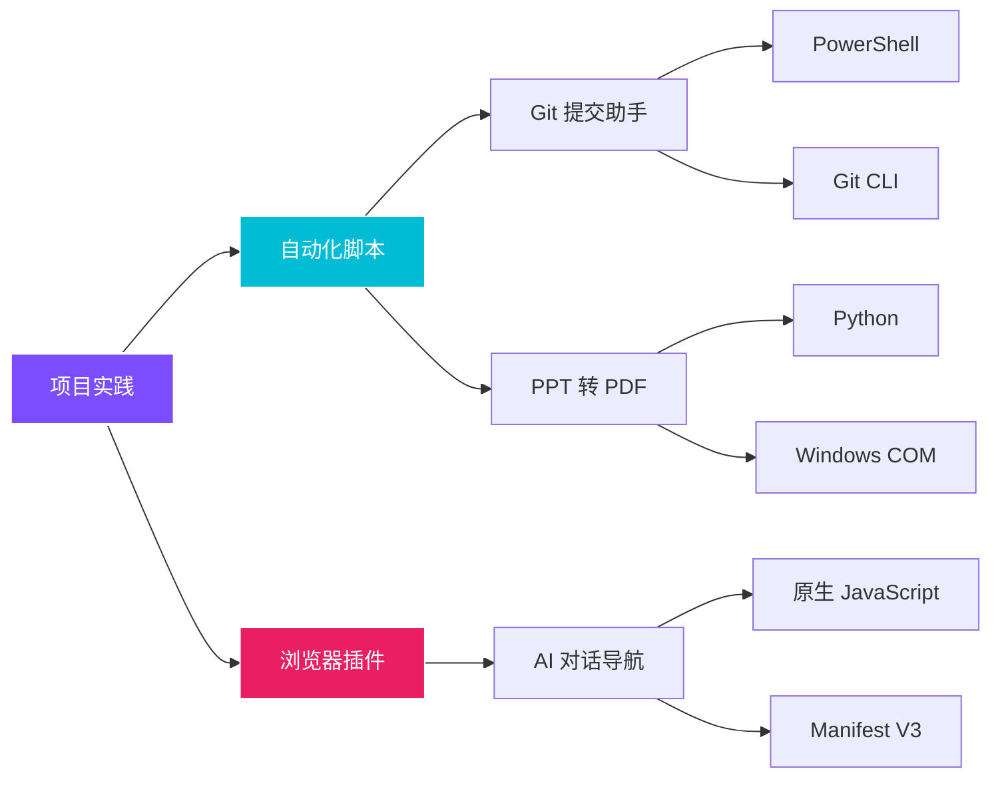

# :material-hammer-wrench: 项目实践

!!! quote "造轮子的价值"
    最好的学习方式是**解决自己的真实痛点**。这里收录的每个项目都源于日常工作中遇到的实际问题——从 Git 提交效率、文件格式转换到 AI 对话体验优化。所有项目均附完整源码，可直接复用。

---

## 🧩 项目总览

-   :material-git:{ .lg .middle } __Git 交互式提交助手__

    ---

    PowerShell 脚本，解决多文件改动时"一锅端"提交的痛点。

    `PowerShell` `Git` `CLI` `自动化`

    *   ✨ **分批提交**：按编号选择文件，一次提交一组
    *   🛡️ **安全防护**：敏感文件警告 + 大文件提醒 + 主分支保护
    *   📊 **遗漏检测**：实时统计已提交/剩余文件，退出前二次确认
    *   🎨 **可视化**：彩色状态标识、进度统计、会话汇总

    [:octicons-arrow-right-24: 查看完整文档](myself_tools/Git_Interactive_Commit_Tool.md){ .md-button .md-button--primary }

-   :material-file-pdf-box:{ .lg .middle } __PPT 批量转 PDF 工具__

    ---

    Python 脚本，通过 Windows COM 接口调用 PowerPoint 原生导出能力。

    `Python` `COM` `自动化` `办公效率`

    *   📁 **批量处理**：自动扫描文件夹中所有 `.ppt` / `.pptx` 文件
    *   🎯 **高保真**：调用 PowerPoint 原生引擎，格式零损失
    *   🔄 **容错设计**：单文件失败不中断全局，`try/finally` 确保资源释放
    *   📈 **进度反馈**：实时显示转换进度与成功/失败统计

    [:octicons-arrow-right-24: 查看完整文档](myself_tools/PPT_to_PDF_Automation_Tool.md){ .md-button .md-button--primary }

-   :material-navigation-variant-outline:{ .lg .middle } __AI 对话导航插件__

    ---

    浏览器扩展，为 AI 长对话生成悬浮目录，告别疯狂翻滚。

    `JavaScript` `Chrome Extension` `Manifest V3`

    *   🚀 **一键导航**：自动提取所有提问，生成侧边栏目录
    *   🤖 **全平台支持**：Gemini / ChatGPT / Claude 三端适配
    *   🏗️ **适配器模式**：新增平台只需添加一个适配器文件
    *   ⚡ **零依赖**：纯原生 JS，体积 < 200KB，加载极快

    [:octicons-arrow-right-24: 查看完整文档](myself_tools/AI_Chat_Navigation_Plugin.md){ .md-button }

---

## 🛠️ 技术栈分布

---

## 📊 项目速览

| 项目 | 语言 / 技术 | 规模 | 核心价值 |
| :--- | :--- | :---: | :--- |
| **Git 交互式提交助手** | PowerShell | ~96K | 分批提交 + 遗漏检测 + 安全防护 |
| **PPT 批量转 PDF** | Python + COM | ~7K | 高保真批量转换 + 容错设计 |
| **AI 对话导航插件** | JavaScript | ~9K | 多平台适配 + 零依赖 + 悬浮目录 |

---

## 💡 设计理念

!!! tip "三个共同特征"

    1. **解决真实痛点**：每个项目都源于日常工作中的具体问题，而非为了技术展示而造的 Demo。
    2. **即插即用**：所有项目均附完整源码，修改配置即可在自己的环境中运行。
    3. **容错优先**：每个项目都内置了错误处理与回退机制——单点失败不会拖垮整个流程。
