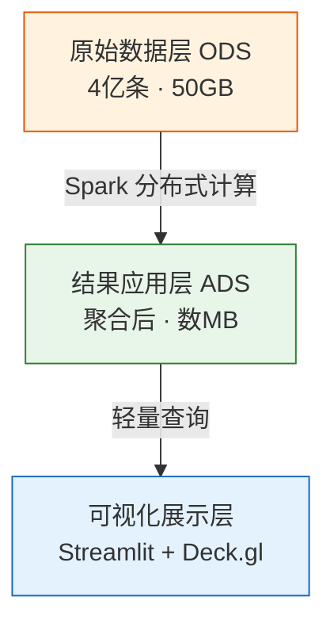
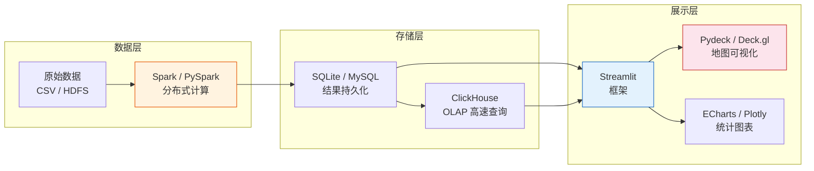

# 数据可视化看板搭建

!!! abstract "写在前面"
    本文整理了我在做数据可视化看板项目过程中的技术选型思考、架构设计经验，以及面对亿级数据时的实战策略。核心技术栈为 **Streamlit + Pydeck (Deck.gl)**，适用于「本地快速开发 → 云端全量计算 → 轻量看板展示」的工作流。

---

## 1. 技术选型：为什么选 Streamlit？

### 1.1 Streamlit 定位

Streamlit 是一个 **Python 原生的 Web 应用框架**，专注于「用最少代码把 Python 脚本变成可交互的网页」。

| 特性 | 说明 |
|---|---|
| 语言 | 纯 Python，不需要写 HTML / CSS / JS |
| 上手难度 | 极低，几行代码即可启动看板 |
| 部署方式 | 本地 `streamlit run app.py` 直接访问 |
| 组件丰富度 | 内置侧边栏、滑动条、多选框、图表等常用 UI 组件 |
| 扩展性 | 支持嵌入 Pydeck（Deck.gl）、ECharts、Plotly 等专业可视化库 |

### 1.2 与 Power BI 的核心区别

| 维度 | Power BI | Streamlit |
|---|---|---|
| 性质 | 商业智能 (BI) 工具（拖拽式） | 开发框架（Code-first） |
| 适用人群 | 业务分析师、管理层 | 数据工程师、数据科学家 |
| 可视化天花板 | 标准图表，定制困难 | 无上限——可调用任意 Python/JS 可视化库 |
| 大数据支持 | 直接导入数据，受本地内存限制 | 可通过代码精准控制数据查询量 |
| 毕设 / 简历价值 | "我会用软件" | "我会设计系统" |

!!! tip "选型建议"
    - **投数据分析岗** → Power BI 是加分项
    - **投大数据开发 / 可视化工程岗** → Streamlit + 自定义可视化才能体现技术深度

---

## 2. 进阶可视化：Streamlit + Pydeck (Deck.gl)

### 2.1 什么是 Pydeck / Deck.gl？

[Deck.gl](https://deck.gl/) 最初由 **Uber** 开发，专门用来处理 **千万级甚至亿级** 的地理空间数据可视化。

- **核心能力**：GPU 加速渲染——利用显卡而非 CPU 来绘制海量数据点
- **视觉效果**：3D 建筑、弧线流向图、蜂窝聚合图（Hexbin）、热力图
- **Python 封装**：`pydeck` 库，可直接在 Streamlit 中通过 `st.pydeck_chart()` 一行代码调用

### 2.2 它们的协作关系

> Streamlit 是 **"框架 / 插座"**，Pydeck 是 **"渲染引擎 / 专业设备"**。
> 不需要二选一——Pydeck 的功能在 Streamlit 内部直接调用即可。

| 角色 | 工具 | 职责 |
|---|---|---|
| 外壳与交互 | Streamlit | 网页菜单、按钮、侧边栏、整体布局 |
| 渲染引擎 | Pydeck (Deck.gl) | 在地图上绘制 3D 柱状图、热力图等 |
| 业务逻辑 | Python 代码 | 接收前端交互 → 查询数据 → 传给 Pydeck |

### 2.3 代码示例：3D 蜂窝聚合图

```python
import streamlit as st
import pydeck as pdk

# 1. 侧边栏交互控件
st.sidebar.title("数据筛选")
radius = st.sidebar.slider("调整聚合半径", 100, 1000, 500)

# 2. Pydeck 图层配置
layer = pdk.Layer(
    "HexagonLayer",          # 蜂窝图层类型
    data=df,                 # 已预处理的 DataFrame
    get_position="[lng, lat]",
    radius=radius,           # 半径由滑动条动态控制
    elevation_scale=50,      # 3D 柱子高度倍数
    extruded=True,           # 开启 3D 效果
)

# 3. 渲染到 Streamlit 页面
st.pydeck_chart(pdk.Deck(layers=[layer]))
```

!!! note "地图可视化能力对比"
    - `st.map()`：Streamlit 内置，一行代码画散点，但功能简陋
    - `st.pydeck_chart()`：调用 Deck.gl，支持 3D、热力图、流向弧线等，适合大数据量级

---

## 3. 面对亿级数据的架构设计

### 3.1 核心问题

> 4 亿个点直接传给浏览器 → 网页必崩。
> 50GB CSV 直接 `pandas.read_csv()` → 内存必溢出。

### 3.2 解决方案：数据分层 + 预聚合

这是工业界处理大规模数据可视化的标准架构：



**各层职责**：

| 层级 | 内容 | 大小 | 存储位置 |
|---|---|---|---|
| 原始数据层 (ODS) | 4 亿条原始日志 | ~50 GB | 云端 HDFS / 对象存储 |
| 结果应用层 (ADS) | Spark 聚合后的统计表 | 数 MB | 本地 CSV / SQLite / MySQL |
| 展示层 | Streamlit 看板 | — | 本地或低配云服务器 |

### 3.3 预聚合维度设计

!!! warning "不要聚合得「太死」"
    如果只保留 `品牌 | 总访问数` 一张表，看板只能画一个柱状图，毫无交互性可言。

建议保留 **多维度** 的预聚合结果：

| 预聚合表 | 字段示例 | 支撑的可视化 |
|---|---|---|
| 品牌 × 时间 | 品牌, 小时, 访问量 | 📈 趋势折线图 |
| 品牌 × 城市 | 品牌, 城市, 经纬度, 访问量 | 🗺️ Deck.gl 地图热力图 |
| 品牌 × 用户属性 | 品牌, 年龄段, 性别, 访问量 | 🍩 用户画像饼图 |

聚合后数据量通常在 **几十万行** 以内，比原始 4 亿条缩小 1000 倍以上，任何低配机器都能秒级响应。

### 3.4 开发与生产环境分离

> 大厂工程师从不直接拿全量数据调试代码。

| 阶段 | 数据量 | 环境 | 目的 |
|---|---|---|---|
| **开发期** | 抽样 1%（~400 万条） | 本地电脑 | 验证逻辑、快速迭代 |
| **生产期** | 全量（4 亿条） | 高配云服务器 (按量付费) | 跑出最终结果表 |
| **展示期** | 聚合结果（数 MB） | 本地或低配服务器 | 7×24 看板展示 |

!!! tip "费用控制"
    - 高配服务器（8核32G）按量付费约 2-3 元/小时，跑完即释放
    - 看板只需读取 MB 级结果文件，挂在学生机（几十元/年）即可
    - 制作 **系统镜像** 可保存环境配置，下次一键拉起

---

## 4. 可视化方向的重点

### 4.1 重点不在「存储」，而在「交互探索」

如果毕设方向是 **数据可视化**，工作精力分配建议：

| 模块 | 投入精力 | 策略 |
|---|---|---|
| 大数据环境 (Hadoop / Spark) | **20%** | 跑通清洗与聚合即可 |
| 查询优化 (OLAP) | **30%** | 保证前端交互不卡顿 |
| 前端可视化 (看板设计) | **50%** | 视觉设计、交互逻辑、数据叙事 |

### 4.2 可视化的「高级感」要素

| 要素 | 说明 | 反面教材 |
|---|---|---|
| **避免视觉冗余** | 亿级数据用热力图 / 蜂窝聚合，而非散点 | 4 亿个点直接画 → 一坨黑 (Overplotting) |
| **多维动态关联** | 左侧选歌手 → 右侧联动显示听众年龄、地域、时长 | 每个图表各自独立、互不关联 |
| **数据叙事** | 看板讲故事："疫情如何改变购买行为？" | 只堆数字、没有洞察 |
| **交互性能** | 亿级数据下筛选延迟 < 200ms | 点一下按钮转圈 30 秒 |
| **层级下钻** | 滚轮缩放：全国总览 → 省份热力 → 城市明细 | 静态报表，无法探索 |

### 4.3 答辩 / 面试关键话术

> "本课题的难点在于 **超大规模数据集下的视觉感知与交互响应**：
>
> - 利用 **预聚合技术**，将 50GB 数据压缩为多级缩放的视觉瓦片
> - 设计 **异步数据加载机制**，通过前后端分离与缓存策略，实现亿级数据下的秒级交互
> - 运用 **多维协同可视映射**，将推荐结果以直观的热力矩阵 / 关系图谱呈现，提升算法的可解释性"

---

## 5. 看板搭建常用技术栈速查



| 工具 | 用途 | 适用场景 |
|---|---|---|
| **Streamlit** | Web 看板框架 | 快速搭建交互式看板 |
| **Pydeck (Deck.gl)** | GPU 地图渲染 | 地理空间数据、3D 可视化 |
| **ECharts / Plotly** | 统计图表 | 折线、柱状、饼图等通用图表 |
| **PySpark** | 分布式计算 | 亿级数据清洗与聚合 |
| **ClickHouse** | OLAP 引擎 | 毫秒级大数据聚合查询 |
| **SQLite** | 轻量数据库 | 结果持久化，零配置 |

---

## 6. 简历写法参考

!!! example "项目经验描述（可视化方向）"
    **XX 电商用户行为分析与可视化看板**

    - 基于 4 亿条真实电商行为日志（50GB+），利用 **PySpark** 完成分布式 ETL，建立多维聚合指标体系
    - 采用 **存算分离架构**：Spark 离线批处理 → 结果持久化 → Streamlit 轻量展示，运维成本降低 80%
    - 集成 **Deck.gl GPU 渲染引擎**，实现亿级数据下的 3D 蜂窝热力图与层级下钻交互，筛选响应 < 200ms
    - 设计多维联动看板（时间趋势 × 地域分布 × 用户画像），支持实时切片与数据叙事
