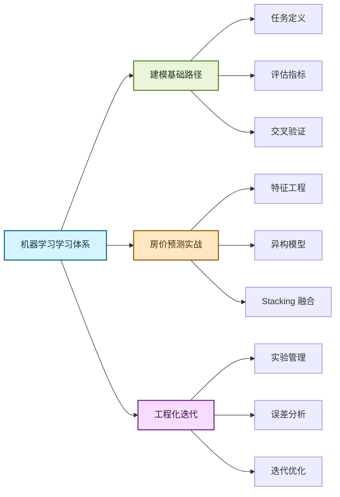

# :material-robot-excited-outline: 机器学习实战

!!! quote "为什么机器学习是数据分析进阶的关键能力"
    机器学习不仅是“训练模型”，更是一个从业务问题定义、特征构建、验证评估到上线复盘的完整闭环。对数据分析师而言，机器学习能力决定了你能否从“描述现象”走向“预测与决策支持”。

---

## 📚 学习模块导航

本专区按照 **"问题定义 → 特征工程 → 建模融合 → 结果解释"** 的路径组织内容，建议按顺序推进。

-   :material-school-outline:{ .lg .middle } __建模基础路径__

    ---

    面向入门与转型阶段，聚焦机器学习项目中的高频基础能力，先搭建稳固的分析与建模框架。

    *   ✨ **基础认知**：回归 / 分类任务拆解、评价指标选择
    *   🔎 **流程能力**：数据清洗、特征构造、交叉验证
    *   🎯 **实战导向**：先建立基线，再做针对性优化

    [:octicons-arrow-right-24: 查看学习优先级](#ml-priority){ .md-button .md-button--primary aria-label="查看机器学习学习优先级建议" title="查看机器学习学习优先级建议" }

-   :material-home-city-outline:{ .lg .middle } __项目实战：西雅图房价预测__

    ---

    基于房价预测场景，完整覆盖从基线 MLP 到 Stacking 集成的建模流程，是当前专区的核心实战案例。

    *   🧪 **特征工程**：空间特征、地理聚类、共线性处理
    *   📈 **模型融合**：TensorFlow + XGBoost + LightGBM + CatBoost
    *   ⚡ **效果提升**：通过目标变换与集成策略优化泛化能力

    [:octicons-arrow-right-24: 进入房价预测项目](Seattle-House-Price-Prediction/blog_post.md){ .md-button .md-button--primary aria-label="进入西雅图房价预测项目实战文章" title="进入西雅图房价预测项目实战文章" }

-   :material-wrench-cog-outline:{ .lg .middle } __工程化与迭代实践__

    ---

    面向中后期提升，关注可复用的实验流程和稳定迭代机制，减少“偶然有效”的模型结果。

    *   🧰 **实验管理**：特征版本、参数记录、结果对比
    *   📊 **稳定验证**：分层抽样、时间切分、误差分析
    *   💡 **持续优化**：从误差来源反推特征与模型改进方向

    [:octicons-arrow-right-24: 查看常见坑与经验](#ml-lessons){ .md-button aria-label="查看机器学习常见坑与经验总结" title="查看机器学习常见坑与经验总结" }

---

## 🧠 知识图谱

<figure class="diagram-figure" role="group" aria-labelledby="ml-map-title" aria-describedby="ml-map-desc" markdown>

<figcaption id="ml-map-title">机器学习学习路径知识图谱</figcaption>

图谱从机器学习学习体系出发，分为建模基础路径、房价预测实战和工程化迭代三部分。基础路径涵盖任务定义、评估指标和交叉验证；项目实战涵盖特征工程、异构模型与 Stacking 融合；工程化迭代涵盖实验管理、误差分析与持续优化。

</figure>

---

## 🎯 数据分析师学习优先级 { #ml-priority }

!!! tip "聚焦原则"
    在机器学习学习中，优先保证 **数据质量与验证策略**，其次再追求更复杂的模型结构。先把可解释、可复现、可提升的闭环建立起来。

| 模块 | 优先级 | 核心理由 |
| :--- | :--- | :--- |
| **问题定义 & 指标选择** | ⭐⭐⭐ 必学 | 目标不清或指标错配会导致模型方向偏离业务价值 |
| **特征工程 & 数据清洗** | ⭐⭐⭐ 必学 | 特征质量通常决定模型上限，远比盲目换模型有效 |
| **验证策略 (K-Fold / 时间切分)** | ⭐⭐⭐ 必学 | 防止过拟合与数据泄漏，保证离线效果可迁移 |
| **基线模型与误差分析** | ⭐⭐⭐ 必做 | 建立可比较的优化起点，避免“优化无参照” |
| **模型融合 (Stacking/Blending)** | ⭐⭐ 推荐 | 在基础扎实后可提升效果，但需要更高维护成本 |
| **复杂深度模型** | ⭐ 选学 | 对多数常规分析场景并非首要，应按业务需求推进 |

---

## 📊 内容规模一览

| 模块 | 文档数 | 核心知识点 |
| :--- | :---: | :--- |
| 建模基础路径 | 规划中 | 任务定义、评价指标、验证策略、基线方法 |
| 房价预测实战 | 1 篇 | 特征工程、模型训练、融合策略、结果分析 |
| 工程化与迭代 | 规划中 | 实验管理、误差拆解、迭代优化流程 |

---

## 🧩 常见坑与经验总结 { #ml-lessons }

- **数据决定上限**：特征工程往往比模型调优更重要，不要一开始就依赖复杂模型。
- **验证策略优先**：先设计数据切分和验证方案，再谈参数搜索与模型融合。
- **重视基线**：先跑通简单 Baseline，所有优化都要相对基线衡量增益。
- **关注可解释性**：模型效果之外，特征贡献和误差来源同样是业务沟通核心。

---

## 🔗 延伸资源

-   :material-web:{ .lg .middle } __在线实践平台__

    ---

    *   [Kaggle](https://www.kaggle.com/) — 机器学习竞赛与公开数据集
    *   [UCI Machine Learning Repository](https://archive.ics.uci.edu/) — 经典算法练习数据
    *   [scikit-learn 示例库](https://scikit-learn.org/stable/auto_examples/index.html) — 官方可运行案例

-   :material-book-open-variant:{ .lg .middle } __推荐学习资料__

    ---

    *   [scikit-learn 官方文档](https://scikit-learn.org/stable/) — 经典机器学习工具库
    *   [Hands-On Machine Learning](https://homl.info/) — 理论与实践结合路线
    *   [XGBoost Docs](https://xgboost.readthedocs.io/) — Boosting 模型核心参考

!!! note "学习建议"
    **实践优先**：每完成一个模型版本，至少记录一次“特征变化 → 指标变化 → 原因解释”。长期看，这比单次调参得到的偶然提升更有价值。
