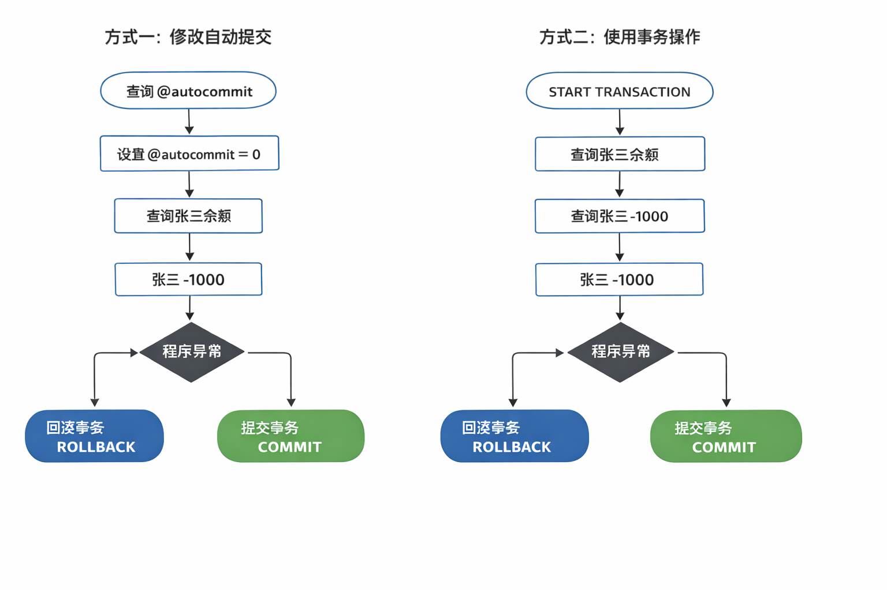
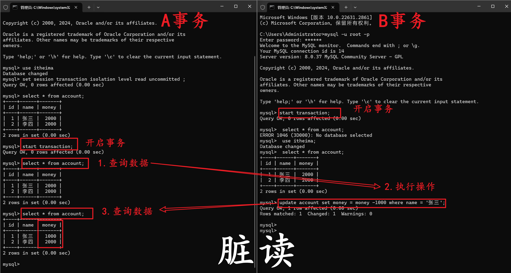
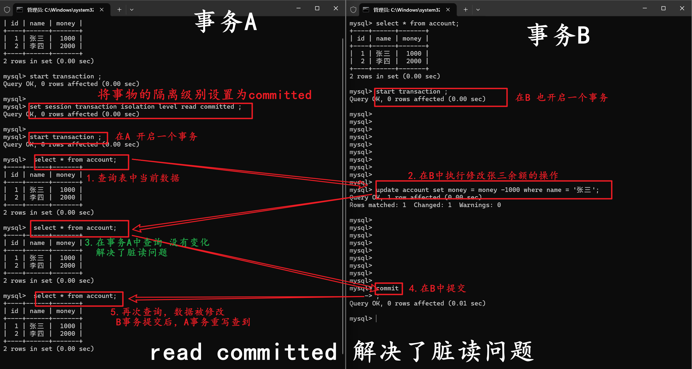
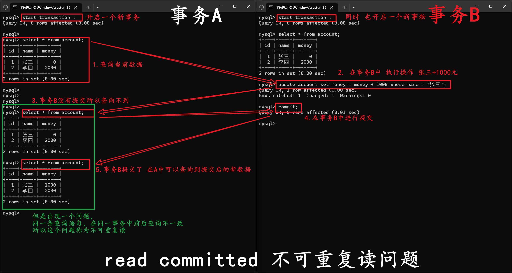
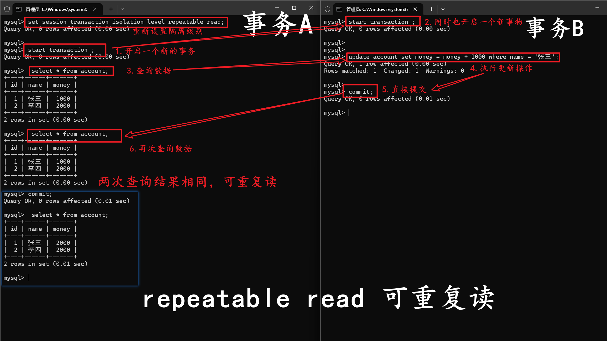
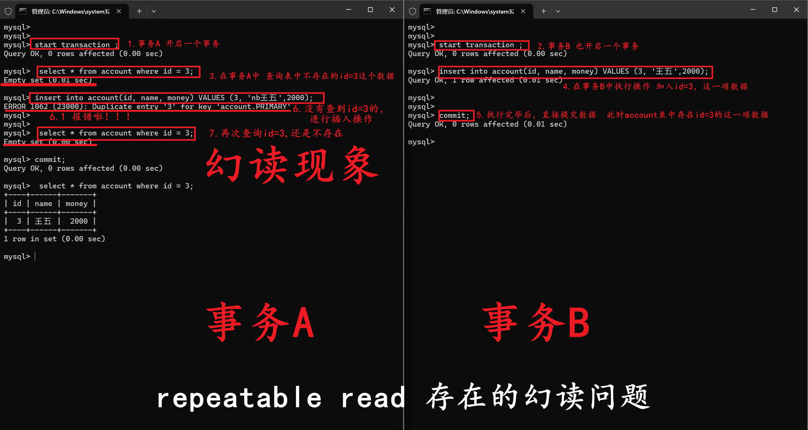
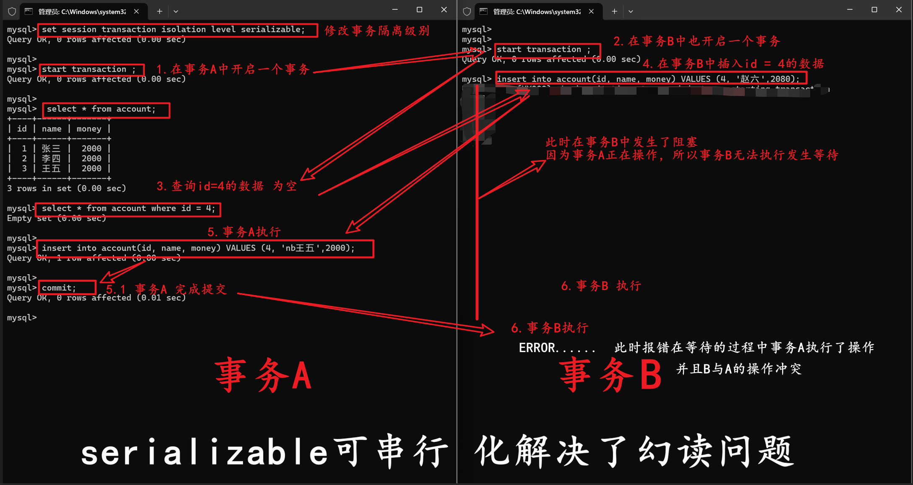

# MySQL 学习笔记 - 基础篇

???+ tip "本章导读"
    本文包含[黑马程序员 MySQL数据库入门到精通](https://www.bilibili.com/video/BV1Kr4y1i7ru) 1-55视频小结的所有笔记，以及笔者的一些思考

## 一、SQL 通用语法

- SQL 语句可以单行或多行书写，以分号结尾。
- SQL 语句可以使用空格 / 缩进来增强语句的可读性。
- MySQL 数据库的 SQL 语句不区分大小写，关键字建议使用大写。
- **注释**：
    - 单行注释：`-- 注释内容` 或 `# 注释内容` (MySQL 特有)
    - 多行注释：`/* 注释内容 */`

## 二、通用语法及分类

- **DDL**: 数据定义语言，用来定义数据库对象（数据库、表、字段）
- **DML**: 数据操作语言，用来对数据库表中的数据进行增删改
- **DQL**: 数据查询语言，用来查询数据库中表的记录
- **DCL**: 数据控制语言，用来创建数据库用户、控制数据库的控制权限

### 2.1 DDL（数据定义语言）

数据定义语言

#### 2.1.1 数据库操作

**查询所有数据库：**
`SHOW DATABASES;`

**查询当前数据库：**
`SELECT DATABASE();`

**创建数据库：**
`CREATE DATABASE [ IF NOT EXISTS ] 数据库名 [ DEFAULT CHARSET 字符集] [COLLATE 排序规则 ];`

**删除数据库：**
`DROP DATABASE [ IF EXISTS ] 数据库名;`

**使用数据库：**
`USE 数据库名;`

##### 注意事项

- UTF8 字符集长度为 3 字节，有些符号占 4 字节，所以推荐用 utf8mb4 字符集

#### 2.1.2 表操作

**查询当前数据库所有表：**
`SHOW TABLES;`

**查询表结构：**
`DESC 表名;`

**查询指定表的建表语句：**
`SHOW CREATE TABLE 表名;`

**创建表：**

```sql
CREATE TABLE 表名(
	字段1 字段1类型 [COMMENT 字段1注释],
	字段2 字段2类型 [COMMENT 字段2注释],
	字段3 字段3类型 [COMMENT 字段3注释],
	...
	字段n 字段n类型 [COMMENT 字段n注释]
)[ COMMENT 表注释 ];
```

**注意：最后一个字段后面没有逗号**

```mysql
CREATE TABLE emp (
    id INT COMMENT '编号',
    workno VARCHAR(10) COMMENT '工号',
    name VARCHAR(10) COMMENT '姓名',
    gender VARCHAR(1) COMMENT '性别',
    age TINYINT COMMENT '年龄',
    idcard VARCHAR(18) COMMENT '身份证号',
    entrydate DATE COMMENT '入职时间'
) comment '员工表';
```

**添加字段：**
`ALTER TABLE 表名 ADD 字段名 类型(长度) [COMMENT 注释] [约束];`
例：`ALTER TABLE emp ADD nickname varchar(20) COMMENT '昵称';`

**修改数据类型：**
`ALTER TABLE 表名 MODIFY 字段名 新数据类型(长度);`

**修改字段名和字段类型：**
`ALTER TABLE 表名 CHANGE 旧字段名 新字段名 类型(长度) [COMMENT 注释] [约束];`
例：将 emp 表的 nickname 字段修改为 username，类型为 varchar(30)
`ALTER TABLE emp CHANGE nickname username varchar(30) COMMENT '昵称';`

**删除字段：**
`ALTER TABLE 表名 DROP 字段名;`

**修改表名：**
`ALTER TABLE 表名 RENAME TO 新表名;`

**删除表：**
`DROP TABLE [IF EXISTS] 表名;`

**删除表，并重新创建该表：**
`TRUNCATE TABLE 表名;`

### 2.2 DML（数据操作语言）

#### 2.2.1 添加数据

**指定字段：**
`INSERT INTO 表名 (字段名1, 字段名2, ...) VALUES (值1, 值2, ...);`

**全部字段：**
`INSERT INTO 表名 VALUES (值1, 值2, ...);`

**批量添加数据：**
`INSERT INTO 表名 (字段名1, 字段名2, ...) VALUES (值1, 值2, ...), (值1, 值2, ...), (值1, 值2, ...);`
`INSERT INTO 表名 VALUES (值1, 值2, ...), (值1, 值2, ...), (值1, 值2, ...);`

##### 注意事项

- 字符串和日期类型数据应该包含在引号中
- 插入的数据大小应该在字段的规定范围内

```mysql
-- 插入指定字段语句 前面字段名和值相对应：
insert into employee(id, workno, name, gender, age, idcard, entrydate)
VALUES (1, '1', 'it', '男', 10, '123466789012345678', '2000-01-22');
insert into employee(id, workno, name, gender, age, idcard, entrydate)
VALUES (2, '2', 'it', '男', 1, '123466789012345678', '2000-01-22');
-- 插入一个没有性别 没有名字的数据
insert into employee(id, workno, age, idcard, entrydate)
VALUES (2, '2', 1, '123466789012345678', '2000-01-22');


/*
 age 字段的数据类型是 tinyint（微整型，通常用于存储较小的整数，范围一般为 0-255），插入的数据应是整数类型的值（例如：25、30 等）。
 entrydate 字段的数据类型是 date（日期类型），插入的数据应符合日期格式（例如：'2023-10-01' 这种 'YYYY-MM-DD' 格式）。
 */
-- alter table employee modify age tinyint unsigned null;
ALTER TABLE employee
    MODIFY age tinyint unsigned NOT NULL;
-- 一开始并没有指定年龄值不为负数
-- 直接执行insert into 语句会再次添加  需要先删除已经创建的年龄为负的那一行
DELETE
FROM employee
WHERE id = 2
  AND age = 1;

select *
from employee;
-- 查询表结构

-- 插入全部字段语句   不需要指定字段 但是插入值的顺序和表中值的顺序及数量保持相同
insert into employee
values (3, '3', 'xiaomi', '男', 18, '123466789012345678', '2005-04-22');

-- 批量添加数据
insert into employee
values (322, '8', 'huawei', '男', 18, '123465929012345678', '2005-04-22'),
       (331, '8', 'oppo', '男', 18, '123466592901245678', '2005-04-22');

```

#### 2.2.2 更新和删除数据

**修改数据：**
`UPDATE 表名 SET 字段名1 = 值1, 字段名2 = 值2, ... [ WHERE 条件 ];`
例：
`UPDATE emp SET name = 'Jack' WHERE id = 1;`

**删除数据：**
`DELETE FROM 表名 [ WHERE 条件 ];`

```mysql
-- DML 修改数据
-- 不指定where会修改整张表的这一数据
update employee
set name = 'ahstu'
where id = 1;

update employee
set name  = 'ASST',
    gender= '女'
where id = 1;


update employee
set entrydate = '2008-08-08';


# DML删除语句
delete from employee where gender='女';

```
### 2.3 DQL（数据查询语言）

语法：

```sql
SELECT
	字段列表
FROM
	表名字段
WHERE
	条件列表
GROUP BY
	分组字段列表
HAVING
	分组后的条件列表
ORDER BY
	排序字段列表
LIMIT
	分页参数
```

#### 2.3.1 基础查询

**查询多个字段：**
`SELECT 字段1, 字段2, 字段3, ... FROM 表名;`
`SELECT * FROM 表名;`

**设置别名：**
`SELECT 字段1 [ AS 别名1 ], 字段2 [ AS 别名2 ], 字段3 [ AS 别名3 ], ... FROM 表名;`
`SELECT 字段1 [ 别名1 ], 字段2 [ 别名2 ], 字段3 [ 别名3 ], ... FROM 表名;`

**去除重复记录：**
`SELECT DISTINCT 字段列表 FROM 表名;`

**转义：**
`SELECT * FROM 表名 WHERE name LIKE '/_张三' ESCAPE '/'`
`/` 之后的 `_` 不作为通配符

```mysql
create table emp(
id int comment '编号',
workno varchar(10) comment '工号',
name varchar(10) comment '姓名',
gender char(1) comment '性别',
age tinyint unsigned comment '年龄',
idcard char(18) comment '身份证号',
workaddress varchar(50) comment '工作地址',
entrydate date comment '入职时间'
) comment '员工表';

insert into emp (id, workno, name, gender, age, idcard, workaddress, entrydate)
values
(1, '1', '柳岩', '女', 20, '123456789012345678', '北京', '2000-01-01'),
(2, '2', '张无忌', '男', 18, '123456789012345670', '北京', '2005-09-01'),
(3, '3', '韦一笑', '男', 38, '123456789712345670', '上海', '2005-08-01'),
(4, '4', '赵敏', '女', 18, '123456757123845670', '北京', '2009-12-01'),
(5, '5', '小昭', '女', 16, '123456769012345678', '上海', '2007-07-01'),
(6, '6', '杨逍', '男', 28, '12345678931234567X', '北京', '2006-01-01'),
(7, '7', '范瑶', '男', 40, '123456789212345670', '北京', '2005-05-01'),
(8, '8', '黛绮丝', '女', 38, '123456157123645670', '天津', '2015-05-01'),
(9, '9', '范凉京', '女', 45, '123156789012345678', '北京', '2010-04-01'),
(10, '10', '陈友谅', '男', 53, '123456789012345670', '上海', '2011-01-01'),
(11, '11', '张士诚', '男', 55, '123567897123465670', '江苏', '2015-05-01'),
(12, '12', '常遇春', '男', 32, '123446757152345670', '北京', '2004-02-01'),
(13, '13', '张三丰', '男', 88, '123666789012345678', '江苏', '2020-11-01'),
(14, '14', '灭绝师太', '女', 65, '123456719012345670', '西安', '2019-05-01'),
(15, '15', '胡青牛', '男', 70, '12345674971234567X', '西安', '2018-04-01'),
(16, '16', '周芷若', '女', 18, null, '北京', '2012-06-01');


-- 查询所有字段
select * from emp;

-- 查询指定字段
select name,workno,age from emp;

-- 查询所有员工工作地址 起别名as'别名'
select workaddress as '工作地址' from emp;

-- 查询所有员工工作地址 不重复
select distinct workaddress as '工作地址' from emp;

```

#### 2.3.2 条件查询

**语法：**
`SELECT 字段列表 FROM 表名 WHERE 条件列表;`

**条件：**

| 比较运算符      | 功能                                            |
| --------------- | ----------------------------------------------- |
| >               | 大于                                            |
| >=              | 大于等于                                        |
| <               | 小于                                            |
| <=              | 小于等于                                        |
| =               | 等于                                            |
| <> 或 !=        | 不等于                                          |
| BETWEEN … AND … | 在某个范围内（含最小、最大值） ==顺序不能反了== |
| IN(…)           | 在in之后的列表中的值，多选一                    |
| LIKE 占位符     | 模糊匹配（_匹配单个字符，%匹配任意个字符）      |
| IS NULL         | 是NULL                                          |

| 逻辑运算符 | 功能                         |
| ---------- | ---------------------------- |
| AND 或 &&  | 并且（多个条件同时成立）     |
| OR 或 \|\| | 或者（多个条件任意一个成立） |
| NOT 或 !   | 非，不是                     |

**案例实操：**

```mysql
-- 年龄等于30
select * from employee where age = 30;
-- 年龄小于30
select * from employee where age < 30;
-- 小于等于
select * from employee where age <= 30;
-- 没有身份证
select * from employee where idcard is null or idcard = '';
-- 有身份证
select * from employee where idcard;
select * from employee where idcard is not null;
-- 不等于
select * from employee where age != 30;
-- 年龄在20到30之间
select * from employee where age between 20 and 30;
select * from employee where age >= 20 and age <= 30;
-- 下面语句不报错，但查不到任何信息
select * from employee where age between 30 and 20;
-- 性别为女且年龄小于30
select * from employee where age < 30 and gender = '女';
-- 年龄等于25或30或35
select * from employee where age = 25 or age = 30 or age = 35;
select * from employee where age in (25, 30, 35);
-- 姓名为两个字
select * from employee where name like '__';
-- 身份证最后为X
select * from employee where idcard like '%X';
```

#### 2.3.3 聚合查询（聚合函数）

**常见聚合函数：**

| 函数  | 功能     |
| ----- | -------- |
| count | 统计数量 |
| max   | 最大值   |
| min   | 最小值   |
| avg   | 平均值   |
| sum   | 求和     |

**语法：**
`SELECT 聚合函数(字段列表) FROM 表名;`
例：
`SELECT count(id) from employee where workaddress = "广东省";`

```mysql
-- DQL聚合函数
-- 统计员工数量
select count(*) from emp;

-- 统计该企业员工平均年龄
select avg(age) from emp;

-- 统计该企业员工最小年龄
select min(age) from emp;
-- 统计该企业员工最大年龄
select max(age) from emp;
-- 统计西安地区员工年龄之和
select * from emp where workaddress = '西安';
select sum(age) from emp where workaddress = '西安';
```

#### 2.3.4 分组查询

**语法：**
`SELECT 字段列表 FROM 表名 [ WHERE 条件 ] GROUP BY 分组字段名 [ HAVING 分组后的过滤条件 ];`

**where 和 having 的区别：**

- **执行时机不同**：where 是分组之前进行过滤，不满足 where 条件不参与分组；having 是分组后对结果进行过滤。
- **判断条件不同**：where 不能对聚合函数进行判断，而 having 可以。

```mysql
-- 分组查询
-- 根据性别分组 统计男女员工的数量
select gender ,count(*) from emp group by gender;
-- 根据性别分组 统计男女员工的平均年龄
select gender ,avg(age) from emp group by gender;
-- 查询年龄小于45的员工，并根据工作地址分组，获取员工数量大于等于3的工作地址
select workaddress, count(*) from emp where age < 45 group by workaddress having count(*)>=3;
```

**案例实操：**

```mysql
-- 根据性别分组，统计男性和女性数量（只显示分组数量，不显示哪个是男哪个是女）
select count(*) from employee group by gender;
-- 根据性别分组，统计男性和女性数量
select gender, count(*) from employee group by gender;
-- 根据性别分组，统计男性和女性的平均年龄
select gender, avg(age) from employee group by gender;
-- 年龄小于45，并根据工作地址分组
select workaddress, count(*) from employee where age < 45 group by workaddress;
-- 年龄小于45，并根据工作地址分组，获取员工数量大于等于3的工作地址
select workaddress, count(*) address_count from employee where age < 45 group by workaddress having address_count >= 3;
```

##### 注意事项

- 执行顺序：where > 聚合函数 > having
- 分组之后，查询的字段一般为聚合函数和分组字段，查询其他字段无任何意义

#### 2.3.5 排序查询

**语法：**
`SELECT 字段列表 FROM 表名 ORDER BY 字段1 排序方式1, 字段2 排序方式2;`

**排序方式：**

- **ASC**: 升序（默认）
- **DESC**: 降序

**案例实操：**

```sql
-- 根据年龄升序排序
SELECT * FROM employee ORDER BY age ASC;
SELECT * FROM employee ORDER BY age;
-- 两字段排序，根据年龄升序排序，入职时间降序排序
SELECT * FROM employee ORDER BY age ASC, entrydate DESC;
```

##### 注意事项

如果是多字段排序，当第一个字段值相同时，才会根据第二个字段进行排序

#### 2.3.6 分页查询

**语法：**
`SELECT 字段列表 FROM 表名 LIMIT 起始索引, 查询记录数;`

**案例实操：**

```sql
-- 查询第一页数据，展示10条
SELECT * FROM employee LIMIT 0, 10;
-- 查询第二页       起始索引 = （查询页码 - 1） * 每页显示记录数
SELECT * FROM employee LIMIT 10, 10;
```

##### 注意事项

- 起始索引从 0 开始，起始索引 = （查询页码 - 1） * 每页显示记录数
- 分页查询是数据库的方言，不同数据库有不同实现，MySQL 是 LIMIT
- 如果查询的是第一页数据，起始索引可以省略，直接简写 LIMIT 10

#### 2.3.7 DQL 执行顺序

FROM -> WHERE -> GROUP BY -> SELECT -> ORDER BY -> LIMIT

#### 2.3.8 综合案例

```mysql
# 1. 查询年龄为20,21,22,23岁的员工信息。
select * from  emp where gender = '女' and age in(20,21,22,23);
# 2. 查询性别为男，并且年龄在20-40岁(含)以内的姓名为三个字的员工。
select * from  emp where gender = '男' and age between 20 and 40  and name like'___' ;
# 3. 统计员工表中,年龄小于60岁的,男性员工和女性员工的人数。
select gender,count(*) from  emp where age<60 group by gender;
# 4. 查询所有年龄小于等于35岁员工的姓名和年龄，并对查询结果按年龄升序排序，如果年龄相同按入职时间降序排序。
select name,age from emp where age <= 35 order by age asc ,entrydate desc;
# 5. 查询性别为男，且年龄在20-40岁(含)以内的前5个员工信息[按页查询，每页仅展示五个员工]，对查询的结果按年龄升序排序，年龄相同按入职时间升序排序。
select *
from emp
where gender = '男'
  and age between 20 and 40
order by age asc, entrydate asc
limit 5;
```
### 2.4 DCL（数据控制语言）

#### 2.4.1 管理用户

**查询用户：**

```sql
USE mysql;
SELECT * FROM user;
```

**创建用户:**
`CREATE USER '用户名'@'主机名' IDENTIFIED BY '密码';`

**修改用户密码：**
`ALTER USER '用户名'@'主机名' IDENTIFIED WITH mysql_native_password BY '新密码';`

**删除用户：**
`DROP USER '用户名'@'主机名';`

**案例实操：**

```sql
-- 创建用户test，只能在当前主机localhost访问
create user 'test'@'localhost' identified by '123456';
-- 创建用户test，能在任意主机访问
create user 'test'@'%' identified by '123456';
create user 'test' identified by '123456';
-- 修改密码
alter user 'test'@'localhost' identified with mysql_native_password by '1234';
-- 删除用户
drop user 'test'@'localhost';
```

##### 注意事项

- 主机名可以使用 % 通配

#### 2.4.2 权限控制

**常用权限：**

| 权限                | 说明               |
| ------------------- | ------------------ |
| ALL, ALL PRIVILEGES | 所有权限           |
| SELECT              | 查询数据           |
| INSERT              | 插入数据           |
| UPDATE              | 修改数据           |
| DELETE              | 删除数据           |
| ALTER               | 修改表             |
| DROP                | 删除数据库/表/视图 |
| CREATE              | 创建数据库/表      |

**查询权限：**
`SHOW GRANTS FOR '用户名'@'主机名';`

**授予权限：**
`GRANT 权限列表 ON 数据库名.表名 TO '用户名'@'主机名';`

**撤销权限：**
`REVOKE 权限列表 ON 数据库名.表名 FROM '用户名'@'主机名';`

##### 注意事项

- 多个权限用逗号分隔
- 授权时，数据库名和表名可以用 * 进行通配，代表所有

```mysql
-- 案例实操

-- 查询权限
show grants for 'test'@'%';
show grants for 'root'@'localhost';

-- 授予权限  给itcast的所有表授予所有权限
grant all on itcast.* to test;

-- 撤销权限
revoke all on itcast.* from 'test'@'%';

```

## 三、函数

- 字符串函数
- 数值函数
- 日期函数
- 流程函数

### 3.1 字符串函数

`select 函数 (参数)`

**常用函数：**

| 函数                             | 功能                                                         |
| -------------------------------- | ------------------------------------------------------------ |
| CONCAT(s1, s2, …, sn)            | 字符串拼接，将s1, s2, …, sn拼接成一个字符串                  |
| LOWER(str)                       | 将字符串全部转为小写                                         |
| UPPER(str)                       | 将字符串全部转为大写                                         |
| LPAD(str, n, pad)                | 左填充，用字符串pad对str的左边进行填充，达到n个字符串长度    |
| RPAD(str, n, pad)                | 右填充，用字符串pad对str的右边进行填充，达到n个字符串长度 <br />**左右嵌套可以实现两边填充** |
| TRIM(str)                        | 去掉字符串头部和尾部的空格                                   |
| SUBSTRING(str, start, len)       | 返回从字符串str从start位置起的len个长度的字符串              |
| REPLACE(column, source, replace) | 替换字符串                                                   |

`lower()` 把字符转为小写
`lower()` 函数与 `concat()` 函数不同，它只接受一个参数
`lower()` 用于将单个字符串中的**所有字母**转换为小写

**使用示例：**

```mysql
-- 拼接
SELECT CONCAT('Hello', 'World');
-- 小写
SELECT LOWER('Hello');
-- 大写
SELECT UPPER('Hello');
-- 左填充
SELECT LPAD('01', 5, '-');
-- 右填充
SELECT RPAD('01', 5, '-');
-- 例如要将'01'居中显示在长度为7的字符串中
select lpad(rpad('01', 5, '-'), 8, '-');

-- 去除空格
SELECT TRIM(' Hello World ');
-- 切片（起始索引为1）
SELECT SUBSTRING('Hello World', 1, 5);
```

### 3.2 数值函数

**常见函数：**

| 函数        | 功能                             |
| ----------- | -------------------------------- |
| CEIL(x)     | 向上取整                         |
| FLOOR(x)    | 向下取整                         |
| MOD(x, y)   | 返回x/y的模                      |
| RAND()      | 返回0~1内的随机数                |
| ROUND(x, y) | 求参数x的四舍五入值，保留y位小数 |

```mysql
-- 数值函数-使用案例

-- ceil 向上取整   ceil n.天花板
select ceil(1.1);

-- floor 向下取整   floor n.地板
select floor(22.3);

-- rand  随机数    random adj.随机的
select rand()*10;

-- round 四舍五入保留小数   round v.把(数字)四舍五入
select  round (2.3336, 2);


-- 生成一个六位随机验证码
select lpad(round (rand()*1000000,0),6,0) ;
```

### 3.3 日期函数

**常用函数：**

| 函数                               | 功能                                              |
| ---------------------------------- | ------------------------------------------------- |
| CURDATE()                          | 返回当前日期                                      |
| CURTIME()                          | 返回当前时间                                      |
| NOW()                              | 返回当前日期和时间                                |
| YEAR(date)                         | 获取指定date的年份                                |
| MONTH(date)                        | 获取指定date的月份                                |
| DAY(date)                          | 获取指定date的日期                                |
| DATE_ADD(date, INTERVAL expr type) | 返回一个日期/时间值加上一个时间间隔expr后的时间值 |
| DATEDIFF(date1, date2)             | 返回起始时间date1和结束时间date2之间的天数        |

> CURDATE()  CUR--current adj.当前的
>
> | 常用时间单位 | DAY  | HOUR | MINUTE | MONTH | YEAR | SECOND |
> | ------------ | ---- | ---- | ------ | ----- | ---- | ------ |
> | 说明         | 天   | 小时 | 分钟   | 月    | 年   | 秒     |

**案例实操：**

```mysql
-- 29.基础-函数-日期函数
# curdata()  当前日期
select curdate();
# curtime()  当前时间
select curtime();
# now()    现在的具体时间 年月日 时分秒
select now();

# year  month day   年月日
select YEAR(now());
select month(now());
select day(now());

# date_add   interval n.间隔，间隙
# 从当前日期往后推70天后的时间
select date_add(now(), INTERVAL 70 day);

# datediff  两个时间相差的天数
select datediff('2026-1-13','2005-04-22');


-- 案例：查询所有员工的入职天数 并根据入职天数倒叙排序
select name, datediff(current_date(),entrydate) as 'alldays' from emp order by alldays desc;

```

### 3.4 流程函数

**常用函数：**

| 函数                                                         | 功能                                                    |
| ------------------------------------------------------------ | ------------------------------------------------------- |
| IF(value, t, f)                                              | 如果value为true，则返回t，否则返回f                     |
| IFNULL(value1, value2)                                       | 如果value1不为空，返回value1，否则返回value2            |
| CASE WHEN [ val1 ] THEN [ res1 ] … ELSE [ default ] END      | 如果val1为true，返回res1，… 否则返回default默认值       |
| CASE [ expr ] WHEN [ val1 ] THEN [ res1 ] … ELSE [ default ] END | 如果expr的值等于val1，返回res1，… 否则返回default默认值 |

**案例实操：**

```mysql 
-- 30.基础-函数-流程控制函数
# if    IF(value, t, f)    如果value为true，则返回t，否则返回f
select  if (true, 'OK','Error');

# ifnull  判断第一个表达式是否为 NULL 值。
# 如果第一个参数不为 NULL：返回第一个参数的值
# 如果第一个参数为 NULL：返回第二个参数作为默认值
select ifnull('OK', 'default');
select ifnull('', 'default'); # 空字符串不是 NULL 值，因此返回 ' '（空字符串）
select ifnull(null, 'default');


# case when then else end
-- 需求： 查询emp表中员工姓名及工作地址(北京/上海-->一线城市,其他 二线城市)
select name,
       (case workaddress when '北京' then '一线城市' when '上海' then '一线城市' else '二线城市' end)as '工作地址'
from emp;

-- 案例：统计班级各个学员的成绩，展示的规则如下：
-- >= 85，展示优秀
-- >= 60，展示及格
-- 否则，展示不及格
create table score(
    id int comment 'ID',
    name varchar(20) comment '姓名',
    math int comment '数学',
    english int comment '英语',
    chinese int comment '语文'
) comment '学员成绩表';

insert into score(id, name, math, english, chinese)
VALUES (1, 'Tom', 67, 88, 95),
       (2, 'Rose', 23, 66, 90),
       (3, 'Jack', 56, 98, 76);

select id,name,
       (case when math >= 85 then '优秀' when math >= 60 then '及格' else '不及格' end)'数学',
       (case when english >= 85 then '优秀' when english >= 60 then '及格' else '不及格' end)'英语',
       (case when chinese >= 85 then '优秀' when chinese >= 60 then '及格' else '不及格' end)'语文'
from score;

```

## 四、约束

- **概念**：作用于表中字段上的规则，用于限制存储在表中的数据
- **目的**：保证数据库中数据的正确性，有效性和完整性

- **分类**：

|           约束           |                           描述                           |   关键字    |
| :----------------------: | :------------------------------------------------------: | :---------: |
|         非空约束         |                限制该字段的数据不能为null                |  NOT NULL   |
|         唯一约束         |          保证该字段的所有数据都是唯一、不重复的          |   UNIQUE    |
|         主键约束         |         主键是一行数据的唯一标识，要求非空且唯一         | PRIMARY KEY |
|         默认约束         |      保存数据时，如果未指定该字段的值，则采用默认值      |   DEFAULT   |
| 检查约束（8.0.16版本后） |                 保证字段值满足某一个条件                 |    CHECK    |
|         外键约束         | 用来让两张图的数据之间建立连接，保证数据的一致性和完整性 | FOREIGN KEY |

约束是作用于表中字段上的，可以再创建表/修改表的时候添加约束。

### 4.1 常用约束

| 约束条件 | 关键字         |
| -------- | -------------- |
| 主键     | PRIMARY KEY    |
| 自动增长 | AUTO_INCREMENT |
| 不为空   | NOT NULL       |
| 唯一     | UNIQUE         |
| 逻辑条件 | CHECK          |
| 默认值   | DEFAULT        |

> **案例** 根据需求,完成表结构的创建
>
> | 字段名 |  字段含义   |  字段类型   |          约束条件          |       约束条关键字       |
> | :----: | :---------: | :---------: | :------------------------: | :----------------------: |
> |   id   | ID 唯一标识 |     int     |     主键，并且自动增长     | `PRIMARY,AUTO_INCREMENT` |
> |  name  |    姓名     | varchar(10) |      不为空，并且唯一      |    `NOT NULL,UNIQUE`     |
> |  age   |    年龄     |     int     |  大于 0，并且小于等于 120  |         `CHECK`          |
> | status |    状态     |   char(1)   | 如果没有指定该值，默认为 1 |        `DEFAULT`         |
> | gender |    性别     |   char(1)   |             无             |                          |

**案例实操：**

```mysql
-- 33. 基础-约束-演示
create table user(
    # id 主键约束，唯一，自增
    id     int primary key auto_increment comment '主键',
    name   varchar(10) not null unique comment '姓名',
    age    int check ( age > 0 && age <= 120 ) comment '年龄',
    status char(1) default '1' comment '状态',
    gender char(1) comment '性别'
) comment '用户表';

-- 插入数据
insert into user(name, age, status, gender)
values ('Tom1', 19, '1', '男'),
       ('Tom2', 1, '0', '男');

# 测试id约束
insert into user(name, age, status, gender)
values ('Tom3', 19, '1', '男');

# 测试name约束
insert into user(name, age, status, gender)
values (null, 19, '1', '男');
# [23000][1048] Column 'name' cannot be null---name不能为空值
insert into user(name, age, status, gender)
values ('Tom3', 19, '1', '男');
# [23000][1062] Duplicate entry 'Tom3' for key 'user.name'
# name不能重复输入

# 检查年龄约束
insert into user(name, age, status, gender)
values ('Tom3', -1, '1', '男');
# [HY000][3819] Check constraint 'user_chk_1' is violated
# 年龄约束1-120之间

```

#### 4.1.1 约束不仅可以用 SQL 语句创建，也可以在图形化界面设置约束


### 4.2 外键约束

- **概念**：外键用来让两张表的数据之间建立连接，从而保证数据的一致性和完整性
- 具有外键的表叫做**子表**，外键所关联的表叫做**父表**

**添加外键：**

```mysql
-- 方法一
CREATE TABLE 表名(
	字段名 字段类型,
	...
	[CONSTRAINT] [外键名称] FOREIGN KEY(外键字段名) REFERENCES 主表(主表列名)
);

-- 方法二
ALTER TABLE 表名 ADD CONSTRAINT 外键名称 FOREIGN KEY (外键字段名) REFERENCES 主表(主表列名);

-- 例子
alter table emp add constraint fk_emp_dept_id foreign key(dept_id) references dept(id);
```

**删除外键：**
`ALTER TABLE 表名 DROP FOREIGN KEY 外键名;`

**案例实操：**

```mysql
-- 34.基础-约束-外键约束
-- ---------------------------- 约束（外键） ------------------------------
-- 准备数据
create table dept
(
    id   int auto_increment comment 'ID' primary key,
    name varchar(50) not null comment '部门名称'
) comment '部门表';

INSERT INTO dept (id, name)
VALUES (1, '研发部'),
       (2, '市场部'),
       (3, '财务部'),
       (4, '销售部'),
       (5, '总经办');

create table emp
(
    id        int auto_increment comment 'ID' primary key,
    name      varchar(50) not null comment '姓名',
    age       int comment '年龄',
    job       varchar(20) comment '职位',
    salary    int comment '薪资',
    entrydate date comment '入职时间',
    managerid int comment '直属领导ID',
    dept_id   int comment '部门ID'
) comment '员工表';

INSERT INTO emp (id, name, age, job, salary, entrydate, managerid, dept_id)
VALUES (1, '金庸', 66, '总裁', 20000, '2000-01-01', null, 5),
       (2, '张无忌', 20, '项目经理', 12500, '2005-12-05', 1, 1),
       (3, '杨逍', 33, '开发', 8400, '2000-11-03', 2, 1),
       (4, '韦一笑', 48, '开发', 11000, '2002-02-05', 2, 1),
       (5, '常遇春', 43, '开发', 10500, '2004-09-07', 3, 1),
       (6, '小昭', 19, '程序员鼓励师', 6600, '2004-10-12', 2, 1);

-- 添加外键
ALTER TABLE emp ADD CONSTRAINT fk_emp_dept_id FOREIGN KEY (dept_id) REFERENCES dept(id);

-- 删除外键
ALTER TABLE emp drop foreign key fk_emp_dept_id;
```

#### 4.2.1 删除/更新行为

| 行为        | 说明                                                         |
| ----------- | ------------------------------------------------------------ |
| NO ACTION   | 当在父表中删除/更新对应记录时，首先检查该记录是否有对应外键，如果有则不允许删除/更新（与RESTRICT一致） |
| RESTRICT    | 当在父表中删除/更新对应记录时，首先检查该记录是否有对应外键，如果有则不允许删除/更新（与NO ACTION一致） |
| CASCADE     | 当在父表中删除/更新对应记录时，首先检查该记录是否有对应外键，如果有则也删除/更新外键在子表中的记录 |
| SET NULL    | 当在父表中删除/更新对应记录时，首先检查该记录是否有对应外键，如果有则设置子表中该外键值为null（要求该外键允许为null） |
| SET DEFAULT | 父表有变更时，子表将外键设为一个默认值（Innodb不支持）       |

**更改删除/更新行为：**
`ALTER TABLE 表名 ADD CONSTRAINT 外键名称 FOREIGN KEY (外键字段) REFERENCES 主表名(主表字段名) ON UPDATE 行为 ON DELETE 行为;`

```mysql
# 35.基础-约束-外键删除更新行为
-- ON UPDATE CASCADE 更新级联：当父表 (dept) 的主键 id 被修改时 自动同步：子表 (emp) 中对应的 dept_id 值会自动更新
-- 数据一致性：确保引用关系始终保持有效
ALTER TABLE emp
    ADD CONSTRAINT fk_emp_dept_id FOREIGN KEY (dept_id) REFERENCES dept (id) on update cascade on delete cascade;


-- set null
# 当在父表中删除/更新对应记录时，首先检查该记录是否有对应外键，如果有则设置子表中该外键值为null（要求该外键允许为null）
ALTER TABLE emp
    ADD CONSTRAINT fk_emp_dept_id FOREIGN KEY (dept_id) REFERENCES dept (id) on update set null on delete set null ;

```

**图形化界面操作**


## 五、多表查询

### 5.1 多表关系

- **一对多（多对一）**
- **多对多**
- **一对一**

#### 5.1.1 一对多

- **案例**：部门与员工
- **关系**：一个部门对应多个员工，一个员工对应一个部门
- **实现**：在多的一方建立外键，指向一的一方的主键

#### 5.1.2 多对多

- **案例**：学生与课程
- **关系**：一个学生可以选多门课程，一门课程也可以供多个学生选修
- **实现**：**建立第三张中间表，**中间表至少包含两个外键，分别关联两方主键

#### 5.1.3 一对一

- **案例**：用户与用户详情
- **关系**：一对一关系，多用于单表拆分，将一张表的基础字段放在一张表中，其他详情字段放在另一张表中，以提升操作效率
- **实现**：在任意一方加入外键，关联另外一方的主键，并且设置外键为唯一的（UNIQUE）

**案例实操：**

```mysql
# 37.基础-多表查询-多表关系介绍
-- ---------------------------- 多表关系 演示 ------------------------------
-- 多对多
create table student(
    id int auto_increment primary key comment '主键ID',
    name varchar(10) comment '姓名',
    no varchar(10) comment '学号'
) comment '学生表';

insert into student values (null, '黛绮丝', '2000100101'),
                           (null, '谢逊', '2000100102'),
                           (null, '殷天正', '2000100103'),
                           (null, '韦一笑', '2000100104');

create table course(
    id int auto_increment primary key comment '主键ID',
    name varchar(10) comment '课程名称'
) comment '课程表';

insert into course values (null, 'Java'),
                          (null, 'PHP'),
                          (null, 'MySQL'),
                          (null, 'Hadoop');

create table student_course
(
    id        int auto_increment comment '主键' primary key,
    studentid int not null comment '学生ID',
    courseid  int not null comment '课程ID',
    constraint fk_courseid foreign key (courseid) references course (id),
    constraint fk_studentid foreign key (studentid) references student (id)
) comment '学生课程中间表';

insert into student_course
values (null, 1, 1),
       (null, 1, 2),
       (null, 1, 3),
       (null, 2, 2),
       (null, 2, 3),
       (null, 3, 4);


-- 一对一
create table tb_user
(
    id     int auto_increment primary key comment '主键ID',
    name   varchar(10) comment '姓名',
    age    int comment '年龄',
    gender char(1) comment '1: 男，2: 女',
    phone  char(11) comment '手机号'
) comment '用户基本信息表';

create table tb_user_edu
(
    id            int auto_increment primary key comment '主键ID',
    degree        varchar(20) comment '学历',
    major         varchar(50) comment '专业',
    primaryschool varchar(50) comment '小学',
    middleschool  varchar(50) comment '中学',
    university    varchar(50) comment '大学',
    userid        int unique comment '用户ID',
    constraint fk_userid foreign key (userid) references tb_user (id)
) comment '用户教育信息表';


insert into tb_user(id, name, age, gender, phone)
values (null, '黄渤', 45, '1', '18800001111'),
       (null, '冰冰', 35, '2', '18800002222'),
       (null, '码云', 55, '1', '18800008888'),
       (null, '李彦宏', 50, '1', '18800009999');

insert into tb_user_edu(id, degree, major, primaryschool, middleschool, university, userid)
values (null, '本科', '舞蹈', '静安区第一小学', '静安区第一中学', '北京舞蹈学院', 1),
       (null, '硕士', '表演', '朝阳区第一小学', '朝阳区第一中学', '北京电影学院', 2),
       (null, '本科', '英语', '杭州市第一小学', '杭州市第一中学', '杭州师范大学', 3),
       (null, '本科', '应用数学', '阳泉第一小学', '阳泉区第一中学', '清华大学', 4);
```

### 5.2 查询概述

**合并查询（笛卡尔积，会展示所有组合结果）：**
`select * from employee, dept;`

> **笛卡尔积**：两个集合 A 集合和 B 集合的所有组合情况（在多表查询时，需要消除无效的笛卡尔积）

**消除无效笛卡尔积：**
`select * from employee, dept where employee.dept = dept.id;`

**案例实操：**

```mysql
# 38.基础-多表查询-概述
CREATE TABLE dept
(
    id   INT AUTO_INCREMENT PRIMARY KEY COMMENT '部门ID',
    name VARCHAR(50) NOT NULL COMMENT '部门名称'
) COMMENT '部门表';


CREATE TABLE emp
(
    id        INT AUTO_INCREMENT PRIMARY KEY COMMENT '员工ID',
    name      VARCHAR(50) NOT NULL COMMENT '姓名',
    age       INT COMMENT '年龄',
    job       VARCHAR(20) COMMENT '职位',
    salary    INT COMMENT '薪资',
    entrydate DATE COMMENT '入职时间',
    managerid INT COMMENT '直属领导ID',
    dept_id   INT COMMENT '所属部门ID',
    -- 外键约束：员工所属部门必须存在于部门表
    CONSTRAINT fk_emp_dept FOREIGN KEY (dept_id) REFERENCES dept (id)
    -- 外键约束：员工的直属领导必须是员工表中存在的员工
#     CONSTRAINT fk_emp_manager FOREIGN KEY (managerid) REFERENCES emp (id)
) COMMENT '员工表';


INSERT INTO dept (id, name)
VALUES (1, '研发部'),
       (2, '市场部'),
       (3, '财务部'),
       (4, '销售部'),
       (5, '总经办'),
       (6, '人事部');


INSERT INTO emp (id, name, age, job, salary, entrydate, managerid, dept_id)
VALUES (1, '金庸', 66, '总裁', 20000, '2000-01-01', NULL, 5),
       (2, '张无忌', 20, '项目经理', 12500, '2005-12-05', 1, 1),
       (3, '杨逍', 33, '开发', 8400, '2000-11-03', 2, 1),
       (4, '韦一笑', 48, '开发', 11000, '2002-02-05', 2, 1),
       (5, '常遇春', 43, '开发', 10500, '2004-09-07', 3, 1),
       (6, '小昭', 19, '程序员鼓励师', 6600, '2004-10-12', 2, 1),
       (7, '灭绝', 60, '财务总监', 8500, '2002-09-12', 1, 3),
       (8, '周芷若', 19, '会计', 48000, '2006-06-02', 7, 3),
       (9, '丁敏君', 23, '出纳', 5250, '2009-05-13', 7, 3),
       (10, '赵敏', 20, '市场部总监', 12500, '2004-10-12', 1, 2),
       (11, '鹿杖客', 56, '职员', 3750, '2006-10-03', 10, 2),
       (12, '鹤笔翁', 19, '职员', 3750, '2007-05-09', 10, 2),
       (13, '东方白', 19, '职员', 5500, '2009-02-12', 10, 2),
       (14, '张三丰', 88, '销售总监', 14000, '2004-10-12', 1, 4),
       (15, '俞莲舟', 38, '销售', 4600, '2004-10-12', 14, 4),
       (16, '宋远桥', 40, '销售', 4600, '2004-10-12', 14, 4),
       (17, '陈友谅', 42, NULL, 2000, '2011-10-12', 1, NULL);


-- 多表查询
# 单表查询  select * from emp;
select * from emp,dept; # 此时由于笛卡尔集的影响，会生成17*6=102条数据
select * from emp,dept where emp.dept_id = dept.id;
```

### 5.3 内连接查询

内连接查询的是两张表交集的部分

**隐式内连接：**
`SELECT 字段列表 FROM 表1, 表2 WHERE 条件 ...;`

**显式内连接：**
`SELECT 字段列表 FROM 表1 [ INNER ] JOIN 表2 ON 连接条件 ...;`

显式性能比隐式高

**案例实操：**

```mysql
# 39 基础-多表查询-内连接查询
-- 1. 查询每一个员工的姓名，以及关联的部门名称（隐式内连接实现）
-- 表结构emp, dept
-- 连接条件emp.dept_id = dept.id;
select emp.name,dept.name from emp,dept where emp.dept_id = dept.id;
-- 使用别名简化查询(起了别名之后只能使用别名)
select e.name,d.name from emp e,dept d where e.dept_id = d.id;


-- 2. 查询每一个员工的姓名，以及关联的部门名称（显式内连接实现）
-- 表结构emp, dept
-- 连接条件emp.dept_id = dept.id;
select e.name, d.name from emp e inner join dept d on e.dept_id = d.id;
```

### 5.4 外连接查询

**左外连接：**

查询左表所有数据，以及两张表交集部分数据
`SELECT 字段列表 FROM 表1 LEFT [ OUTER ] JOIN 表2 ON 条件 ...;`
相当于查询表 1 的所有数据，包含表 1 和表 2 交集部分数据

**右外连接：**
查询右表所有数据，以及两张表交集部分数据
`SELECT 字段列表 FROM 表1 RIGHT [ OUTER ] JOIN 表2 ON 条件 ...;`

**案例实操：**

```mysql
# 40 基础-多表查询-外连接查询
-- 1. 查询emp表所有数据，和对应部门信息(左外连接)
 -- 表结构emp, dept
-- 连接条件emp.dept_id = dept.id;
select e.*,d.name from emp e left outer join dept d on d.id = e.dept_id;
select e.*,d.name from emp e left  join dept d on d.id = e.dept_id; # 去掉outer显示效果相同

-- 2. 查询dept表所有数据，和对应员工信息(右外连接)
select d.*,e.* from emp e right outer join dept d on d.id = e.dept_id;
```

左连接可以查询到没有 dept 的 employee，右连接可以查询到没有 employee 的 dept

### 5.5 自连接查询

当前表与自身的连接查询，自连接必须使用表别名

**语法：**
`SELECT 字段列表 FROM 表A 别名A JOIN 表A 别名B ON 条件 ...;`

自连接查询，可以是内连接查询，也可以是外连接查询

**案例实操：**

```mysql
# 41.基础-多表查询-自连接
-- 1. 查询员工 及其所属领导的名字（内连接查询即可）
-- 表结构 emp !! 在自连接查询时必须给表起别名
select  a.name , b.name from emp a, emp b where a.managerid = b.id;


-- 2.查询所有员工emp及其领导的名字emp 如果员工没有领导，也需要查询出来
-- （必须使用外连接 left join  on）内连接只能查到交集部分，不符合题意
select  YuanGong.name , Leader.name from emp YuanGong left join emp Leader on  YuanGong.managerid = Leader.id;

```

### 5.6 联合查询 union, union all

把多次查询的结果合并，形成一个新的查询集

**语法：**

```mysql
SELECT 字段列表 FROM 表A ...
UNION [ALL]
SELECT 字段列表 FROM 表B ...
```

#### 注意事项

- **对于联合查询的多张表的列数必须保持一致，字段类型也需要保持一致**

- UNION ALL 会将全部数据直接合并在一起，union 会对合并之后的数据去重
  - **也就是说 **  UNION ALL 会有重复结果，UNION 不会
- 联合查询比使用 or 效率高，不会使索引失效

**案例实操：**

```mysql
# 42.基础-多表查询-联合查询union, union all
-- 1.将薪资低于5000的员工和年龄大于50岁的员工同时查询出来
select * from emp where salary < 5000
union all
select * from emp where age  > 50;
-- 此时是将两个查询结果直接合并，可能会有重复数据

select * from emp where salary < 5000
union
select * from emp where age  > 50;
-- 对查询结果去重
```

### 5.7 子查询

SQL 语句中嵌套 SELECT 语句，称谓嵌套查询，又称子查询。
`SELECT * FROM t1 WHERE column1 = ( SELECT column1 FROM t2);`
**子查询外部的语句可以是 INSERT / UPDATE / DELETE / SELECT 的任何一个**

**根据子查询结果可以分为：**

- 标量子查询（子查询结果为单个值）
- 列子查询（子查询结果为一列）
- 行子查询（子查询结果为一行）
- 表子查询（子查询结果为多行多列）

**根据子查询位置可分为：**

- WHERE 之后
- FROM 之后
- SELECT 之后

#### 5.7.1 标量子查询

子查询返回的结果是单个值（数字、字符串、日期等）。
常用操作符：`= <> > >= < <=`

**案例实操：**

```mysql
-- 44.基础-多表查询-标量子查询
# 1.标量子查询：子查询返回的结果是单个值（数字 字符串 日期等）
# 常用的操作符号：=   <>  >  >= <  <=
# 1.查询“销售部”所有的员工信息
-- a. 查询出“销售部 ”部门id
select id from dept where name = '销售部';
-- b. 根据销售部 部门id 查询员工信息
select * from emp where dept_id = 4;

select * from emp where dept_id = (select id from dept where name = '销售部');


# 2.查询在“方东白”入职之后的员工信息
-- a.查询方东白的入职日期
select entrydate from emp where name = '方东白';
-- b.查询在2009-02-12之后入职的员工信息
select * from emp where entrydate > '2009-02-12';

select * from emp where entrydate > (select entrydate from emp where name = '方东白');

```

#### 5.7.2 列子查询

返回的结果是一列（可以是多行）。

**常用操作符：**

| 操作符 |                  描述                  |
| :----: | :------------------------------------: |
|   IN   |       在指定的集合范围内，多选一       |
| NOT IN |          不在指定的集合范围内          |
|  ANY   |  子查询返回列表中，有任意一个满足即可  |
|  SOME  | 与ANY等同，使用SOME的地方都可以使用ANY |
|  ALL   |    子查询返回列表的所有值都必须满足    |

**案例实操：**

```mysql
-- 45.基础-多表查询-列子查询
-- 1. 查询“销售部”和“市场部”的所有员工信息
-- a.查询“销售部”和“市场部”的
select id from dept where name = '销售部' or name = '市场部';
-- b.根据部门ID 查询员工信息
select * from  emp where dept_id in (2,4);

select * from  emp where dept_id in (select id from dept where name = '销售部' or name = '市场部');

-- 2. 查询比财务部所有人工资都高的员工信息
-- a. 查询财务部所有人员的工资
select  id from dept where name = '财务部';
select  salary from emp where dept_id =  (select  id from dept where name = '财务部');
-- b.比财务部所有人工资都高的员工信息  --all 后面的结果都需要满足
select * from emp where salary > all (select  salary from emp where dept_id =  (select  id from dept where name = '财务部'));
-- 等价于： salary > 48000
select * from emp where salary > all (select e.salary from emp e join dept d on e.dept_id = d.id where d.name = '财务部');
-- 查询比财务部最高薪资高的员工
select * from emp where salary > (select max(salary) from emp where dept_id = (select id from dept where name = '财务部'));

-- 等价于：salary > 48000
select * from emp where salary > (select max(e.salary) from emp e join dept d on e.dept_id = d.id where d.name = '财务部');

-- 3. 查询比研发部其中任意一人工资高的员工信息
-- a. 查询研发部所有人员的工资
select  salary from emp where dept_id =  (select  id from dept where name = '研发部');
-- b.比研发部其中任意一人工资高的员工信息  --any some 后面的结果有一个满足即可
select * from emp where salary > any (select  salary from emp where dept_id =  (select  id from dept where name = '研发部'));
```

#### 5.7.3 行子查询

返回的结果是一行（可以是多列）。
常用操作符：`=, <, >, IN, NOT IN`

**案例实操：**

```mysql
-- 45.基础-多表查询-行子查询
-- 1.查询与“张无忌” 及直属领导相同的员工信息
# a.查询张无忌的薪资及直属领导
select salary, managerid from emp where name = '张无忌';
# b.查询与“张无忌” 及直属领导相同的员工信息
select * from emp where salary = '12500' and managerid = 1;
select * from emp where (salary , managerid) = (12500,1);

select * from emp where (salary , managerid) = (select salary, managerid from emp where name = '张无忌');
```

#### 5.7.4 表子查询

返回的结果是多行多列
常用操作符：`IN`

**案例实操：**

```mysql
-- 47. 基础-多表查询-表子查询
-- 1.查询与“鹿杖客”，“宋远桥” 的职位和薪资相同的员工信息
-- a. 查询与“鹿杖客”，“宋远桥” 的职位和薪资
select job,salary from emp where name = '鹿杖客'or name = '宋远桥';
-- b.查询与“鹿杖客”，“宋远桥” 的职位和薪资相同的员工信息
select * from emp where (job,salary) in (select job,salary from emp where name = '鹿杖客'or name = '宋远桥');


-- 2.查询入职日期是“ 2006-01-01 “之后的员工信息，及其部门信息
# a.查询入职日期是“ 2006-01-01 “之后的员工信息
select * from emp where entrydate > '2006-01-01';
# b. 查询入职日期是“ 2006-01-01 “之后的员工信息，及其部门信息
select * from (select * from emp where entrydate > '2006-01-01') e left join dept d on e.dept_id = d.id;
```

### 5.8 多表查询---练习

**根据需求，完成 SQL 语句的编写**

1. 查询员工的姓名、年龄、职位、部门信息。
2. 查询年龄小于 30 岁的员工姓名、年龄、职位、部门信息。
3. 查询拥有员工的部门 ID、部门名称。
4. 查询所有年龄大于 40 岁的员工，及其归属的部门名称；如果员工没有分配部门，也需要展示出来。
5. 查询所有员工的工资等级。
6. 查询 "研发部" 所有员工的信息及工资等级。
7. 查询 "研发部" 员工的平均工资。
8. 查询工资比 "灭绝" 高的员工信息。
9. 查询比平均薪资高的员工信息。
10. 查询低于本部门平均工资的员工信息。
11. 查询所有的部门信息，并统计部门的员工人数。
12. 查询所有学生的选课情况，展示出学生名称，学号，课程名称

```mysql
-- -- 48/49. 基础-多表查询-练习1/2
-- -------------------------> 多表查询案例 <---------------------------
create table salgrade(
    grade int,
    losal int,
    hisal int
) comment '薪资等级表';

insert into salgrade values (1,0,3000);
insert into salgrade values (2,3001,5000);
insert into salgrade values (3,5001,8000);
insert into salgrade values (4,8001,10000);
insert into salgrade values (5,10001,15000);
insert into salgrade values (6,15001,20000);
insert into salgrade values (7,20001,25000);
insert into salgrade values (8,25001,30000);

-- 1. 查询员工的姓名、年龄、职位、部门信息（隐式内连接）
select emp.name, emp.age, emp.job, dept.name from emp , dept where emp.dept_id = dept.id;

# 2. 查询年龄小于 30 岁的员工姓名、年龄、职位、部门信息。(显式内连接)
select emp.name, emp.age, emp.job, dept.name from emp join dept on  emp.dept_id = dept.id where emp.age < 30;

# 3. 查询拥有员工的部门 ID、部门名称。
select distinct d.id,d.name from emp e,dept d where e.dept_id = d.id;

# 4. 查询所有年龄大于 40 岁的员工，及其归属的部门名称；如果员工没有分配部门，也需要展示出来。(外连接)
select e.*, d.name from emp e left join dept d on e.dept_id = d.id where e.age > 40;

# 5. 查询所有员工的工资等级。
-- 表：emp,salgrade
-- 连接条件 ： emp.salary >= salgrade.losal  and emp.salary <= salgrade.hisal
select e.*, s.grade from emp e ,salgrade s where e.salary >= s.losal  and e.salary <= s.hisal;
-- 也可以使用between and 语法
select e.*, s.grade from emp e ,salgrade s where e.salary between s.losal  and s.hisal;

# 6. 查询 "研发部" 所有员工的信息及工资等级。
-- 表：emp ,salary,dept
-- 连接条件e.salary between s.losal  and s.hisal ; emp.dept_id = dept.id
-- 查询条件 ： dept.name = '研发部'
select e.*, s.grade
from emp e,
     dept d,
     salgrade s
where e.salary between s.losal and s.hisal
  and (e.dept_id = d.id)
  and d.name = '研发部';

# 7. 查询 "研发部" 员工的平均工资。
select avg(e.salary)
from emp e,
     dept d
where e.dept_id = d.id
  and d.name = '研发部';

# 8. 查询工资比 "灭绝" 高的员工信息。
select salary from emp e where e.name = '灭绝';
select  * from emp e where e.salary > (select salary from emp e where e.name = '灭绝');

# 9. 查询比平均薪资高的员工信息。
select avg(e.salary) from emp e ;
select * from  emp e where salary > (select avg(e.salary) from emp e);

# 10. 查询低于本部门平均工资的员工信息。
-- a.查询指定部门的平均工资
select avg(e1.salary) from emp e1 where e1.dept_id = 1;
-- b.  查询低于本部门平均工资的员工信息。
select *, (select avg(e1.salary) from emp e1 where e1.dept_id = e2.dept_id) '平均薪资'
from emp e2
where salary < (select avg(e1.salary) from emp e1 where e1.dept_id = e2.dept_id);

# 11. 查询所有的部门信息，并统计部门的员工人数。
select  d.id, d.name, (select count(*) from emp e where e.dept_id =d.id) '人数' from dept d  ;
select count(*) from emp where dept_id =1;

# 12. 查询所有学生的选课情况，展示出学生名称，学号，课程名称#
-- 表：student ;course ; student_course
-- 连接条件：student.id = student_course.studentid;
select s.name, s.no, c.name
from student s,
     student_course sc,
     course c
where s.id = sc.studentid
  and sc.courseid = c.id;
```
## 六、事务

事务是一组操作的集合，它是一个不可分割的工作单位，事务会把所有操作作为一个整体一起向系统提交或撤销操作请求，即这些操作要么同时成功，要么同时失败。

默认 MySQL 的事务是自动提交的，也就是说当执行一条 DML 语句，MySQL 会立即隐式的提交事务

### 6.1 基本操作

```mysql
-- 52.基础-事务-操作演示
-- ------------------------ 事务操作 --------------------------
-- 数据准备
create table account(
    id int auto_increment primary key comment '主键ID',
    name varchar(10) comment '姓名',
    money int comment '余额'
) comment '账户表';

insert into account(id, name, money) VALUES (null,'张三',2000),(null,'李四',2000);

-- 恢复数据
update account set money = 2000 where name = '张三' or name = '李四';

-- 转账操作（张三给李四转账1000）
-- 1.查询张三账户的余额---是否能够进行转账
select * from account where name = '张三';

-- 2.余额足够，将张三账户余额-1000
update account set money = money -1000 where name = '张三';

程序出现异常...
-- 3.将李四账户余额+1000
update account set money = money + 1000 where name = '李四';
```

```mysql
-- 查看事务提交方式
SELECT @@AUTOCOMMIT;
-- 设置事务提交方式，1为自动提交，0为手动提交，该设置只对当前会话有效
SET @@AUTOCOMMIT = 0;
-- 提交事务
COMMIT;
-- 回滚事务
ROLLBACK;

-- 设置手动提交后上面代码改为：
select * from account where name = '张三';
update account set money = money - 1000 where name = '张三';
update account set money = money + 1000 where name = '李四';
commit;
```

**操作方式二：**

**开启事务：**
`START TRANSACTION 或 BEGIN TRANSACTION;`
**提交事务：**
`COMMIT;`
**回滚事务：**
`ROLLBACK;`

**操作实例：**

```sql
start transaction;
select * from account where name = '张三';
update account set money = money - 1000 where name = '张三';
update account set money = money + 1000 where name = '李四';
commit;
```



### 6.2 四大特性 ACID

- **原子性(Atomicity)**：事务是不可分割的最小操作单元，要么全部成功，要么全部失败
- **一致性(Consistency)**：事务完成时，必须使所有数据都保持一致状态
- **隔离性(Isolation)**：数据库系统提供的隔离机制，保证事务在不受外部并发操作影响的独立环境下运行
- **持久性(Durability)**：事务一旦提交或回滚，它对数据库中的数据的改变就是永久的

### 6.3 并发事务

| 问题       | 描述                                                         |
| ---------- | ------------------------------------------------------------ |
| 脏读       | 一个事务读到另一个事务还没提交的数据                         |
| 不可重复读 | 一个事务先后读取同一条记录，但两次读取的数据不同             |
| 幻读       | 一个事务按照条件查询数据时，没有对应的数据行，但是再插入数据时，又发现这行数据已经存在 |

> 这三个问题的详细演示：https://www.bilibili.com/video/BV1Kr4y1i7ru

### 6.4 事务隔离级别

- 解决并发事务所引发的问题

|             隔离级别              | 脏读 | 不可重复读 | 幻读 |
| :-------------------------------: | ---- | ---------- | ---- |
|   Read uncommitted【读 未提交】   | √    | √          | √    |
|   Read committed  【读 已提交】   | ×    | √          | √    |
| Repeatable Read(默认)【可重复读】 | ×    | ×          | √    |
|     Serializable 【可串行化】     | ×    | ×          | ×    |

- √表示在当前隔离级别下该问题会出现
- Serializable 性能最低；Read uncommitted 性能最高，数据安全性最差

**查看事务隔离级别：**
`SELECT @@TRANSACTION_ISOLATION;`

**设置事务隔离级别：**
`SET [ SESSION | GLOBAL ] TRANSACTION ISOLATION LEVEL {READ UNCOMMITTED | READ COMMITTED | REPEATABLE READ | SERIALIZABLE };`
SESSION 是会话级别，表示只针对当前会话有效，GLOBAL 表示对所有会话有效

```mysql
-- 55.基础-事务-并发事务演示及隔离级别
-- 查看事务隔离级别
select @@transaction_isolation;

-- 设置事务的隔离级别
set session transaction isolation level read uncommitted ;
```

**下面是详细演示：**

B 事务进行了进行操作，没有提交。A 事务读取到了 B 事务未提交的数据  发生了**脏读**

!!! info "信息"
    Read uncommitted会出现脏读问题


!!! info "信息"
    Read committed  可以解决脏读问题

!!! info "信息"
    Read committed  会出现不可重复读问题

!!! info "信息"
    Repeatable Read(默认)【可重复读】  解决重复读问题

!!! info "信息"
    Repeatable Read  会出现不可重幻读问题


**串行化**：在进行并发事务操作时，每次只允许一个事务进行操作。如图中 A 事务运行，则 B 事务一定要等待，当 A 事务运行结束才执行 B 事务。

!!! note "笔记"
    事务隔离级别越高，数据越安全，但是性能越低

## 基础篇完结

---

## 修改清单

| 修改位置 | 原内容 | 修改后内容 | 修改理由 |
| :--- | :--- | :--- | :--- |
| **全文** | (无统一编号) | 增加 1, 2, 2.1 等层级编号 | 优化文档结构，提升可读性 |
| **2.2.1 添加数据** | `emplyee` | `employee` | 修正拼写错误 |
| **2.2.1 添加数据** | `inster` | `insert` | 修正拼写错误 |
| **2.3.1 基础查询** | `/_张三` | `/_张三` (增加代码格式) | 优化排版 |
| **5.6 联合查询** | `unio` | `union` | 修正拼写错误 |
| **5.7.1 标量子查询** | `称谓` | `称为` | 修正错别字 |
| **5.7.1 标量子查询** | `- < >` | `= < >` | 修正符号错误 |
