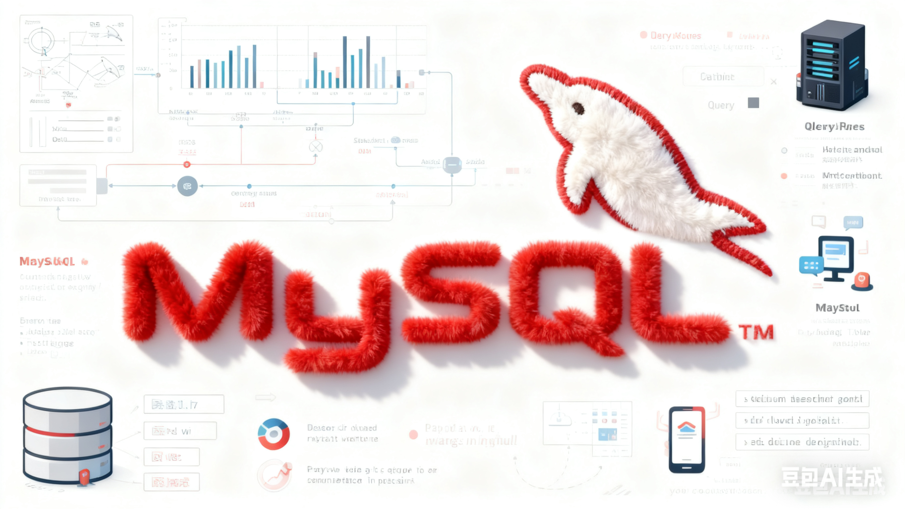

# MySQL从基础到入门

!!! info "信息"
    本篇摘录自黑马程序员的B站教学视频，由本人学习视频内容后总结并提取摘要制作而成的简要笔记。
    
     **黑马程序员**[黑马程序员 MySQL数据库入门到精通，从mysql安装到mysql高级、mysql优化全囊括](https://www.bilibili.com/video/BV1Kr4y1i7ru)
     
    本站笔记，由本人学习视频内容后，大量参考[智云笔记](https://jimhackking.github.io/archives/) 这位前辈的markdown文档。进一步进行了补充，包括但不限于(课程中老师的所有程序,一些基础概念,图表,以及细微的知识点)。并对前1-27章总结了幕布的思维导图笔记，方便及时查阅与复习。
    
    对于黑马程序员的课程与前辈的笔记一并表示感谢！如有不妥之处可联系删除

> 本笔记暂时只记录到基础篇（完结），剩下的进阶篇以及运维篇由于本人方向是**数据分析**，在有限的时间下可能会挑选部分进行学习。
