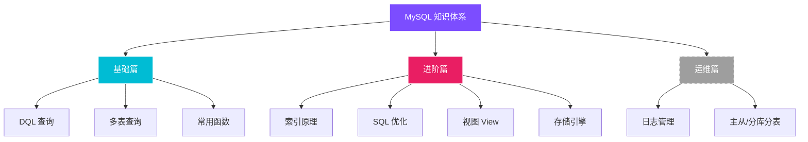

# MySQL 从基础到入门

!!! info "课程致谢"
    本篇笔记摘要自 **黑马程序员** 的 B 站精品教程 [MySQL数据库入门到精通](https://www.bilibili.com/video/BV1Kr4y1i7ru)。
    同时参考了前辈 [智云笔记](https://jimhackking.github.io/archives/) 的文档结构，在此基础上补充了代码实操、图表与思维导图。

---

## 📚 章节导航

-   __基础篇：SQL 核心语法__

    ---
    
    掌握数据库增删改查（CRUD）与多表查询，这是数据分析的基石。
    
    *   ✨ **DDL/DML/DQL**：建表、增删改查
    *   🔗 **多表查询**：内连接、外连接、子查询
    *   📦 **事务控制**：ACID 特性与并发问题
    
    [:octicons-arrow-right-24: 进入基础篇](Base/BasicChapter.md){ .md-button .md-button--primary }

-   __进阶篇：原理与优化__

    ---
    
    深入理解数据库底层，写出高性能 SQL。
    
    *   🔎 **索引优化**：B+树结构、执行计划 Explain
    *   🚀 **SQL调优**：Order By/Group By 优化技巧
    *   👁️ **视图与存储过程**：逻辑封装与编程
    *   🔒 **锁机制**：行锁、表锁与死锁避免
    
    [:octicons-arrow-right-24: 挑战进阶篇](Base/AdvancedChapter.md){ .md-button }

---

## 🧠 知识图谱与学习路径

!!! tip "数据分析师特别指南"
    MySQL 的体系庞大（含 DBA 运维内容）。作为 **数据分析师**，我们应遵循 **"去肥增瘦"** 的原则，聚焦于 **取数** 与 **查询效率**。

### 🎯 章节筛选建议

| 板块 | 章节推荐 | 核心理由 |
| :--- | :--- | :--- |
| **索引** | ⭐⭐⭐ **必学** | 分析师常处理千万级数据，不懂索引会导致查询超时甚至拖垮库。重点掌握 **最左前缀**、**覆盖索引**。 |
| **SQL 优化** | ⭐⭐⭐ **必学** | 掌握 `Order By`、`Group By` 的优化技巧，提升报表统计速度。 |
| **视图** | ⭐⭐ **推荐** | 学会封装复杂的分析逻辑（如留存率计算），方便复用。 |
| **窗口函数** | ⭐⭐⭐ **必学** | 课程中可能未深入，请移步 [SQL 窗口函数专题](../windows_function/index.md) 专攻。 |
| **存储过程** | ⭐ **选学** | 现代架构多用 Python/Airflow 做 ETL，存储过程只需读懂即可。 |
| **运维篇** | ❌ **跳过** | 主从复制、分库分表配置由 DBA 负责，分析师只需知道原理。 |

---

### 📝 学习复盘

> "Talk is cheap, show me the code."

建议在学习过程中，不仅要看懂笔记，更要在本地 MySQL 环境中亲自执行每一条 SQL。对于 **Explain 执行计划**，尝试对比加索引前后的查询行数差异，会有醍醐灌顶的感觉。
