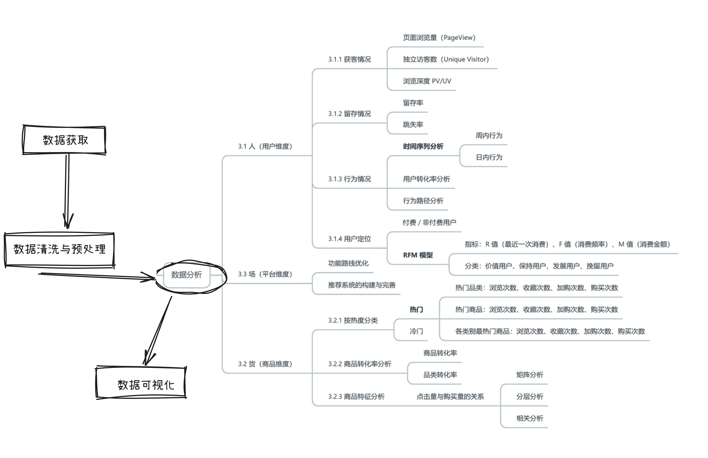

# 淘宝用户行为数据实战（MySQL）


> 1 亿行淘宝用户行为数据，从导入到分析的完整实战路线。

`MySQL` `UserBehavior` `1e8+ 行` `电商分析` `SQL 实战`



## 项目说明
本项目基于阿里云天池 UserBehavior 数据集（2017-11-25 至 2017-12-03），包含 pv、buy、cart、fav 四类行为记录，总量约 1 亿行。我们使用 MySQL 完成数据导入、清洗、特征加工与指标分析，形成一套可复用的电商分析实战流程。

适合人群：刚入门数据分析/SQL 的同学，希望通过一个真实项目打通“数据获取、导入、清洗、分析、可视化”的完整链路。

## 快速导航
| 模块 | 说明 | 入口 |
| --- | --- | --- |
| 数据准备 | 数据迁移建议 | [数据迁移建议](mysqldata.md) |
| 实战主线--项目主体（附源码） | 从导入到分析的完整步骤 | [实战主线](taobao.md) |
| 实战建议 | 小样本快速验证 | [小样本验证](suggest.md) |

## 数据规模
| 维度 | 数量 |
| --- | --- |
| 用户数量 | 987,994 |
| 商品数量 | 4,162,024 |
| 商品类目数量 | 9,439 |
| 行为记录数量 | 100,150,807 |

## 实战内容一览
- 数据导入与性能优化（Kettle/LOAD DATA INFILE）
- 数据清洗与去重、时间字段规范化
- 行为分析：浏览/收藏/加购/购买
- 转化率与漏斗分析
- 用户分层：RFM/RF 模型
- 热门品类与热门商品分析
- 可视化结果与业务解读

## 新手上路建议
- 先用小样本验证 SQL，再扩到全量数据。
- 亿级导入优先 Kettle 或 `LOAD DATA INFILE`，不要全程依赖 GUI。
- 数据目录尽量避开 C 盘，日志/临时文件会迅速膨胀。
- 建表字段与 CSV 保持一致，`timestamp` 建议改名为 `timestamps`。
- 导入时关闭自动提交，采用批量提交（如 10000 行/批）。
- 连接池不要盲目拉到 100，单表导入 5-20 通常已足够。
- 先做空值、重复检查，再通过自增 `id` 去重更稳妥。
- 把时间戳转成 datetime，再派生日期/小时字段，分析更顺手。
- 需要时再调大 `innodb_buffer_pool_size`，前提是机器内存允许。

## 采样验证三步法
这样做能降低试错成本、节省资源，并更快看到数据分布是否异常。

1. 随机采样：创建临时表并抽取少量数据。
2. 逻辑验证：在临时表上完成 EDA 与指标验证。
3. 全量推广：确认无误后替换为正式表。

```sql
create table temp_behavior like user_behavior;
insert into temp_behavior
select * from user_behavior limit 100000;
```

## 阅读建议
- 第一次阅读建议按“数据准备 → 导入 → 清洗 → 分析”的顺序走一遍。
- 跑全量前先把关键 SQL 在小样本上验证完毕。
