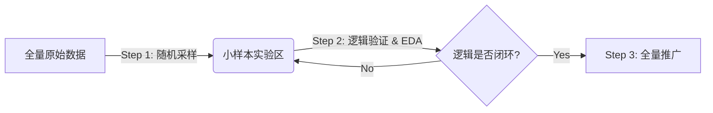

# 亿级数据分析最佳实践：采样验证策略 (Sampling & Verification Strategy)

> **摘要**：在面对亿级（10^8+）规模的数据集时，直接进行全量分析往往伴随着高昂的时间成本与计算资源消耗。本文档详细阐述了“采样验证”这一工业界标准作业流程，旨在帮助数据分析师建立高效、低风险的数据探索方法论。

---

## 1. 核心理念：为什么不能直接跑全量？

在处理大规模数据（Big Data）时，**“快速失败”（Fail Fast）**与**“资源隔离”**是两个至关重要的工程原则。

*   **容错成本过高**：在 1 亿行数据上执行一个包含逻辑错误的 SQL（如笛卡尔积、错误的正则提取），可能需要运行 30 分钟甚至数小时才会报错或超时。这意味着一次试错的成本就是半天时间。
*   **资源竞争风险**：全量数据的聚合（`GROUP BY`）与连接（`JOIN`）操作极度消耗 CPU 与内存。在探索阶段频繁执行此类操作，极易导致数据库负载过高，甚至阻塞生产任务。
*   **数据质量陷阱**：全量数据中往往隐藏着脏数据（如异常值、NULL、重复 ID）。如果未在小样本中发现这些问题，全量跑出的结果往往是不可信的。

**最佳实践**：**“大处着眼，小处着手”**。先在小池子里学会游泳，再去大海里冲浪。

---

## 2. 标准化工作流 (Standard Workflow)

建议将以下三步走策略固化到日常数据分析的工作流中：



### Step 1: 随机采样 (Random Sampling)

构建一个轻量级的“沙盒环境”。

*   **目标**：创建一个包含 10万 ~ 100万 行数据的临时表或视图。
*   **策略**：
    *   **完全随机**：适用于数据分布均匀的场景。
    *   **分层采样**：如果关注特定类别（如极少量的付费用户），需确保样本中包含足够数量的目标群体。

**SQL 实现示例**：

```sql
-- 1. 创建一个结构完全一致的临时表
CREATE TABLE temp_behavior LIKE user_behavior;

-- 2. 随机抽取数据注入临时表
-- 场景 A：数据本身无序或对随机性要求不高（推荐，速度快）
INSERT INTO temp_behavior 
SELECT * FROM user_behavior LIMIT 100000;

-- 场景 B：数据严格有序，需要打散（速度较慢，慎用）
-- INSERT INTO temp_behavior 
-- SELECT * FROM user_behavior ORDER BY RAND() LIMIT 100000;
```

### Step 2: 逻辑验证与探索性分析 (EDA)

在沙盒中进行高频迭代。

*   **动作**：在 `temp_behavior` 上编写并执行所有的分析 SQL（转化率计算、漏斗模型、留存分析等）。
*   **验证清单**：
    1.  **语法正确性**：SQL 能否跑通？函数使用是否正确？
    2.  **数据分布合理性**：
        *   转化率是否超过 100%？
        *   是否存在未知的 `behavior_type`？
        *   时间戳是否在有效范围内？
    3.  **性能预估**：小样本上的查询耗时可以作为全量预估的参考。

### Step 3: 全量推广 (Scale Up)

将验证过的逻辑应用到生产环境。

*   **动作**：当 SQL 逻辑在 `temp_behavior` 上验证无误后，仅需将 SQL 中的表名替换为 `user_behavior`。
*   **执行**：建议通过后台任务（如 `nohup`）或分批次（Batch Processing）执行，避免长事务锁表。

---

## 3. 进阶技巧与避坑指南

### 3.1 警惕“数据倾斜” (Data Skew)
在小样本中，某些长尾分布的数据可能完全消失。
*   **对策**：在采样前，先对关键维度（如 `category_id`）做一次全量的 `COUNT(DISTINCT)` 或简单的 `GROUP BY` 概览，确保样本具有代表性。

### 3.2 唯一性校验
不要假设 ID 永远是唯一的。
*   **操作**：在分析前，务必执行 `SELECT COUNT(*) - COUNT(DISTINCT id)` 检查主键重复情况。

### 3.3 采样比例
*   **10万行**：适合调试 SQL 语法和逻辑。
*   **100万行**：适合观察数据分布和统计特征。
*   **1000万行+**：适合进行压力测试。

---

## 4. 总结

> **"Think Big, Start Small, Scale Fast."**

数据分析不仅仅是写 SQL，更是一门关于**效率管理**与**风险控制**的艺术。通过“采样验证”策略，您可以将 90% 的逻辑错误拦截在低成本的沙盒阶段，从而以最优雅的姿态驾驭亿级数据。