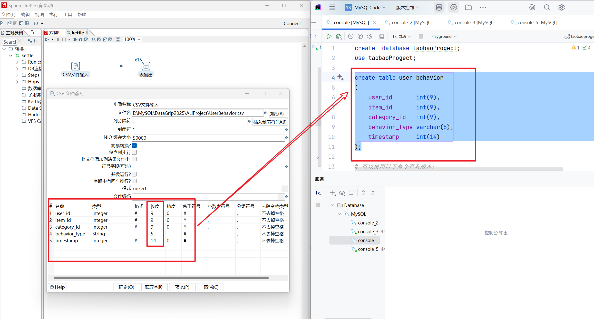
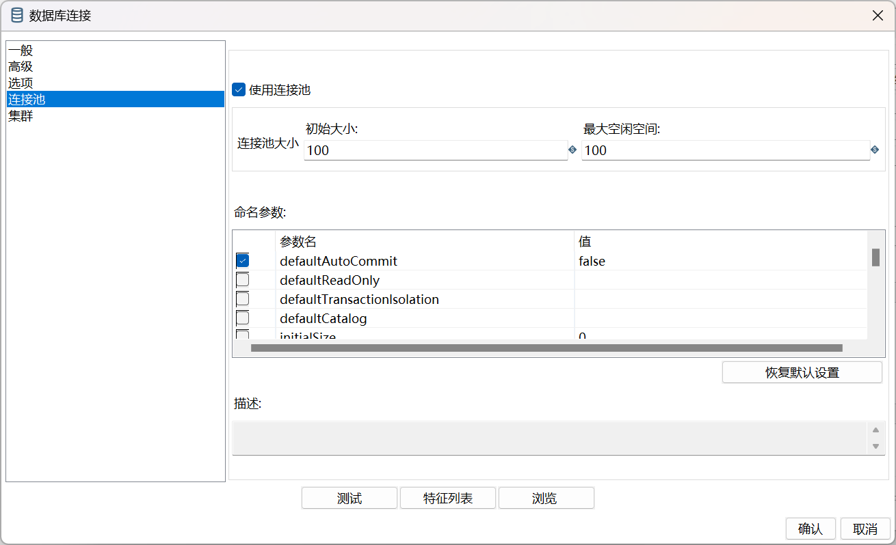
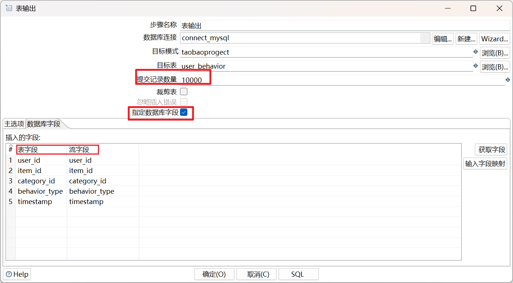
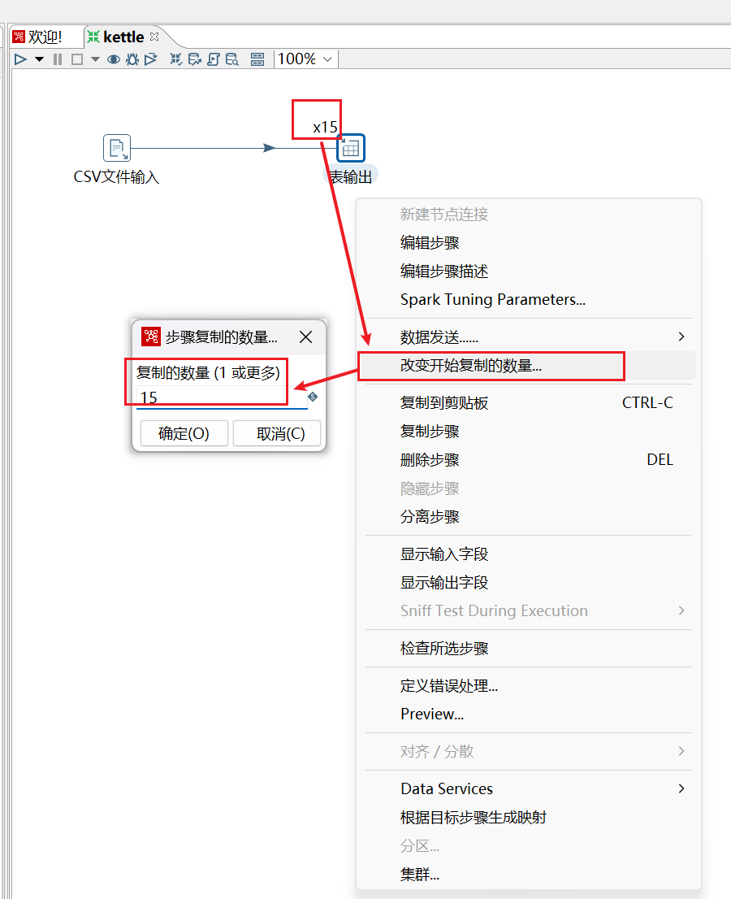
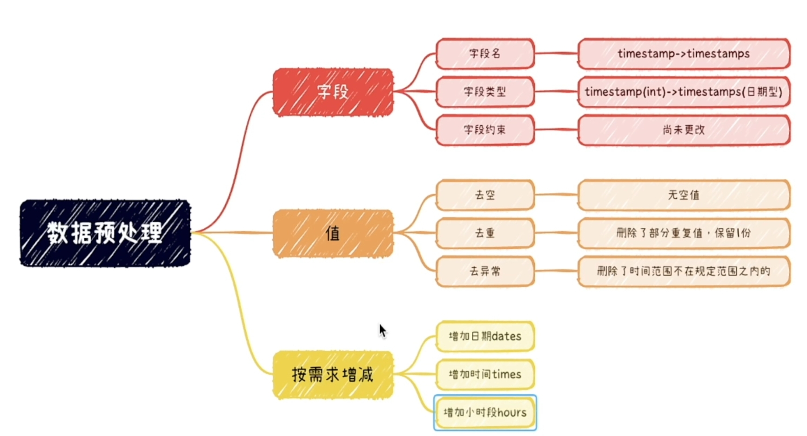
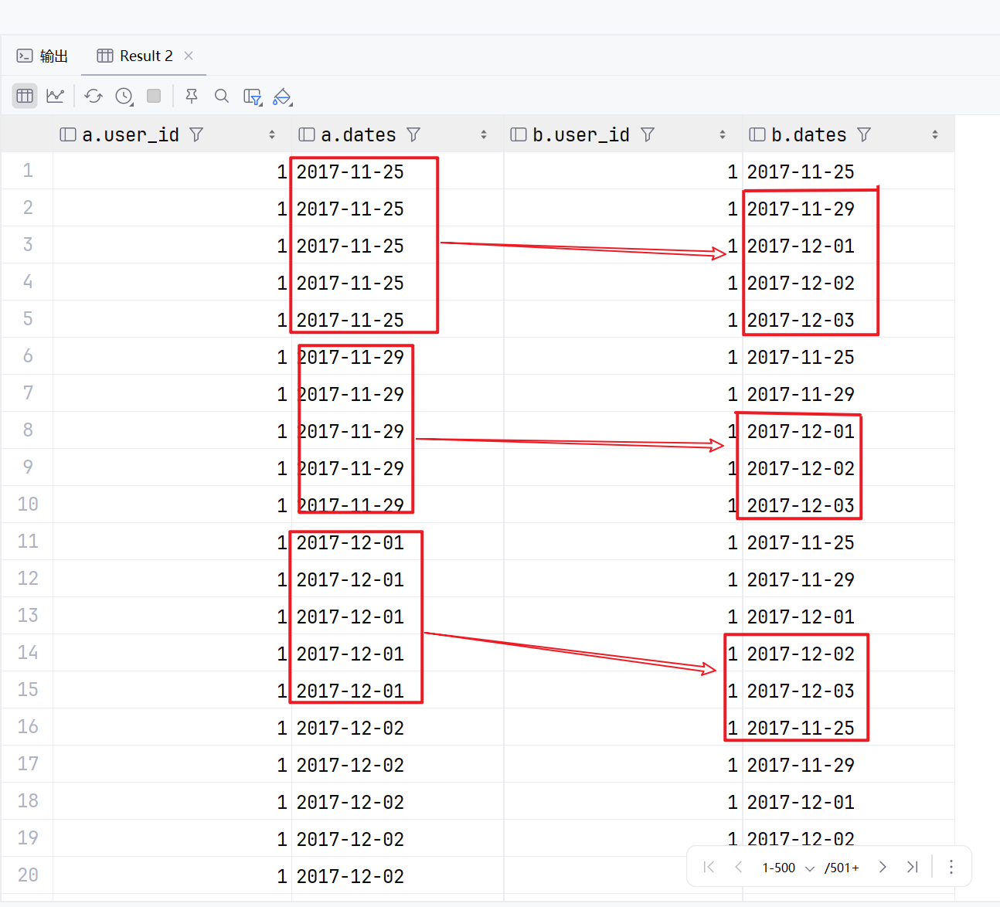
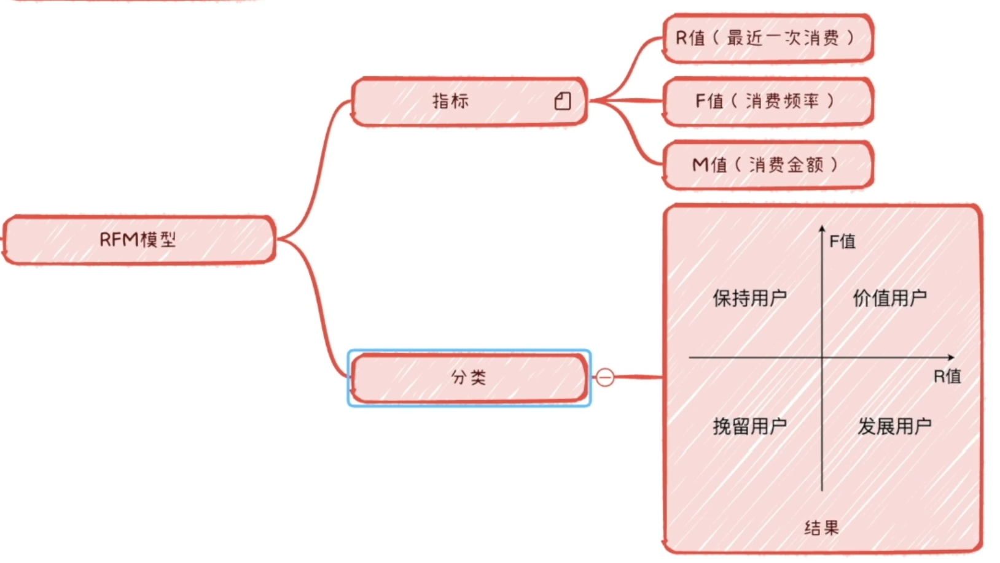

# 《MySQL实战》

## 一、数据集介绍与下载
[项目文档(资料、链接等）：](https://lusuzi.com/tech/mysql-practice-project-doc/)博主原文档说的很清楚，链接也十分详细,这里不做过多赘述。

[数据迁移](./ mysqldata.md):1亿条用户数据,在运行时会产生大量日志文件。如果你的MySQL数据在C盘建议迁移出来,否则C盘可能会爆炸！

### 1.1数据集下载
> 数据集建议直接从官网下载，会比网盘快很多

[阿里云天池数据集: User Behavior Data from Taobao for Recommendation](https://tianchi.aliyun.com/dataset/dataDetail?dataId=649&userId=1)

!!! info "信息提示"
    使用数据前仔细阅读数据说明，以确保正确理解数据的结构和含义。

???- tip "和官网数据说明一致"
    #### 1. 概述
    
    UserBehavior是阿里巴巴提供的一个淘宝用户行为数据集，用于隐式反馈推荐问题的研究。
    
    #### 2. 介绍
    
    | 文件名称 | 说明 | 包含特征 |
    | :--- | :--- | :--- |
    | UserBehavior.csv | 包含所有的用户行为数据 | 用户ID, 商品ID, 商品类目ID, 行为类型, 时间戳 |
    
    #### UserBehavior.csv
    
    本数据集包含了2017年11月25日至2017年12月3日之间，有行为的约一百万随机用户的所有行为（行为包括点击、购买、加购、喜欢）。数据集的组织形式和MovieLens-20M类似，即数据集的每一行表示一条用户行为，由用户ID、商品ID、商品类目ID、行为类型和时间戳组成，并以逗号分隔。关于数据集中每一列的详细描述如下：
    
    | 列名称 | 说明 |
    | :--- | :--- |
    | 用户ID | 整数类型，序列化后的用户ID |
    | 商品ID | 整数类型，序列化后的商品ID |
    | 商品类目ID | 整数类型，序列化后的商品所属类目ID |
    | 行为类型 | 字符串，枚举类型，包括('pv', 'buy', 'cart', 'fav') |
    | 时间戳 | 行为发生的时间戳 |
    
    注意到，用户行为类型共有四种，它们分别是：
    
    | 行为类型 | 说明 |
    | :--- | :--- |
    | pv | 商品详情页pv，等价于点击 |
    | buy | 商品购买 |
    | cart | 将商品加入购物车 |
    | fav | 收藏商品 |
    
    关于数据集大小的一些说明如下：
    
    | 维度 | 数量 |
    | :--- | :--- |
    | 用户数量 | 987,994 |
    | 商品数量 | 4,162,024 |
    | 商品类目数量 | 9,439 |
    | 所有行为数量 | 100,150,807 |
    
    | 字段          | 说明                                               |
    | :------------ | :------------------------------------------------- |
    | User ID       | 整数类型，序列化后的用户ID                         |
    | Item ID       | 整数类型，序列化后的商品ID                         |
    | Category ID   | 整数类型，序列化后的商品所属类目ID                 |
    | Behavior type | 字符串，枚举类型，包括('pv', 'buy', 'cart', 'fav') |
    | Timestamp     | 行为发生的时间戳                                   |
    
    | Behavior type | 说明                     |
    | :------------ | :----------------------- |
    | pv            | 商品详情页pv，等价于点击 |
    | buy           | 商品购买                 |
    | cart          | 将商品加入购物车         |
    | fav           | 收藏商品                 |


## 二、数据集介绍（略过）

## 三、kettle安装（略过）

```MySQL
# 可以使用以下命令查看版本：
SELECT VERSION();
# 然后去下载相应的mysql驱动mysql-connector-java
```

在图形化界面使用上述命令可以查看MySQL的版本


## 四、用kettle将数据导入MySQL

> 这里UP主对一些操作讲的很模糊，我会详细说明每个参数的作用

**DataGrip vs Kettle（PDI/Spoon）导入大数据对比**

| 维度          | DataGrip 图形化导入     | Kettle（PDI）ETL 导入      |
| ----------- | ------------------ | ---------------------- |
| 定位          | 数据库 IDE，偏“手动一次性操作” | ETL 工具，偏“流程化/工程化导入”    |
| 上手成本        | 低：点点按钮即可           | 中：需要配置步骤、连接、字段映射       |
| 性能（亿级）      | 一般：容易受本机/GUI/网络影响  | 较好：可配置批量提交、并行、缓冲       |
| 稳定性         | 中：长时间运行更易中断        | 高：更适合长作业、可后台跑          |
| 断点/容错       | 弱：失败后往往人工处理        | 强：可记录日志、坏数据分流、失败策略     |
| 可重复执行       | 一般：更多靠手工重复操作       | 强：一次配置可反复跑，支持变量化       |
| 自动化/调度      | 弱：不适合上生产定时         | 强：可命令行运行 + 调度（任务计划/脚本） |
| 数据清洗/转换     | 弱：导入基本就是导入         | 强：导入同时做清洗、映射、过滤、去重等    |
| 可观测性（日志/统计） | 一般：过程信息有限          | 强：行数统计、错误日志、执行日志更完善    |
| 适用场景        | 小数据、临时导入、快速查看      | 大数据、长期任务、需要稳定与可控的导入    |

---


* **少量数据/临时导入**：用 **DataGrip** 更省事。
* **一亿条这种大数据**：更推荐 **Kettle**，因为能控制**批量提交/容错/日志/可重复执行**，失败也更容易恢复，不容易“跑到一半崩了”。

---

**MySQL命令： `LOAD DATA INFILE`(最简说明)**
如果你只是想把大数据集导入MySQL而不做任何处理，直接用 `LOAD DATA INFILE` 就行，速度最快。

这是 **MySQL 原生的高速导入命令**，通常比 GUI/ETL 更快：

```sql
LOAD DATA INFILE '/path/userbehavior.csv'
INTO TABLE user_behavior
FIELDS TERMINATED BY ',' ENCLOSED BY '"'
LINES TERMINATED BY '\n'
IGNORE 1 LINES;
```

* 优点：**速度快、开销小**
* 注意：需要 MySQL 允许本地/服务器文件导入（有时要用 `LOCAL` 或开启相关权限/参数）


### 4.1 在MySQL中创建数据库和表
```mysql
create database taobao;
use taobao;

create table user_behavior(
    user_id       int(9),
    item_id       int(9),
    category_id   int(9),
    behavior_type varchar(5),
    timestamp     int(14)
);
```
### 4.2 在kettle中上传数据



让 Kettle 字段元数据和 MySQL 列定义一致，减少转换和风险。

---



???- tip "连接池相关设置"

    **连接池是什么**
    
    连接池就是：Kettle 运行时不每次都“新建/关闭”数据库连接，而是**提前准备一批连接**，用完归还复用，减少频繁建连的开销。


    **Q1：为什么填 100？**
    
    通常是出于这几类动机：
    
    1. **并发步骤/多线程写入时**需要更多连接
       比如你用了：
    
    * “表输出”步骤并发（步骤级并发）
    * 多个转换/多个 job 并行跑
    * 分片导入（同一时刻多个线程在写 MySQL）
    
    这时如果池太小，线程会抢连接、阻塞等待，吞吐变差。
    
    2. **高延迟网络 / 远程 MySQL**，建连成本高
       复用连接更重要。
    
    3. **习惯性“大一点不怕”**
       很多教程喜欢写 50/100，看着“性能更强”。
    
     但关键事实是：
    
    > **连接池=100 并不等于速度就快 100 倍**
    > 导入性能瓶颈通常在：磁盘 IO / MySQL 写入能力 / redo log / 索引维护 / 单表锁争用，而不是连接数。
    
    **Q2:连接池设太大可能带来的问题**
    
    * **MySQL 连接数打爆**（max_connections 不够）
    * **内存占用大**：MySQL 每个连接都有线程/缓冲区开销
    * **写入争用更严重**：同表高并发写会让锁竞争、redo/flush 压力更大，反而慢
    * **对你这种“单表单 CSV 导入”**：很多时候 5~20 个连接就够了
    
    更合理的经验（不绝对）：
    
    * **单线程导入**：1~5 足够
    * **少量并发（2~8 线程）**：10~30
    * **你明确在并行跑多个转换/多个表输出**：再考虑 50+
    * **100** 只有在你确认 MySQL 和服务器扛得住，并且确实有大量并发连接需求时才有意义
    
    > 所以：**100 更像“上限准备”，不是必须值。**

---
???- tip "自动提交设置的说明"

     **2）为什么要取消自动提交（defaultAutoCommit=false）？**
    
    **Q3：自动提交（AutoCommit=true）意味着什么**
    
    * **每插入一行，就立即提交一次事务**
    * 后果：对 MySQL 来说就是 **一亿次 commit**
      这会让：
    * redo log 刷盘次数暴增
    * binlog/事务日志开销暴增
    * 性能通常会“惨烈下降”
    
    **Q4：取消自动提交（AutoCommit=false）带来的好处**
    
    你可以让 Kettle 按“批次”提交，比如每 10,000 行提交一次（在“表输出”里配置 commit size / batch size）。
    
    这样变成：
    
    * 一亿行 / 10,000 = **10,000 次 commit**
    * 从“一亿次提交”变成“一万次提交”，通常性能会有数量级提升
    
    这也是大数据导入最核心的优化之一：**批量提交 + 批处理写入**。
    
    **Q5：取消自动提交的代价/风险**
    
    * **中途失败会回滚“最后一批”**（比如最后 1 万行没提交会丢）
    * **单次事务太大**会：
    
       * 占用更多锁
      * 回滚更慢
      * redo/undo 压力大
        所以 commit size 不能无限大，通常要找平衡点。

---


| 字段                     | 值    |
| ------------------------ | ----- |
| useServerPrepStmts       | false |
| useCompression           | true  |
| rewriteBatchedStatements | true  |


| 选项                         | 作用（一句话）                                     | 对亿级导入影响        | 推荐值         | 备注/注意                       |
| -------------------------- | ------------------------------------------- | -------------- | ----------- | --------------------------- |
| `rewriteBatchedStatements` | 把批量 insert 重写成 `values(...),(...)` 这种真正批量写入 | ⭐⭐⭐⭐⭐ **非常关键** | `true`      | 吞吐常提升 **3~10倍**，亿级导入必开      |
| `useServerPrepStmts`       | 使用**服务端预编译** PreparedStatement，减少重复解析       | ⭐⭐⭐⭐ 重要        | `true`      | 和 batch 配合更好，普通 insert 场景很稳 |
| `defaultFetchSize`         | 控制 **SELECT 查询**每次拉取行数                      | ⭐ 几乎无关（写入场景）   | `500`（默认即可） | 主要影响“读库”，CSV→写库基本不靠它        |
| `useCompression`           | 客户端与 MySQL 之间启用网络传输压缩                       | ⭐⭐ 视情况         | `false`（一般） | 本地/内网别开；远程带宽小/延迟高可尝试 `true` |

---



???- tip "图中相关设置的说明"

    **Q1：提交记录数量 = 10000（Commit size）**
    
    **它的含义：每插入 10000 行数据，提交一次事务（commit）。**
    
    如果你不设置（或是 1）：
    
    - 就会变成**每插一行就提交一次**
    - 对 1 亿行来说就是 1 亿次 commit，性能会非常差
    
    设成 **10000** 的好处：
    ✅ **大幅提升速度**：减少事务提交次数、减少刷盘日志开销
    ✅ **更稳定**：单次事务不会大到撑爆日志/回滚压力
    ✅ **更容易恢复**：失败时最多丢最后 10000 行未提交的数据
    
    > 这种亿级导入：**10000 是一个很合理的起点** 
    
    ---
    
    **Q2：为什么要勾选“指定字段”**
    
    指定数据库字段 **不靠默认顺序写入，而是按你指定的字段映射写入。**
    
    如果不勾选，Kettle 往往按“流字段顺序”直接插入——风险很大：
    
    - 你 CSV 字段顺序和表字段顺序稍微不一致 → **写错列**
    - 将来你表新增一列 → **整个导入错位/失败**
    
    勾选它后：
    ✅ **明确写入哪一列，不怕顺序变化**
    ✅ **更安全、更可控**
    ✅ 适合亿级数据：避免跑一半发现列错了（那就灾难了）
    
    - **表字段**：数据库表的“列名”
    - **流字段**：Kettle 数据流里的“字段名”（上游步骤带过来的列）
    - **映射**：告诉 Kettle “流字段写到哪个表字段里”




线程10-20个左右

???- tip "线程设置说明"

    **x15 表示把“表输出”步骤复制成 15 个并行副本同时运行（15 个线程并发写库）。**
    
     **关键点**
    
    * ✅ 作用：**提高并发写入**，可能加快导入速度
    * ⚠️ 风险：写同一张 MySQL 表时并发太大容易
    
      * 锁竞争变多
      * 日志/IO 压力暴涨
      * 连接数飙升
      * **反而变慢甚至失败**
    * ✅ 建议：亿级导入通常 **从 x1/x2 开始测试**，一般不需要到 x15					


**导入数据后查看数据的基本情况，确保无误**
```mysql
select count(1) from user_behavior;

desc user_behavior;
```


`select count(1) from user_behavior;`，`COUNT` 函数用于统计行数。   
1. **`COUNT(*)`**  
    - 统计表中所有行的数量，包括所有列，不会忽略 `NULL` 值。
    - 性能上通常会更快，因为它不需要检查具体列的值。

2. **`COUNT(1)`**  
    - 统计表中所有行的数量，`1` 是一个常量，与具体列无关。
    - 实际上与 `COUNT(*)` 的效果相同，数据库会优化为统计行数。

3. **`COUNT(column_name)`**  
    - 统计某一列中非 `NULL` 值的数量。
    - 如果列中有 `NULL` 值，这些行不会被计入。

`desc user_behavior;`

这条SQL语句用于查看 user_behavior 表的结构（即表的字段名、类型、是否允许为NULL、主键信息等）。常用于了解表的设计和字段详情。


## 五、数据预处理

### 5.1 数据预处理三部曲：

1. **数据清洗**：处理缺失值、重复值和异常值。
2. **数据转换**：对数据进行格式化、标准化和归一化处理。
3. **特征工程**：提取有用特征，构建新的特征。

```mysql
# 改变字段名称 因为timestamp是mysql的关键字
alter table user_behavior change timestamp timestamps int(14);

desc user_behavior; 
# 检查数据中是否有空值
select count(1) from user_behavior where user_id is null;
select count(1) from user_behavior where item_id is null;
select count(1) from user_behavior where category_id is null;
select count(1) from user_behavior where behavior_type is null;
select count(1) from user_behavior where timestamps is null;
# 检查数据中是否有重复值
select user_id, item_id, timestamps from user_behavior
group by user_id, item_id, timestamps
having count(*) > 1;
```

- 注意在这里单个字段重复并不代表整行数据重复
- 所以我们要检查所有字段的组合的整行数据是否有重复
- 这样可以找出在同一时刻、同一用户、同一商品下，是否有多条完全一样的行为数据（即重复数据）。


```mysql
-- 去重
# 添加一个新的字段id
alter table user_behavior add id int first ;
select * from user_behavior limit 5; -- 检查是否加入了新字段

# 将id设置为不为空的，自增的主键
alter table user_behavior modify column id int not null auto_increment primary key;
select * from user_behavior limit 5; -- 检查是否执行成功
```
在去重时加入 id 字段，是为了**唯一标识每一行数据**，方便后续删除重复记录时只保留一条。


```mysql
-- 创建去重代码
delete user_behavior
from user_behavior,
     (select user_id, item_id, timestamps, min(id) id
      from user_behavior
      group by user_id, item_id, timestamps
      having count(*)>1) t2
where user_behavior.user_id = t2.user_id
  and user_behavior.item_id = t2.item_id
  and user_behavior.timestamps = t2.timestamps
  and user_behavior.id > t2.id;

```
**删除 user_behavior 表中重复的数据，只保留每组重复中的一条**。具体逻辑如下：
   - 子查询部分会找出所有重复的行为（即 user_id、item_id、timestamps 这三列完全相同且出现多次的数据）。
   - 对每组重复数据，`min(id)` 取出该组中 id 最小的那一条（即最早插入的那条），用来保留。

**主查询 delete ... from ... where ...**

- 将 user_behavior 表和子查询 t2 进行关联，条件是三列（user_id, item_id, timestamps）都相等。
- `and user_behavior.id > t2.id` 表示只删除 id 比最小 id 大的那些行，也就是每组重复中“多余的”那几条。
- 这样每组重复数据只会保留一条（id 最小的那条），其余的全部删除。


```mysql
-- 更改buffer值
-- 查看当前缓冲值的大小
show VARIABLES like '%_buffer%';
-- 设置缓冲值为10G
set global innodb_buffer_pool_size=10*1024*1024*1024;
-- 查看修改后的缓冲值
show VARIABLES like '%_buffer%';
```
更改 buffer 是数据库性能优化的常见手段，尤其适合大数据导入、复杂查询等高负载场景。
???- tip "详细说明"
    更改 MySQL 的 buffer（缓冲区）大小，主要是为了**提升数据库的读写性能**，尤其是在处理大数据量导入或查询时。

    具体原因如下：
    
    1. **提高数据处理速度**  
    增大 `innodb_buffer_pool_size` 可以让更多的数据和索引缓存到内存，减少磁盘读写次数，提升查询和写入效率。
    
    2. **适应大数据场景**  
    当数据量很大时，默认缓冲区可能不足，容易导致频繁的磁盘IO，影响性能。设置为10G等较大值，可以更好地支持批量导入和高并发操作。
    
    3. **减少延迟和锁等待**  
    充足的缓冲区能减少因磁盘读写带来的延迟，也能降低事务锁等待的概率。


```mysql
-- 添加一个新的字段datetimes用于存储时间戳转换后的时间 秒后面的(0)表示不保留小数位
alter table  user_behavior add datetimes timestamp(0);

-- 将int类型的时间戳转换为datetime类型并存储到新的字段中
update user_behavior set datetimes = from_unixtime(user_behavior.timestamps);

-- 检查是否更新成功
select * from user_behavior limit 5;
```
> 原始数据中的时间是以 int 类型的时间戳存储，不方便直接进行日期、小时等维度的分析。
通过 from_unixtime() 函数，将时间戳转换为标准的 datetime 类型，存入新字段 datetimes。

```mysql
-- 新增日期字段：date time hours
alter table  user_behavior add dates char(10);
alter table  user_behavior add times char(8);
alter table  user_behavior add hours char(2);

# 一次性插入三条语句
update user_behavior
set user_behavior.dates= substring(user_behavior.datetimes, 1, 10),
    user_behavior.times= substring(user_behavior.datetimes, 12, 8),
    user_behavior.hours= substring(user_behavior.datetimes, 12, 2);

-- 检查是否更新成功
select * from user_behavior limit 5;
```
**解释：**
- `dates` 字段保存日期（如 2023-01-22），便于按天统计。
- `times` 字段保存具体时间（如 12:34:56），便于分析具体时刻的行为。
- `hours` 字段保存小时（如 12），便于按小时统计用户行为分布。
- 通过 `substring` 函数从 datetimes 字段中提取对应的内容，批量更新。


```mysql
-- 去除异常数据
select max(datetimes),min(user_behavior.datetimes) from user_behavior;

-- 删除不应该存在的异常数据，阿里云的数据集有标注时间范围
deletefrom user_behavior
where datetimes < '2017-11-25 00:00:00'
   or datetimes > '2017-12-03 23:59:59';

-- 数据预处理后概览
describe user_behavior;  -- 查看表结构

select count(1) from user_behavior;  -- 查看总行数
select * from user_behavior limit 5;
```




## 六、获客情况
### 6.1 三大核心指标
1.  **页面浏览量 (PV - Page View)**
    *   **概念**：指页面被浏览的总次数。用户每刷新一次页面或打开一个新的页面，PV 就会增加一次。它是衡量网站流量最直接的指标。

2.  **独立访客数 (UV - Unique Visitor)**
    *   **概念**：指在一定时间内访问网站的自然人（去重后的用户数）。无论同一个用户在一天内访问了多少次页面，UV 只计算一次。


3.  **浏览深度 (PV/UV)**
    *   **概念**：平均每个独立访客浏览的页面数量。计算公式为 PV 除以 UV。
    这个指标反映了网站的**用户粘性**或内容吸引力。数值越高，说明用户在网站停留时间越长，查看的内容越多。

> 数据太多 先选取十万条数据进行分析
```mysql
-- 创建临时表
create table temp_behavior like user_behavior;

-- 截取前十万条数据
insert into temp_behavior
select * from user_behavior limit 100000;

-- 查看临时表数据
select * from temp_behavior;
```
`like` 在这里的是 **"复制表结构"**。

创建一个名为 `temp_behavior` 的新表，它的**结构（列名、数据类型、索引、主键等）**与已存在的 `user_behavior` 表**完全一致**。

* **只复制结构**：它只会把表的“骨架”复制过来。
* **不复制数据**：新表 `temp_behavior` 里面是空的，没有原本 `user_behavior` 中的任何数据。

这通常用于创建临时表、备份表结构或者在不影响原数据的情况下进行测试。


```mysql
-- 某一天的页面浏览量 pv
select dates,count(*) as pv
from temp_behavior
where behavior_type = 'pv'
group by dates;
-- 某一天的独立访客数 uv
# 某一天内访问某个网站或页面的唯一用户数量
select dates,count(distinct user_id) as uv
from temp_behavior
where behavior_type = 'pv'
group by dates;
```

distinct 在统计或查询时，自动去除重复值，只保留唯一的数据。

```mysql
-- 某一天的浏览深度 pv/uv
# 浏览深度是指用户在一次访问中浏览的页面数量
select dates,
       count(*)  pv,
       count(distinct user_id)  uv,
       round(count(*) / count(distinct user_id),2)  'pv/uv'
from temp_behavior
where behavior_type = 'pv'
group by dates;
-- 处理真实数据
-- 创建表存储最终数据
create table pv_uv_puv(
    dates char(10),
    pv    int(9),
    uv    int(9),
    p_uv  decimal(10,2)  # 存储带有小数点的数字
    );

-- 查询原表数据插入到新表中
insert into pv_uv_puv ()
select dates,
       count(*)  pv,
       count(distinct user_id)  uv,
       round(count(*) / count(distinct user_id),2)  'pv/uv'
from user_behavior   # 这里是对真实数据进行操作
where behavior_type = 'pv'
group by dates;

-- 查看插入数据
select * from pv_uv_puv;
```

这里出现null值的原因是，timestamp字段存储的时间戳数据在转换为datetime格式时，可能存在一些无效或异常的时间戳值(如负值)，导致转换失败，从而在datetimes字段中产生null值。

在其他案例中，也可能是因为在计算浏览深度（pv/uv）时，某些日期的独立访客数（uv）为零，导致除以零的情况，从而产生了null值。

```mysql
-- 删除含有null值的行
delete from pv_uv_puv
where dates is null;
```


## 七、留存情况
### 留存率
留存率是指在某一时间段内，用户在首次访问或使用某个产品后，在后续时间段内继续访问或使用的比例。通常用于衡量用户对产品的粘性。

**计算公式**：  
`留存率 = （某时间段内留存用户数 / 首次访问用户数） × 100%`

### 跳失率
跳失率是指用户在进入某个页面后，没有进行任何交互（如点击、浏览其他页面）就离开的比例。通常用于衡量页面内容的吸引力。跳失率越高，说明页面内容越不吸引用户，可能需要优化页面设计或内容。

**计算公式**：  
`跳失率 = （单页访问数 / 总访问数） × 100%`   

> 由于本数据集中没有用户的注册时间，因此我们只能从第一天开始计算留存率。例如，某用户在11月22日活跃，如果该用户在11月23日仍然活跃，则计为次日留存；如果该用户在11月24日仍然活跃，则计为两日留存。以此类推，依照用户在后续天数内的活跃情况，计算相应的留存率。

---
这些留存率指标（次日、三日、七日/周、半月、月留存）构成了完整的**用户生命周期监控体系**。它们分别对应着用户在不同阶段的心理状态和业务关注点。


### 各阶段留存率指标业务价值表

| 留存指标 | 时间跨度 | 核心关注点 | 业务作用与分析价值 | 应对策略 |
| :--- | :--- | :--- | :--- | :--- |
| **次日留存率**<br>(Day 1) | +1 天 | **第一印象**<br>新用户体验 | **衡量“吸引力”：**<br>代表用户首次来了之后，是否满意并愿意立即回来。如果不满意（如界面丑、商品少、价格高），次日留存会立刻暴跌。<br>这是产品能否“立住”的最基础指标。 | 优化落地页体验、新人红包引导、降低注册/下单门槛。 |
| **三日留存率**<br>(Day 3) | +3 天 | **初步适应**<br>熟悉程度 | **衡量“敏感度”：**<br>用户是否度过了“新手期”。通常通过3天时间，用户已经探索了平台的核心功能。如果这里流失高，说明产品上手难度大或核心价值传递不够。 | 增加新手引导任务、推送个性化推荐商品、触发召回短信。 |
| **周留存率**<br>(Day 7) | +7 天 | **习惯养成**<br>忠诚度起点 | **衡量“完整周期”：**<br>一周通常包含工作日和周末，覆盖了一个完整的用户生活周期。用户如果一周后还在，说明已经基本适应了产品节奏，开始产生粘性。 | 建立会员体系（积分/打卡）、周常活动（如每周三会员日）。 |
| **半月留存率**<br>(Day 14) | +14 天 | **中期稳定**<br>活跃健康度 | **衡量“过渡期”：**<br>用户从“新用户”向“老用户”转化的关键期。此时用户的新鲜感已过，留下来的往往是有明确需求的用户。 | 丰富商品品类、通过算法推荐更精准的长尾商品。 |
| **月留存率**<br>(Day 30) | +30 天 | **长期锁定**<br>平台价值 | **衡量“版本与渠道”：**<br>反映了产品的长期核心竞争力（PMF，产品市场匹配度）。通常用于评估不同渠道的用户质量（比如A渠道来的用户全是羊毛党，30日留存就很低）。 | 提升供应链能力、售后服务、构建社区/内容生态（如淘宝逛逛）。 |


```mysql
-- 查询用户id 和活跃日期 活跃日期间隔就是留存时常
select temp_behavior.user_id, temp_behavior.dates
from temp_behavior
group by temp_behavior.user_id, temp_behavior.dates;
-- 自关联查询
select *
from (select temp_behavior.user_id, temp_behavior.dates
      from temp_behavior
      group by temp_behavior.user_id, temp_behavior.dates) a
   , (select temp_behavior.user_id, temp_behavior.dates
      from temp_behavior
      group by temp_behavior.user_id, temp_behavior.dates) b
where a.user_id = b.user_id;
```



**问题分析：**
通过自关联查询，我们可以查到每一个用户在不同日期的活跃情况。例如，一个用户既在 11月25日 活跃，也在 11月29日 活跃。
如果不加限制，数据库会生成两个方向的关联：
1. `a.dates`(25日) -> `b.dates`(29日)：这代表 25日的用户在 4天后 依然活跃（这是我们要的留存）。
2. `a.dates`(29日) -> `b.dates`(25日)：这代表 29日的用户在 4天前 活跃过（这是历史回溯，不是留存）。

**筛选逻辑：**
我们在计算留存时，只关心用户在**某一天（基准日）之后**的行为。
因此，必须进行筛选：确保 **`b` 表的日期（后续活跃日）要大于或等于 `a` 表的日期（基准日）**。即 `a.dates <= b.dates`。

```mysql
-- 筛选
select *
from (select temp_behavior.user_id, temp_behavior.dates
      from temp_behavior
      group by temp_behavior.user_id, temp_behavior.dates) a
   , (select temp_behavior.user_id, temp_behavior.dates
      from temp_behavior
      group by temp_behavior.user_id, temp_behavior.dates) b
where a.user_id = b.user_id and a.dates < b.dates;
 -- 核心修改：只看未来，排除“回头看”的历史数据
-- 计算留存数
select a.dates,
       count(if(datediff(b.dates,a.dates)= 0,b.user_id,null)) retention_count_0d,
       count(if(datediff(b.dates,a.dates)= 1,b.user_id,null)) retention_count_1d
from (select temp_behavior.user_id, temp_behavior.dates
      from temp_behavior
      group by temp_behavior.user_id, temp_behavior.dates) a
   , (select temp_behavior.user_id, temp_behavior.dates
      from temp_behavior
      group by temp_behavior.user_id, temp_behavior.dates) b
where a.user_id = b.user_id and a.dates <= b.dates
group by a.dates;
```

这段SQL代码是计算**留存用户数**的核心逻辑。它通过自关联（Self Join）和条件计数，统计每一天（基准日）有多少用户在当天活跃，以及有多少用户在次日（第2天）依然活跃。

???- tip "代码详细拆解"
    ```mysql
    select
        -- 1. 基准日期
        a.dates,

        -- 2. 当日活跃用户数 (Day 0)
        count(if(datediff(b.dates,a.dates)= 0,b.user_id,null)) retention_count_0d,

        -- 3. 次日留存用户数 (Day 1)
        count(if(datediff(b.dates,a.dates)= 1,b.user_id,null)) retention_count_1d

    from
        -- 子查询 A：每个人每天只留一条记录（去重），作为“基准日”表
        (select temp_behavior.user_id, temp_behavior.dates
          from temp_behavior
          group by temp_behavior.user_id, temp_behavior.dates) a
       ,
        -- 子查询 B：同上，作为“后续活跃日”表，用于和 A 表进行对比
        (select temp_behavior.user_id, temp_behavior.dates
          from temp_behavior
          group by temp_behavior.user_id, temp_behavior.dates) b

    -- 4. 关联条件 & 筛选
    where a.user_id = b.user_id      -- 必须是针对同一个用户
      and a.dates <= b.dates         -- 只看未来时间（不看历史回溯）

    -- 5. 分组
    group by a.dates;                -- 按基准日分组统计
    ```

    **关键逻辑解释**

    1.  **`datediff(b.dates, a.dates)`**：
        *   计算两个日期相差的天数。
        *   如果结果是 `0`，说明 `b.dates` 就是当天。
        *   如果结果是 `1`，说明 `b.dates` 是明天（次日）。

    2.  **`if(..., b.user_id, null)`**：
        *   **逻辑**：如果相差天数符合要求（比如等于1），就返回这个用户的ID；否则返回 `null`。
        *   **作用**：配合 `count()` 函数使用，因为 `count(列名)` 只会统计非 NULL 的值。

    3.  **统计过程示例**：
        假设 **11月25日** (a.dates) 有 100 个用户活跃。
        *   `retention_count_0d`：检查 `b.dates` - `a.dates` = 0 的记录。因为每个活跃用户肯定都有当天的记录，所以这里结果是 100（即当天的总活跃人数）。
        *   `retention_count_1d`：检查 `b.dates` - `a.dates` = 1 的记录。如果在 11月26日 这100人里只有 40 个人出现了，那么这里统计出的结果就是 40。


执行这段代码后，你会得到类似下面的表格：

| dates (日期) | retention_count_0d (当天活跃人数) | retention_count_1d (次日留存人数) |
| :--- | :--- | :--- |
| 2017-11-25 | 1000 | 400 |
| 2017-11-26 | 1200 | 500 |
| ... | ... | ... |

有了这两个数字，下一步就可以轻松计算**次日留存率**：`retention_count_1d / retention_count_0d`。

```mysql

-- 计算留存率
select a.dates,
       count(if(datediff(b.dates,a.dates)= 1,b.user_id,null)) / 
       count(if(datediff(b.dates,a.dates)= 0,b.user_id,null))retention_count_1d
from (select temp_behavior.user_id, temp_behavior.dates
      from temp_behavior
      group by temp_behavior.user_id, temp_behavior.dates) a
   , (select temp_behavior.user_id, temp_behavior.dates
      from temp_behavior
      group by temp_behavior.user_id, temp_behavior.dates) b
where a.user_id = b.user_id and a.dates <= b.dates
group by a.dates;


-- 创建表存储最终数据
create table retention_rate(
    dates               char(10),
    retention_count_1d  float);

insert into retention_rate
select a.dates,
       count(if(datediff(b.dates, a.dates) = 1, b.user_id, null)) /
       count(if(datediff(b.dates, a.dates) = 0, b.user_id, null)) retention_count_1d
from (select user_behavior.user_id, user_behavior.dates
      from user_behavior
      group by user_behavior.user_id, user_behavior.dates) a
   , (select user_behavior.user_id, user_behavior.dates
      from user_behavior
      group by user_behavior.user_id, user_behavior.dates) b
where a.user_id = b.user_id
  and a.dates <= b.dates
group by a.dates;

-- 查看插入数据
select * from retention_rate;
-- 因为12.3日后面没有统计数据 所以留存率为null，是正常现象

-- 跳失率
-- 跳失率是指只访问了单个页面就离开网站的访问  
select count(*) from (
select user_id from user_behavior
group by user_id
having count(behavior_type) = 1) a;

-- 2. 分母：总用户数 (UV)
select count(distinct user_id) from user_behavior;
# select sum(uv) from pv_uv_puv;

```

计算**跳失率（Bounce Rate）**，这是衡量页面或网站粘性、质量的重要指标。

**详细解释：**

1.  **计算“跳失人数”**
    *   `select user_id from user_behavior group by user_id having count(behavior_type) = 1`
        *   这里查找的是那些**总共只产生了一次行为**的用户。
        *   `count(behavior_type) = 1` 意味着这个用户自始至终在统计周期内只干了一件事（通常是浏览 pv，也有可能是直接购买但概率较低），然后就离开了（或再没回来）。这符合“跳失”的定义。
    *   `select count(*) from (...) a`
        *   统计这部分“仅操作一次就离开”的用户总数。

**计算跳失率的公式应用：**
`跳失率 = (只产生一次行为的用户数 / 总用户数)  * 100%`


## 八、时间序列分析
**将原始的行为日志数据，按照“日期+小时”的粒度进行聚合统计，从而分析用户在一天中不同时间段的活跃规律。**
```mysql
-- 通过日期和时间段这两个字段 对于用户不同时间段的访问情况进行分析
select 'action'
select dates, hours,
       count(if(behavior_type = 'pv', 1, null)) as pv_count,
       count(if(behavior_type = 'buy', 1, null)) as buy_count,
       count(if(behavior_type = 'cart', 1, null)) as cart_count,
       count(if(behavior_type = 'fav', 1, null)) as fav_count
from temp_behavior
group by dates, hours
order by dates, hours;
```


```mysql
-- 创建表存储处理后的数据
create table date_hour_behavior(
    dates       char(10),
    hours       char(2),
    pv_count    int,
    buy_count   int,
    cart_count  int,
    fav_count   int
    );

-- 将临时表换成原表 将结果插入
insert into date_hour_behavior
select dates, hours,
       count(if(behavior_type = 'pv', 1, null)) as pv_count,
       count(if(behavior_type = 'buy', 1, null)) as buy_count,
       count(if(behavior_type = 'cart', 1, null)) as cart_count,
       count(if(behavior_type = 'fav', 1, null)) as fav_count
from user_behavior -- 注意：这里切换回了包含全量数据的原表
group by dates, hours
order by dates, hours;
-- 查看插入数据
select * from date_hour_behavior;
```

###  业务分析价值

通过这张生成后的表，我们可以回答以下问题：

1.  **用户作息规律**：一天中哪个时间段是流量高峰（浏览量最高）？（通常是晚上 20:00-22:00）。
2.  **转化高峰**：哪个时间段下单购买的人最多？（有时购买高峰会比浏览高峰滞后或提前）。
3.  **营销决策**：
    *   如果在晚上 21点 流量最大，那么这就是推销活动、直播带货的最佳时间。
    *   如果在凌晨 3点 流量最低，那么这就是系统停机维护的最佳时间。

!!! danger "危险"
	这里需要使用可视化工具（如 Excel、Tableau、Power BI 等）来绘制折线图或热力图，直观展示用户在不同时间段的行为分布，从而辅助业务决策。
	
	可视化图表，博主还在学习中，这里建议直接看视频。后续会补充


## 九、用户转化率分析
“加入购物车”这个行为是一个非常经典的**行为→心理→商业增长 链条**：

1. **痛点**：手提购物会累 → 人会下意识少买
2. **解决方案**：购物车让“负担消失” → 购买上限被抬高
3. **结果**：购物车影响的不只是便利，而是**消费行为本身**
4. **迁移**：线下购物车 → 线上购物车
5. **结论**：所以“加入购物车”值得被单独分析，因为它是一个**被设计出来的增长杠杆**

> 数据分析不是算数，而是理解“人为什么这么做”。

---

### 9.1 商业洞察：为何“加入购物车”是增长设计的核心？

???- tip "你真的了解购物车吗"

    **你以为购物车只是一个工具，其实它是一种“让你买更多”的商业设计。**

    在超市还没有购物车的年代，人们购物只能手提商品去结账。问题很快出现：
    东西一重，人就会本能地减少购买，因为大脑会自动计算“体力成本”。

    1937 年，美国超市老板 **Sylvan Goldman** 观察到这个现象：
    顾客不是不想买，而是**拎不动**。于是他从办公室的折叠椅得到灵感：

    > 折叠椅 + 篮子 + 轮子 ＝ 购物车
    > 就这样，购物车改变了整个零售业。[维基百科 "Sylvan Goldman"](https://en.wikipedia.org/wiki/Sylvan_Goldman)

    ---

    #### 9.1.1 历史溯源：从折叠椅到购买力的释放

    购物车的伟大，不在于“方便”，而在于它降低了一个关键门槛：

    > **把“我能拿多少”变成“我想买多少”**

    当拿取成本被消除，人的购买上限就被放大了。
    这就是为什么很多超市会不断改大购物车——因为它能直接影响顾客的购买量。

    ---

    #### 9.1.2 机制迁移：电商场景下的心理博弈

    电商里的“加入购物车”，看起来只是一个按钮，但它也在做同一件事：

    * 让用户产生“我已经拥有它了”的心理占有感
    * 让用户觉得“差一点就能下单了”（降低决策压力）
    * 让用户把多个商品凑单、拼单，提高客单价
    * 甚至产生社交玩法：晒购物车、清空购物车

    所以电商购物车并不是“中转站”，它更像是：

    > **购买欲望的蓄水池**

---

### 9.2 数据意义：连接兴趣与意图的关键跃迁

???- tip "分析加入购物车的意义"

    因为“加入购物车”不是一次普通点击，它是用户**从浏览（兴趣）走向购买（意图）**的中间跃迁。

    在数据分析里，它往往是一个超级重要的分水岭：

    * **浏览 → 加购**：说明用户被商品打动了（兴趣变强）
    * **加购 → 下单**：说明用户完成决策（意图变成交付）

    #### 9.2.1 趋势分析：加购率上升的业务归因

    * 商品吸引力更强（标题/价格/图片/评价更打动人）
    * 推荐更精准（用户看到更想要的东西）
    * 促销刺激有效（满减、凑单门槛设计合理）

    #### 9.2.2 漏斗分析：只加购不支付的阻力排查

    * 价格犹豫（等降价、等活动）
    * 运费/配送/库存卡住
    * 对比心态强（拿购物车当收藏夹）
    * 支付路径太长、信任不足


    > **购物车不是让用户“放东西”的地方，
    > 而是让用户“买更多”的增长装置。**

    所以，数据分析师必须把“加入购物车”当成一个核心行为来研究——
    因为它连接着**用户心理、产品设计、商业收入**三个层面。


```mysql
-- 统计各类行为的独立用户数（UV - Unique Visitor）
-- 同一用户多次操作只算作一个人
select behavior_type,
       count(distinct user_id) unique_user_num
from temp_behavior
group by behavior_type
order by behavior_type desc;


-- 存储结果  在真实数据上操作
create table behavior_user_num(
    behavior_type   varchar(5),
    user_num        int
    );

-- 插入数据
insert into behavior_user_num
select behavior_type,
       count(distinct user_id) user_num
from user_behavior
group by behavior_type
order by behavior_type desc;

-- 查看插入数据
select * from behavior_user_num;

-- 用购买过商品的用户数除以浏览过商品的用户数，计算转化率
select (select user_num from behavior_user_num where behavior_type = 'buy') /
       (select user_num from behavior_user_num where behavior_type = 'pv') as conversion_rate;

-- 统计各类行为的总次数（PV - Page View）
-- 即使同一用户多次操作也会重复计算
select behavior_type,
       count(*) behavior_count
from temp_behavior
group by behavior_type
order by behavior_type desc;

-- 存储
create table behavior_num(
    behavior_type      varchar(5),
    behavior_count_num int
);

insert into behavior_num
select behavior_type
     , count(*) behavior_count_num
from user_behavior
group by behavior_type
order by behavior_type desc;

select * from behavior_num;

-- 浏览购买率
select (select behavior_count_num from behavior_num where behavior_type = 'buy') /
       (select behavior_count_num from behavior_num where behavior_type = 'pv') as purchase_rate;

-- 收藏加购率
select ( (select behavior_count_num from behavior_num where behavior_type = 'cart') +
         (select behavior_count_num from behavior_num where behavior_type = 'fav') ) /
       (select behavior_count_num from behavior_num where behavior_type = 'pv') as add_to_favorite_rate;
```


### 9.3 转化漏斗的逻辑悖论：由于路径分支导致的计算局限

在得到上述的“浏览购买率”和“收藏加购率”后，很多人会试图直接构建一个简单的漏斗模型。但通过逻辑推演，我们会发现**仅凭总量统计不仅是不够的，甚至可能得出错误的结论**。

#### 9.3.1 理想模型与现实路径的冲突

行为路径简化示意图


假设我们要复盘一组数据（如上图所示）：
*   **总浏览量 (PV)**：100 次
*   **收藏/加购总数**：50 次
*   **购买总数**：10 次

**基于总量的计算：**
1.  **购买转化率** = 购买 / 浏览 = $10 \div 100 = 10\%$
2.  **收藏加购率** = (收藏+加购) / 浏览 = $50 \div 100 = 50\%$

**逻辑陷阱：**
如果我们想计算**“从收藏/加购到最终购买”的转化率**，能不能直接用 $10 \div 50 = 20\%$ 呢？

> **答案是：不能。结果必然小于 20%。**

#### 9.3.2 为什么不能直接相除？

因为购买行为的发生存在**两条截然不同的路径**，而在目前的总量统计中，我们无法区分这两类用户：

1.  **路径 A（深思熟虑型）**：浏览 $\rightarrow$ 收藏/加购 $\rightarrow$ 购买
2.  **路径 B（冲动消费型）**：浏览 $\rightarrow$ 直接购买（跳过了收藏加购环节）

**推演分析：**
在最终的 10 个购买用户中，必然有一部分是“路径 B”带来的直接购买。
*   假设有 2 人是直接购买，那么从收藏夹转化来的实际只有 8 人。
*   真实的收藏转化率应为：$8 \div 50 = 16\%$。

由于我们目前的数据统计只能看到“总购买量是 10”，无法剥离出“直接购买”和“加购后购买”各自的具体数量，因此简单的总量相除会**虚高**收藏加购的转化价值。

**结论：**
要解决这个问题，精准计算不同路径的转化效率，我们需要在下一章进行**第十部分：用户的行为路径分析**，追踪具体用户的单一链路。
## 十、行为路径分析

### 10.1 转化漏斗的修正：剥离路径依赖
```mysql
# 当前库内查看已经创建的所有视图
SHOW FULL TABLES WHERE Table_type = 'VIEW';

-- 创建一个名为 user_behavior_view 的视图
-- 统计每个用户对每个商品分别做了多少次浏览、购买、加购和收藏。
-- 对用户id和商品ID经行分组 统计次数
create view user_behavior_view as
select user_id, item_id,
       count(if(behavior_type = 'pv', 1, null)) as pv_count,
       count(if(behavior_type = 'buy', 1, null)) as buy_count,
       count(if(behavior_type = 'cart', 1, null)) as cart_count,
       count(if(behavior_type = 'fav', 1, null)) as fav_count
from temp_behavior
group by user_id, item_id;

select * from user_behavior_view limit 10;


-- 用户行为标准化
-- 将“具体的行为次数”简化为“是否发生过该行为”（用 1 表示“是”，0 表示“否”）
-- 把里面的数字（浏览了 5 次、购买了 2 次等）全部“抹平”，只保留有没有这个状态。
create view user_behavior_standard as
select user_id, item_id,
       (case when pv_count > 0 then 1 else 0 end)   as 浏览,
        (case when fav_count > 0 then 1 else 0 end)  as 收藏,
        (case when cart_count > 0 then 1 else 0 end) as 加购,
       (case when buy_count > 0 then 1 else 0 end)  as 购买
from user_behavior_view;


-- 路径类型
-- 创建“购买路径”视图，专门筛选出那些最终发生了“购买”的用户行为，并把他们的行为组合成一个字符串标签。
-- 它是用户行为路径分析的关键一步，目的是把分散的 0 和 1（如：浏览了、没收藏）拼成一个直观的路径代码（如："1,1,0,1"）。
create view user_behavior_path as
select *,
       concat(`浏览`, `收藏`, `加购`, `购买`) as `购买路径类型`
from user_behavior_standard as a
where a.`购买` > 0;


-- 统计各类路径类型的用户数
-- 统计每种“购买路径”下，到底覆盖了多少个独立用户。
-- （例如：有多少人是“直接购买”的？有多少人是“浏览后才买”的？）
create view path_count as
select `购买路径类型`, count(distinct user_id) as 数量
from user_behavior_path
group by `购买路径类型`
order by 数量 desc;

-- 建立一个“翻译字典”表。
-- 所有的用户行为都被最后转化成了类似 1,1,0,1 这样的数字代码。
-- 这些代码虽然计算机处理起来很快，但人很难一眼看出它代表什么意思。
create table renhua(
    path_type char(4),
    description varchar(40));

insert into renhua values
('0001', '直接购买了'),
('1001', '浏览后购买了'),
('0011', '加购后购买了'),
('1011', '浏览加购后购买了'),
('0101', '收藏后购买了'),
('1101', '浏览收藏后购买了'),
('0111', '收藏加购后购买了'),
('1111', '浏览收藏加购后购买了');
-- 对于直接购买的说明：因为我们统计的时间范围是有限的
-- 所以用户可能之前浏览过、收藏过、加购过
-- 但只要在统计时间范围内没有这些行为记录，就只能归类为“直接购买了”


-- 路径分析的最终展示步骤，生成一份可阅读的报表。
select * from path_count p
join renhua r on p.`购买路径类型` = r.path_type
order by p.数量 desc;


--  -----------上面都是根据临时表操作 下面是对原表user_behavior操作-----------------
-- 1. 创建结果存储表
create table if not exists behavior_path_count(
    path_type       char(7),
    description     varchar(40),
    user_count      int
    );

-- 2. 创建用户行为统计视图：基于原表 user_behavior
create or replace view user_behavior_view as
select user_id, item_id,
       count(if(behavior_type = 'pv', 1, null)) as pv_count,
       count(if(behavior_type = 'buy', 1, null)) as buy_count,
       count(if(behavior_type = 'cart', 1, null)) as cart_count,
       count(if(behavior_type = 'fav', 1, null)) as fav_count
from user_behavior
group by user_id, item_id;

select * from user_behavior_view limit 10;

-- 3. 用户行为标准化：次数转状态
create or replace view user_behavior_standard as
select user_id, item_id,
       (case when pv_count > 0 then 1 else 0 end)   as 浏览,
       (case when fav_count > 0 then 1 else 0 end)  as 收藏,
       (case when cart_count > 0 then 1 else 0 end) as 加购,
       (case when buy_count > 0 then 1 else 0 end)  as 购买
from user_behavior_view;


-- 4. 购买路径类型视图：拼接路径字符串
create or replace view user_behavior_path as
select *,
       concat(`浏览`, `收藏`, `加购`, `购买`) as `购买路径类型`
from user_behavior_standard as a
where a.`购买` > 0;


-- 5. 统计各类路径类型的用户数
create or replace view path_count as
select `购买路径类型`, count(distinct user_id) as 数量
from user_behavior_path
group by `购买路径类型`
order by 数量 desc;

-- 6. 创建路径字典表（确保翻译准确）
create table if not exists renhua(
    path_type char(4),
    description varchar(40));

truncate table renhua;

insert into renhua values
('0001', '直接购买了'),
('1001', '浏览后购买了'),
('0011', '加购后购买了'),
('1011', '浏览加购后购买了'),
('0101', '收藏后购买了'),
('1101', '浏览收藏后购买了'),
('0111', '收藏加购后购买了'),
('1111', '浏览收藏加购后购买了');

-- 7. 最终报表展示
select * from path_count p
join renhua r on p.`购买路径类型` = r.path_type
order by p.数量 desc;

-- 8. 存入结果表
insert into behavior_path_count(path_type, description, user_count)
select path_type, description, 数量
from path_count p
join renhua r on p.`购买路径类型` = r.path_type
order by 数量 desc;

select * from behavior_path_count;

-- 9. 简单漏斗流失计算
select sum(buy_count)
from user_behavior_view
where buy_count>0 and fav_count=0 and cart_count=0;
```

在上一章“用户转化率分析”中，我们遇到了一个**逻辑悖论**：单纯用 `总购买量 / 总收藏加购量` 计算出的转化率是虚高的，因为它混入了大量“直接购买”的用户。

为了构建更精准的业务漏斗，我们需要解决一个核心难题：
**如何将“直接购买”和“收藏/加购后购买”这两部分流量剥离？**

虽然严格区分每一笔订单的归因非常复杂（由时间跨度、操作习惯导致），但我们可以通过**行为排重**的方式，给出一个接近真实的估算值。

#### 10.1.1 修正思路

1.  **统计“仅购买”用户**：找出那些在购买前**从未进行过**收藏或加购行为的用户数量。我们将这部分视为“直接购买路径 (Path B)”。
2.  **推算“路径购买量”**：`收藏加购路径的购买量` = `总购买量` - `直接购买量`。
3.  **重构漏斗**：使用修正后的购买量，计算从“收藏/加购”流向“购买”的真实转化率。

> **注意**：这就好比我们很难统计谁是先逛了商场再买的，但我们可以轻松统计出谁是“没逛商场直接冲进来买完就走”的，剩下的自然就是逛了商场的。

#### 10.1.2 行为剥离实现

我们需要借助之前的数据集或建立新的查询逻辑。目标是计算：**在这段时间内产生了购买行为，但完全没有产生过加购（cart）或收藏（fav）行为的用户/购买记录。**

*(注：此处后续需补充具体的 SQL 实现代码，逻辑为：在购买用户集合中，排除掉在此之前有过 fav/cart 记录的用户)*

**预期修正效果：**
*   **总购买量**：(统计值 A)
*   **直接购买量 (无收藏加购)**：(统计值 B)
*   **收藏加购转化量**：(A - B)

若之前粗略计算的转化率可能高达 20%，修正后我们可能会发现，真实的收藏加购转化率其实非常低（例如仅有 5.79%）。

**业务启示：**
这个数字虽然残酷，但更具指导意义。它能告诉我们：
1.  **功能渗透率**：收藏夹/购物车功能是否真的被大家“顺手”使用了？
2.  **决策辅助**：对于那些用了收藏夹却还没买的 95% 的人，我们是不是该发点优惠券推一把了？

---

#### 10.1.3 SQL 实现：精准计算收藏加购转化率

为了实现上述逻辑，我们需要利用 SQL 的集合操作：从“所有购买用户”中剔除掉“有过收藏或加购行为的用户”。

```mysql
-- 1. 统计总购买用户数 (Total Buyers)
-- 也就是分母中的“总购买量” (这里按用户数计算)
select count(distinct user_id) as total_buy_users 
from user_behavior 
where behavior_type = 'buy';

-- 2. 统计“直接购买”用户数 (Direct Buyers)
-- 逻辑：在所有由购买行为的用户中，排除掉那些曾经有过 'fav' 或 'cart' 行为的用户
select count(distinct user_id) as direct_buy_users
from user_behavior
where behavior_type = 'buy'
AND user_id NOT IN (
    -- 子查询：找出所有有过收藏或加购行为的用户ID
    select distinct user_id
    from user_behavior
    where behavior_type IN ('fav', 'cart')
);

-- 3. 计算结果与转化率
-- 收藏加购路径购买用户数 = 总购买用户数 - 直接购买用户数
-- 真实转化率 = (收藏加购路径购买用户数) / (有过收藏加购行为的总用户数)

-- 我们可以合并写一个查询来直接看结果：
SELECT 
    -- A. 总购买用户
    (select count(distinct user_id) from user_behavior where behavior_type = 'buy') as total_buy,
    
    -- B. 直接购买用户 (从未收藏加购)
    (select count(distinct user_id) 
     from user_behavior 
     where behavior_type = 'buy' 
     and user_id not in (select distinct user_id from user_behavior where behavior_type in ('fav', 'cart'))
    ) as direct_buy,
    
    -- C. 收藏加购行为总用户 (分母)
    (select count(distinct user_id) from user_behavior where behavior_type in ('fav', 'cart')) as fav_cart_total;
```

**模拟计算与结论：**
假设执行结果如下：
*   **Total Buy**: 10,000 人
*   **Direct Buy (Path B)**: 2,000 人
*   **Fav/Cart Total**: 140,000 人

那么：
*   **路径 A (收藏加购后购买) 的用户数** = 10,000 - 2,000 = 8,000 人
*   **真实的收藏加购转化率** = 8,000 / 140,000 ≈ **5.7%**

这个 **5.7%** 才是我们在绘制漏斗图时，从第二层（收藏/加购）流向第三层（购买）的真实通过率。相比简单的 (10000/140000 = 7.1%)，我们剔除了 20% 的噪音数据，结论更加严谨。

**（注：这里的计算是基于用户维度的简化估算，实际场景中用户可能买A商品时直接买，买B商品时先收藏，严格按商品维度区分会更复杂，但在宏观分析中，此方法已足够说明“路径依赖”的问题。）**

## 十一、用户定位 RFM模型


### 11.1 模型概述

RFM 模型是客户关系管理 (CRM) 中最经典、使用最广泛的分析模型之一。它通过三个核心维度来量化用户的价值，帮助企业对用户进行分层，从而实施精细化运营。

1.  **R (Recency) 最近一次消费**：
    *   **定义**：用户最后一次购买距离现在的时间间隔。
    *   **业务含义**：间隔越短（R值越小），表示用户越活跃，对产品的记忆越深，回购的可能性通常也越大。你需要时刻关注那些 R 值正在变大的高价值用户，防止流失。
    *   *注：在本数据集中，我们将用“最近一次行为时间”来近似替代。*

2.  **F (Frequency) 消费频率**：
    *   **定义**：用户在统计周期内购买的次数。
    *   **业务含义**：频率越高（F值越大），说明用户的忠诚度越高，是平台的熟客及核心流量来源。

3.  **M (Monetary) 消费金额**：
    *   **定义**：用户在统计周期内的总消费金额。
    *   **业务含义**：金额越高（M值越大），用户的贡献价值越大，是企业的“金主”。
    *   *注：本数据集（User Behavior）主要包含行为类型（点击、加购、购买等），但不包含具体的商品价格和订单金额。因此，我们在此案例中无法直接计算 M 值，我们将主要基于 R 和 F 两个维度构建 **RF模型** 进行用户价值分析。*

### 11.2 模型应用：用户分层策略

通过 R 和 F 维度的组合（通常按平均值划分为“高”和“低”），我们可以将用户分为四大象限，如图片右下角所示：

| 用户类型 | 维度特征 | 业务解读与策略 |
| :--- | :--- | :--- |
| **价值用户** | 高 R (近), 高 F (频) | **核心资产**。他们最近买过，而且经常买。策略：**VIP服务/情感维系**，保持他们的满意度，鼓励老带新。 |
| **发展用户** | 高 R (近), 低 F (疏) | **潜力股**。最近刚买过，但频率不高（可能是新客）。策略：**引导复购**，通过优惠券、推荐系统促使他们建立购买习惯。 |
| **保持用户** | 低 R (远), 高 F (频) | **流失预警**。以前经常买，但最近很久没来了。策略：**主动召回**，发送“老友回归”短信或推送，调查流失原因。 |
| **挽留用户** | 低 R (远), 低 F (疏) | **边缘用户**。买的少，也很久没来了。策略：**低成本运营**，不建议投入过多资源，顺其自然或做普惠式营销。 |

*(我们将在后续的 SQL 实战中，通过计算 R 和 F 的具体得分，给每个用户打上上述标签。)*
```mysql

-- 最近购买时间
-- 统计每个用户最后一次发生购买行为的时间，用于计算 R 值（Recency）。
select user_id
     , max(dates) '最近购买时间'
from temp_behavior
where behavior_type = 'buy'
group by user_id
order by 2 desc;

-- 购买次数
-- 统计每个用户在统计周期内的购买总次数，用于计算 F 值（Frequency）。
select user_id
     , count(user_id) '购买次数'
from temp_behavior
where behavior_type = 'buy'
group by user_id
order by 2 desc;

-- 统一
-- 从原表 user_behavior 中同时查询最近购买时间和购买次数，验证数据一致性。
select user_id
     , count(user_id) '购买次数'
     , max(dates)     '最近购买时间'
from user_behavior
where behavior_type = 'buy'
group by user_id
order by 2 desc, 3 desc;

-- 存储
-- 创建 RFM 模型表并插入从 user_behavior 计算出的基础数据。
drop table if exists rfm_model;
create table rfm_model
(
    user_id   int,
    frequency int,
    recent    char(10)
);

insert into rfm_model
select user_id
     , count(user_id) '购买次数'
     , max(dates)     '最近购买时间'
from user_behavior
where behavior_type = 'buy'
group by user_id
order by 2 desc, 3 desc;

-- 根据购买次数对用户进行分层
-- 为表添加 fscore 列，并根据购买频率（frequency）划分 1-5 分。
alter table rfm_model
    add column fscore int;

update rfm_model
set fscore = case
                 when frequency between 100 and 262 then 5
                 when frequency between 50 and 99 then 4
                 when frequency between 20 and 49 then 3
                 when frequency between 5 and 20 then 2
                 else 1
    end;

-- 根据最近购买时间对用户进行分层
-- 为表添加 rscore 列，并根据最近购买时间（recent）划分 1-5 分。
alter table rfm_model
    add column rscore int;

update rfm_model
set rscore = case
                 when recent = '2017-12-03' then 5
                 when recent in ('2017-12-01', '2017-12-02') then 4
                 when recent in ('2017-11-29', '2017-11-30') then 3
                 when recent in ('2017-11-27', '2017-11-28') then 2
                 else 1
    end;

select *
from rfm_model;

-- 分层
-- 计算 F 和 R 的平均分，并预生成查询结果查看用户分类（价值/保持/发展/挽留）。
set @f_avg = null;
set @r_avg = null;
select avg(fscore)
into @f_avg
from rfm_model;
select avg(rscore)
into @r_avg
from rfm_model;

select *
     , (case
            when fscore > @f_avg and rscore > @r_avg then '价值用户'
            when fscore > @f_avg and rscore < @r_avg then '保持用户'
            when fscore < @f_avg and rscore > @r_avg then '发展用户'
            when fscore < @f_avg and rscore < @r_avg then '挽留用户'
    end) class
from rfm_model;

-- 插入
-- 将计算出的用户分类结果（class）更新到物理表中。
alter table rfm_model
    add column class varchar(40);
update rfm_model
set class = case
                when fscore > @f_avg and rscore > @r_avg then '价值用户'
                when fscore > @f_avg and rscore < @r_avg then '保持用户'
                when fscore < @f_avg and rscore > @r_avg then '发展用户'
                when fscore < @f_avg and rscore < @r_avg then '挽留用户'
    end;


-- 统计各分区用户数
-- 最终统计各类用户群体的数量分布。
select class, count(user_id)
from rfm_model
group by class;
```


## 十二、商品按热度分类
```mysql
-- 统计商品的热门品类、热门商品、热门品类热门商品
select category_id
     , count(if(behavior_type = 'pv', behavior_type, null)) '品类浏览量'
from temp_behavior
GROUP BY category_id
order by 2 desc
limit 10;

select item_id
     , count(if(behavior_type = 'pv', behavior_type, null)) '商品浏览量'
from temp_behavior
GROUP BY item_id
order by 2 desc
limit 10;

-- 找出每个品类下最热门（浏览量最高）的那一个商品，然后按照热度进行全局排名，列出前 10 名。
select category_id,
       item_id,
       品类商品浏览量
from (select category_id
           , item_id
           , count(if(behavior_type = 'pv', behavior_type, null))    '品类商品浏览量'
           , rank() over (partition by category_id order by count(if(behavior_type = 'pv', behavior_type, null)) desc) r
      from temp_behavior
      GROUP BY category_id, item_id
      order by 3 desc) a
where a.r = 1
order by a.品类商品浏览量 desc
limit 10;

-- 将临时表换成原表
-- 存储
create table popular_categories(
    category_id int,
    pv          int
);
create table popular_items(
    item_id int,
    pv      int
);
create table popular_cateitems(
    category_id int,
    item_id     int,
    pv          int
);


insert into popular_categories
select category_id
     , count(if(behavior_type = 'pv', behavior_type, null)) '品类浏览量'
from user_behavior
GROUP BY category_id
order by 2 desc
limit 10;


insert into popular_items
select item_id
     , count(if(behavior_type = 'pv', behavior_type, null)) '商品浏览量'
from user_behavior
GROUP BY item_id
order by 2 desc
limit 10;

insert into popular_cateitems
select category_id,
       item_id,
       品类商品浏览量
from (select category_id
           , item_id
           , count(if(behavior_type = 'pv', behavior_type, null))                  '品类商品浏览量'
           , rank() over (partition by category_id order by '品类商品浏览量' desc) r
      from user_behavior
      GROUP BY category_id, item_id
      order by 3 desc) a
where a.r = 1
order by a.品类商品浏览量 desc
limit 10;


select * from popular_categories;

select * from popular_items;

select * from popular_cateitems;
```
## 十三、商品转化率分析
```mysql

-- 特定商品转化率
select item_id
     , count(if(behavior_type = 'pv', behavior_type, null))    'pv'
     , count(if(behavior_type = 'fav', behavior_type, null))   'fav'
     , count(if(behavior_type = 'cart', behavior_type, null))  'cart'
     , count(if(behavior_type = 'buy', behavior_type, null))   'buy'
     , count(distinct if(behavior_type = 'buy', user_id, null)) / count(distinct user_id) 商品转化率
from temp_behavior
group by item_id
order by 商品转化率 desc;


-- 保存
create table item_detail
(
    item_id       int,
    pv            int,
    fav           int,
    cart          int,
    buy           int,
    user_buy_rate float
);

insert into item_detail
select item_id
     , count(if(behavior_type = 'pv', behavior_type, null))     'pv'
     , count(if(behavior_type = 'fav', behavior_type, null))    'fav'
     , count(if(behavior_type = 'cart', behavior_type, null))   'cart'
     , count(if(behavior_type = 'buy', behavior_type, null))    'buy'
     , count(distinct if(behavior_type = 'buy', user_id, null)) / count(distinct user_id) 商品转化率
from user_behavior
group by item_id
order by 商品转化率 desc;

select *
from item_detail;

-- 品类转化率

create table category_detail
(
    category_id   int,
    pv            int,
    fav           int,
    cart          int,
    buy           int,
    user_buy_rate float
);

insert into category_detail
select category_id
     , count(if(behavior_type = 'pv', behavior_type, null))    'pv'
     , count(if(behavior_type = 'fav', behavior_type, null))   'fav'
     , count(if(behavior_type = 'cart', behavior_type, null))  'cart'
     , count(if(behavior_type = 'buy', behavior_type, null))   'buy'
     , count(distinct if(behavior_type = 'buy', user_id, null)) / count(distinct user_id) 品类转化率
from user_behavior
group by category_id
order by 品类转化率 desc;

select *
from category_detail;
```


## 十四、商品特征分析
!!! danger "危险"
	这里需要使用可视化工具（如 Excel、Tableau、Power BI 等）来绘制折线图或热力图，直观展示分布情况，从而辅助业务决策。
	
	可视化图表，博主还在学习中，这里建议直接看视频。后续会补充
## 十五、数据可视化结果

