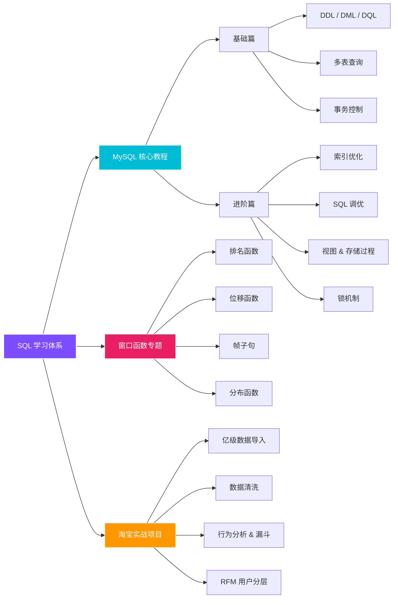

# :material-database-search: SQL 数据查询

!!! quote "为什么 SQL 是数据分析师的第一语言"
    SQL 是与数据库对话的通用语言——**超过 90% 的数据分析岗位**将其列为必备技能。无论是日常取数、报表统计，还是用户行为分析和漏斗建模，SQL 都是你最直接、最高效的工具。

---

## 📚 学习模块导航

本专区按照 **"基础语法 → 高级技巧 → 实战项目"** 的路径组织内容，建议按顺序推进。

-   :material-school:{ .lg .middle } __MySQL 核心教程__

    ---

    从零开始系统学习 MySQL，涵盖 **基础篇** 与 **进阶篇**，全程配有代码实操、图表与思维导图。

    *   ✨ **基础篇**：DDL/DML/DQL、多表查询、事务控制
    *   🔎 **进阶篇**：索引优化、SQL 调优、视图与锁机制
    *   🎯 附数据分析师**章节筛选建议**，避免无效学习

    [:octicons-arrow-right-24: 进入 MySQL 核心教程](MySQL_Base_ITcase/index.md){ .md-button .md-button--primary aria-label="进入 MySQL 核心教程，查看基础篇与进阶篇内容" title="进入 MySQL 核心教程（基础篇与进阶篇）" }

-   :material-chart-timeline-variant:{ .lg .middle } __SQL 窗口函数专题__

    ---

    窗口函数是数据分析师与 SQL 工程师的**分水岭技能**，专项攻克排名、同比环比、滑动平均等难点。

    *   📊 **基础篇**：`ROW_NUMBER` / `RANK` / `LEAD` / `LAG`
    *   🖼️ **进阶篇**：帧子句 `ROWS` vs `RANGE`、`NTILE`、`CUME_DIST`
    *   ⚡ 配有完整测试数据与**易错点汇总**

    [:octicons-arrow-right-24: 进入窗口函数专题](windows_function/index.md){ .md-button .md-button--primary aria-label="进入 SQL 窗口函数专题，查看基础与进阶内容" title="进入 SQL 窗口函数专题" }

-   :material-cart-outline:{ .lg .middle } __实战：淘宝用户行为分析__

    ---

    基于 **1 亿行** 阿里云天池 UserBehavior 数据集，完整走通数据导入、清洗、分析与可视化全链路。

    *   🗄️ 亿级数据导入方案（Kettle / `LOAD DATA INFILE`）
    *   📈 转化漏斗、RFM 用户分层、热门品类分析
    *   💡 附**小样本验证**策略与新手上路建议

    [:octicons-arrow-right-24: 进入淘宝实战项目](TaoBao_project/index.md){ .md-button aria-label="进入淘宝用户行为分析实战项目，查看完整分析流程" title="进入淘宝用户行为分析实战项目" }

---

## 🧠 知识图谱

<figure class="diagram-figure" role="group" aria-labelledby="sql-map-title" aria-describedby="sql-map-desc" markdown>

<figcaption id="sql-map-title">SQL 学习路径知识图谱</figcaption>

图谱从 SQL 学习体系出发，分为 MySQL 核心教程、窗口函数专题与淘宝实战项目。MySQL 路径继续细分为基础篇与进阶篇，窗口函数覆盖排名、位移、帧子句和分布函数，实战项目覆盖导入、清洗、行为分析和 RFM 分层。

</figure>

---

## 🎯 数据分析师学习优先级

!!! tip "聚焦原则"
    MySQL 体系庞大（含 DBA 运维内容），数据分析师应遵循 **"去肥增瘦"** 原则，把时间花在**取数效率**和**分析能力**上。

| 模块 | 优先级 | 核心理由 |
| :--- | :--- | :--- |
| **DQL 查询 & 多表连接** | ⭐⭐⭐ 必学 | 日常取数的基石，面试必考 |
| **索引 & SQL 优化** | ⭐⭐⭐ 必学 | 千万级数据不懂索引 = 查询超时，掌握 `EXPLAIN` 是分水岭 |
| **窗口函数** | ⭐⭐⭐ 必学 | 排名、同比环比、留存分析的利器，面试高频考点 |
| **实战项目** | ⭐⭐⭐ 必做 | 打通"导入 → 清洗 → 分析 → 可视化"全链路，简历加分项 |
| **视图** | ⭐⭐ 推荐 | 封装复杂分析逻辑（如留存率计算），方便复用 |
| **存储过程 & 触发器** | ⭐ 选学 | 现代架构多用 Python/Airflow 做 ETL，读懂即可 |
| **运维篇** | ❌ 跳过 | 主从复制、分库分表由 DBA 负责 |

---

## 📊 内容规模一览

| 模块 | 文档数 | 核心知识点 |
| :--- | :---: | :--- |
| MySQL 核心教程 | 4 篇 | DDL/DML/DQL、多表查询、事务、索引、SQL 优化、视图、锁 |
| 窗口函数专题 | 2 篇 | 排名/位移/聚合窗口、帧子句、分布函数、WINDOW 子句复用 |
| 淘宝实战项目 | 3 篇 | 亿级导入、数据清洗、漏斗分析、RFM 分层、热门商品分析 |

---

## 🔗 延伸资源

-   :material-web:{ .lg .middle } __在线练习平台__

    ---

    *   [SQLZoo](https://sqlzoo.net/) — 交互式 SQL 教程
    *   [LeetCode Database](https://leetcode.com/problemset/database/) — SQL 面试题库
    *   [HackerRank SQL](https://www.hackerrank.com/domains/sql) — 分难度刷题

-   :material-book-open-variant:{ .lg .middle } __推荐学习资料__

    ---

    *   [MySQL 8.0 官方文档](https://dev.mysql.com/doc/refman/8.0/en/) — 权威参考
    *   [SQL Style Guide](https://www.sqlstyle.guide/) — SQL 编码规范
    *   [Use The Index, Luke](https://use-the-index-luke.com/) — 索引优化圣经

!!! note "学习建议"
    **实践优先**：每学完一个章节，务必在本地 MySQL 环境中亲自执行 SQL。对于 `EXPLAIN` 执行计划，尝试对比加索引前后的查询行数差异，会有醍醐灌顶的体验。
