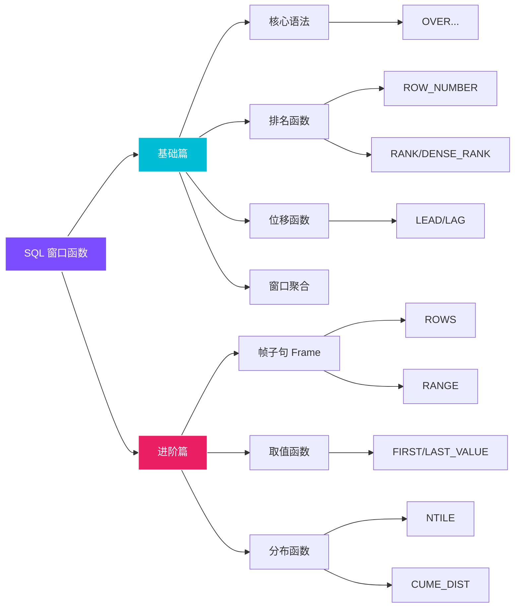

# 🚀 SQL 窗口函数 (Window Functions)

!!! quote "核心价值"
    **窗口函数**是数据分析师与 SQL 工程师的分水岭技能。它允许我们在不破坏数据明细粒度的前提下，进行复杂的聚合、排名、趋势分析和累计计算，是处理"组内比较"、"滑动窗口"、"留存分析"等场景的神器。

---

## 📚 学习模块导航

本专题分为 **基础篇** 与 **进阶篇** 两部分，建议按顺序学习。

-   __基础篇：核心概念与常用函数__

    ---
    
    适合初学者，掌握 80% 的日常应用场景。
    
    *   ✨ **核心语法**：`OVER()`、`PARTITION BY`、`ORDER BY`
    *   📊 **排名函数**：`ROW_NUMBER` vs `RANK` vs `DENSE_RANK`
    *   🔄 **位移函数**：`LEAD` / `LAG` 实现同比环比
    *   📈 **聚合窗口**：`SUM/AVG` 的窗口化应用
    
    [:octicons-arrow-right-24: 开始学习基础篇](notes1.md){ .md-button .md-button--primary }

-   __进阶篇：帧子句与高级统计__

    ---
    
    突破默认设置限制，精细控制计算范围。
    
    *   🖼️ **帧子句 (Frames)**：`ROWS` vs `RANGE` 核心原理
    *   🎯 **取值函数**：`FIRST_VALUE` / `LAST_VALUE` / `NTH_VALUE`
    *   🔢 **分桶与分布**：`NTILE`、`CUME_DIST`、`PERCENT_RANK`
    *   ⚡ **性能优化**：`WINDOW` 子句复用
    
    [:octicons-arrow-right-24: 挑战进阶篇](notes2.md){ .md-button }

---

## 🧠 知识图谱

## 💡 常见应用场景速查

| 场景 | 推荐函数 | 示例 |
| :--- | :--- | :--- |
| **组内排名** | `RANK()` / `DENSE_RANK()` | 每个部门工资最高的前 3 名 |
| **去重/取最新** | `ROW_NUMBER()` | 取每个用户最新的一条登录记录 |
| **同比/环比** | `LAG()` / `LEAD()` | 本月销售额与上月对比 |
| **累计求和** | `SUM() OVER(...)` | 计算年初至今的累计收入 (Running Total) |
| **滑动平均** | `AVG() ... ROWS BETWEEN` | 最近 7 天的平均日活 (MA7) |
| **用户分层** | `NTILE()` / `CUME_DIST()` | 将用户按消费金额分为 5 个等级 |

---

!!! tip "学习建议"
    窗口函数的难点在于**思维转换**。建议在数据库中亲自运行示例代码，观察 `PARTITION BY` 如何分组，`ORDER BY` 如何影响计算顺序，以及 `ROWS` 窗口帧如何动态变化。
